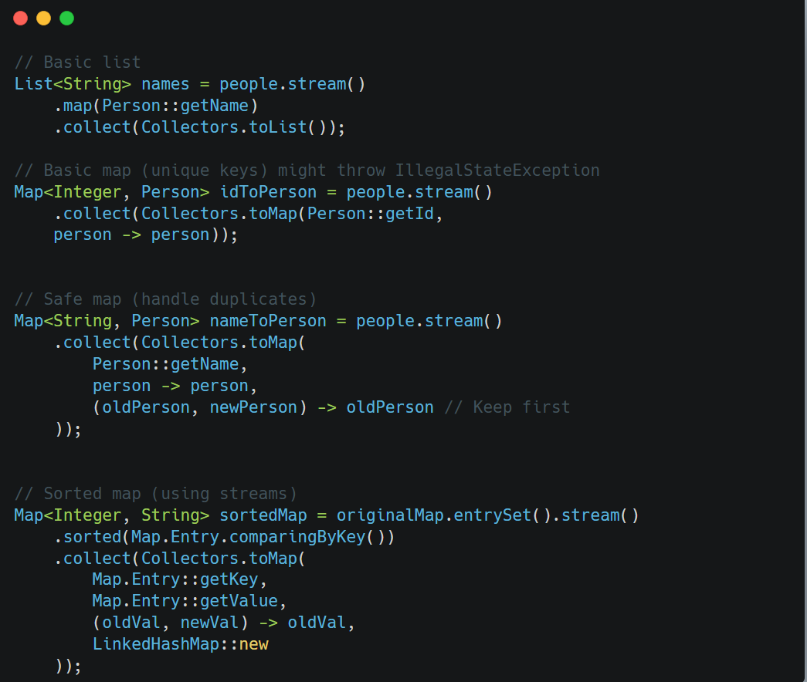

&nbsp;

### The `Collectors.toMap` Pattern

`Collectors.toMap` <span style="color: #f8faff;">has</span> **multiple overloads** <span style="color: #f8faff;">(versions).</span>

```java
Collectors.toMap(
    keyMapper,      // How to extract the new key from a stream element
    valueMapper,    // How to extract the new value
    mergeFunction,  // How to resolve key collisions (duplicates)
    mapSupplier     // How to create the final map (e.g., LinkedHashMap)
)
```

&nbsp;

1.  **Key/Value Mappers**:
    
    - Because streams process generic objects (like `Map.Entry`), you must tell Java how to reconstruct keys/values for the new map.
        
    - Example: `Map.Entry::getKey` says, “Use the entry’s key as the new key.”
        
2.  **Merge Function**:
    
    - Maps cannot have duplicate keys. If two entries have the same key, this function decides which value to keep.
        
    - Example: `(oldVal, newVal) -> oldVal` means “keep the first value encountered.”
        
3.  **Map Supplier**:
    
    - By default, `toMap` returns a `HashMap`, which doesn’t preserve order. To retain sorted order, you need a `LinkedHashMap`.

&nbsp;

* * *

### `Collectors.toList()`: Simple Collection

```java
.collect(Collectors.toList());
```

- **No parameters needed** because Java already knows how to collect elements into a `List` (just add them in order).  
    <br/>

* * *

### `Collectors.groupingBy()`: Grouping Logic

```java
.collect(Collectors.groupingBy(
    Person::getDepartment,  // Key = department name
    Collectors.toList()     // Value = list of people in that department
));
```

**Key mapper + downstream collector**: Here, we are grouping by a key and specifying how to collect grouped values (e.g., into a list).

* * *

&nbsp;

### `Collectors.joining()`: String Concatenation

```java
.collect(Collectors.joining(", "));
```

&nbsp;

- **Delimiter only**: Simpler because the logic (concatenate with commas) is predefined.

* * *

### The Universal Truth About `collect`

Every `collect` operation requires you to specify:

- **What to collect** (e.g., keys/values, strings, objects).
    
- **How to handle conflicts** (e.g., duplicate keys).
    
- **Where to store the result** (e.g., `List`, `LinkedHashMap`).
    

&nbsp;

&nbsp;

&nbsp;

| Scenario | Collector Pattern |
| --- | --- |
| **I want a list/set** | `.collect(Collectors.toList())` or `.toSet()` (no parameters needed) |
| **I want a map** | `.collect(Collectors.toMap(keyMapper, valueMapper, mergeFunction, mapSupplier))` |
| **I want to group elements** | `.collect(Collectors.groupingBy(classifier, downstreamCollector))` |
| **I want a string** | `.collect(Collectors.joining(delimiter))` |

&nbsp;



&nbsp;

&nbsp;