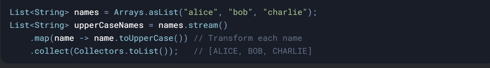

## 1\. `map()`: Transforming Elements

### What It Does

`map()` converts each element in a stream to another object using a **mapper function**. Think of it as a **1:1 transformation**.

### Common Mistakes:

- **Side Effects**: Using `map()` to perform actions (e.g., printing) instead of transformations.

- **Null Returns**: If the mapper returns `null`, the stream will carry `null` values.

* * *

## 2\. `flatMap()`: Flattening Nested Structures

### What It Does

`flatMap()` transforms each element into a **stream** and then **flattens** all streams into a single stream. Think of it as **1:N transformation + flattening**.

### Example: Splitting Sentences into Words

### Common Mistakes:

- **Forgetting to Stream**: Returning a `List`/`Collection` instead of a `Stream`:

&nbsp;

### When to Use:

- When dealing with **nested collections** (e.g., `List<List<Integer>>` → `List<Integer>`).
    
- When a single element maps to **multiple elements**.
    

&nbsp;

&nbsp;