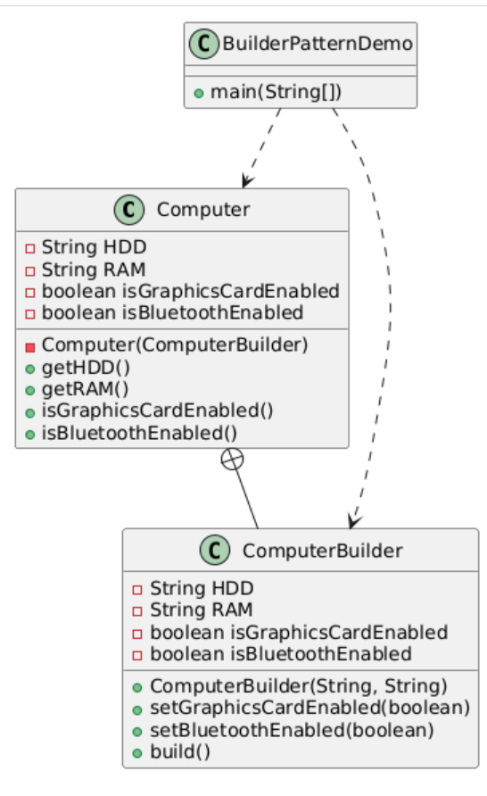

The Builder Design Pattern is a creational design pattern that **allows for the construction of complex objects step by step.**

It is particularly useful when an object has many optional parameters or when the construction process involves multiple steps. This pattern helps to avoid issues related to telescoping constructors, where multiple overloaded constructors become unwieldy.

&nbsp;

### When It Can Be Used:

- **When an object requires many parameters:** The Builder pattern allows for setting only the necessary parameters without needing to pass null for optional ones.
- **When the construction process is complex:** If the process involves multiple steps or configurations, the Builder pattern provides a structured approach.
- When an increase in the number of constructor parameters leads to a large list of constructors
- **When creating immutable objects**, the Builder pattern allows for gradual construction of the object before it is finalized, ensuring that all required attributes are set.
- **Configuration Objects:** In applications where configuration settings are needed, such as building a database connection or a web service client, the Builder pattern can provide a clear and flexible way to specify settings.

&nbsp;

## Typical Steps/Pattern While Using Builder Design Pattern

1.  **Define the Product Class**: Create a class that represents the complex object being built. This class should contain all the attributes that the object will have.
2.  **Create a Builder Class**: This class will contain methods to set the various attributes of the product. It can include both required and optional parameters.
3.  **Implement a Build Method**: The builder class should have a method (often named `build()`) that constructs and ==returns the final product object. This method typically calls the private constructor of the product class.==
4.  **Use Method Chaining**: Implement methods in the builder class that return `this` to allow for method chaining, making the code more readable.
5.  **Client Code**: In the client code, create an instance of the builder, set the desired parameters, and call the `build()` method to obtain the constructed object

&nbsp;

> We can either put the builder class inside product class for simplicity , there we can make the constructor of product class as private  
> but if we needed to make the builder class separate , we need to make the constructor as package private (dont specify access modifier)

&nbsp;

**Example:**  
<br/>

Computer Class: This is the product class that represents the complex object being built. It has required attributes (HDD and RAM) and optional attributes (graphics card and Bluetooth).



**remember we made the constructor private to enforce use of builder(when putting the builder as inner class )**

```java
// Step 1: Create the Product class
// This class represents the complex object that will be built.
public class Computer {
    private final String HDD; // Required
    private final String RAM; // Required
    private final boolean isGraphicsCardEnabled; // Optional
    private final boolean isBluetoothEnabled; // Optional

    // Private constructor to enforce the use of the Builder
    private Computer(ComputerBuilder builder) {
        this.HDD = builder.HDD;
        this.RAM = builder.RAM;
        this.isGraphicsCardEnabled = builder.isGraphicsCardEnabled;
        this.isBluetoothEnabled = builder.isBluetoothEnabled;
    }

    // Getters for the fields
    public String getHDD() {
        return HDD;
    }

    public String getRAM() {
        return RAM;
    }

    public boolean isGraphicsCardEnabled() {
        return isGraphicsCardEnabled;
    }

    public boolean isBluetoothEnabled() {
        return isBluetoothEnabled;
    }
```

&nbsp;

&nbsp;here in the constructor of builder class we used required parameters while optional ones are set using setters.

&nbsp;we may wanna keep the builder class inside the product class for simplicity while while creating object

so that it can be called like `Computer.ComputerBuilder.`

```java
// Step 2: Create the Builder class
    // This inner static class provides the methods to build the Computer object.
    public static class ComputerBuilder {
        private final String HDD; // Required
        private final String RAM; // Required
        private boolean isGraphicsCardEnabled; // Optional
        private boolean isBluetoothEnabled; // Optional

        // Constructor for required parameters
        public ComputerBuilder(String hdd, String ram) {
            this.HDD = hdd;
            this.RAM = ram;
        }

        // Setter methods for optional parameters
        public ComputerBuilder setGraphicsCardEnabled(boolean isGraphicsCardEnabled) {
            this.isGraphicsCardEnabled = isGraphicsCardEnabled;
            return this;
        }

        public ComputerBuilder setBluetoothEnabled(boolean isBluetoothEnabled) {
            this.isBluetoothEnabled = isBluetoothEnabled;
            return this;
        }

        // Build method to create the Computer object
        public Computer build() {
            return new Computer(this);
        }
    }
}
```

&nbsp;

```java
// Step 3: Client code to demonstrate the Builder pattern
public class BuilderPatternDemo {
    public static void main(String[] args) {
        // Using the builder to create a Computer object
        Computer computer = new Computer.ComputerBuilder("500 GB", "2 GB")
                .setGraphicsCardEnabled(true)
                .setBluetoothEnabled(true)
                .build();

        // Displaying the computer configuration
        System.out.println("Computer Configuration:");
        System.out.println("HDD: " + computer.getHDD());
        System.out.println("RAM: " + computer.getRAM());
        System.out.println("Graphics Card Enabled: " + computer.isGraphicsCardEnabled());
        System.out.println("Bluetooth Enabled: " + computer.isBluetoothEnabled());
    }
}
```

&nbsp;

&nbsp;