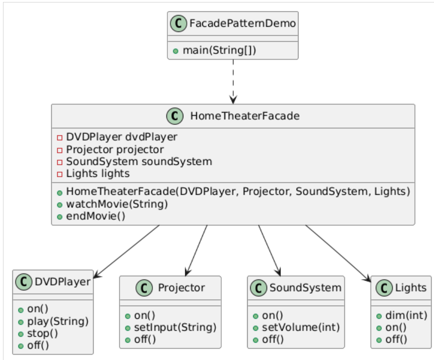

The Facade Design Pattern is a structural design pattern that ==provides a simplified interface to a complex subsystem, making it easier for clients to interact with the system without needing to understand its complexities.== This pattern is particularly useful when working with a set of interfaces in a subsystem that may be difficult to use or understand.

&nbsp;

### When It Can Be Used

- **When a system is complex or difficult to understand**: Facades can help hide the complexity of the underlying system, providing a simpler interface for clients.
- **When you want to decouple clients from the subsystem**: This reduces the coupling between the client code and the subsystem, making it easier to change or refactor the subsystem without affecting clients.
- **When you need to provide a single entry point to a subsystem**: Facades can serve as a single point of access for multiple classes in a subsystem.

### Example:

In a typical **home theater setup**, there are multiple components such as a **DVD player, projector, sound system, and lighting controls**. Each of these components has its own interface and requires specific commands to operate. The Facade pattern can simplify the interaction with these components by providing a unified interface.

<span style="color: oklch(0.304 0.04 213.681);"></span>

&nbsp;

<span style="color: oklch(0.304 0.04 213.681);"><span style="color: #8e908c;">// Step 1: Create the subsystem classes</span></span>

&nbsp;

```java
// DVD Player class
public class DVDPlayer {
    public void on() {
        System.out.println("DVD Player is ON");
    }

    public void play(String movie) {
        System.out.println("Playing movie: " + movie);
    }

    public void stop() {
        System.out.println("Stopping the DVD Player");
    }

    public void off() {
        System.out.println("DVD Player is OFF");
    }
}
```

&nbsp;

&nbsp;

```java
// Projector class
public class Projector {
    public void on() {
        System.out.println("Projector is ON");
    }

    public void setInput(String input) {
        System.out.println("Projector input set to: " + input);
    }

    public void off() {
        System.out.println("Projector is OFF");
    }
}
```

&nbsp;

```java
// Sound System class
public class SoundSystem {
    public void on() {
        System.out.println("Sound System is ON");
    }

    public void setVolume(int level) {
        System.out.println("Setting volume to: " + level);
    }

    public void off() {
        System.out.println("Sound System is OFF");
    }
}
```

&nbsp;

```java
// Lights class
public class Lights {
    public void dim(int level) {
        System.out.println("Dimming lights to: " + level + "%");
    }

    public void on() {
        System.out.println("Lights are ON");
    }

    public void off() {
        System.out.println("Lights are OFF");
    }
}
```

&nbsp;

<span style="color: #8e908c;">// Step 2: Create the Facade class</span>

```java
public class HomeTheaterFacade {
    private DVDPlayer dvdPlayer;
    private Projector projector;
    private SoundSystem soundSystem;
    private Lights lights;

    public HomeTheaterFacade(DVDPlayer dvdPlayer, Projector projector, SoundSystem soundSystem, Lights lights) {
        this.dvdPlayer = dvdPlayer;
        this.projector = projector;
        this.soundSystem = soundSystem;
        this.lights = lights;
    }

    public void watchMovie(String movie) {
        System.out.println("Get ready to watch a movie...");
        lights.dim(10); // Dim the lights
        projector.on(); // Turn on the projector
        projector.setInput("DVD"); // Set projector input to DVD
        soundSystem.on(); // Turn on the sound system
        soundSystem.setVolume(5); // Set volume
        dvdPlayer.on(); // Turn on the DVD player
        dvdPlayer.play(movie); // Play the movie
    }
     public void endMovie() {
        System.out.println("Shutting down the home theater...");
        dvdPlayer.stop(); // Stop the DVD player
        dvdPlayer.off(); // Turn off the DVD player
        soundSystem.off(); // Turn off the sound system
        projector.off(); // Turn off the projector
        lights.on(); // Turn on the lights
    }
}
```

&nbsp;

<span style="color: #8e908c;">// Step 3: Client</span>

```java
public class FacadePatternDemo {
    public static void main(String[] args) {
        // Create subsystem components
        DVDPlayer dvdPlayer = new DVDPlayer();
        Projector projector = new Projector();
        SoundSystem soundSystem = new SoundSystem();
        Lights lights = new Lights();

        // Create the facade
        HomeTheaterFacade homeTheater = new HomeTheaterFacade(dvdPlayer, projector, soundSystem, lights);

        // Use the facade to watch a movie
        homeTheater.watchMovie("Inception");

        // End the movie
        homeTheater.endMovie();
    }
}
```

&nbsp;

## Explanation

- **Subsystem Classes**: The `DVDPlayer`, `Projector`, `SoundSystem`, and `Lights` classes represent the various components of the home theater system. Each class has methods to perform specific actions.
- **HomeTheaterFacade Class**: This is the <ins>facade class that simplifies the interaction with the complex subsystem</ins>. It provides a high-level interface for watching and ending movies, coordinating the actions of the various components.
- **FacadePatternDemo Class**: This is the client code that demonstrates how to use the facade. It creates instances of the subsystem components and the facade, then calls the `watchMovie` and `endMovie` methods.

&nbsp;