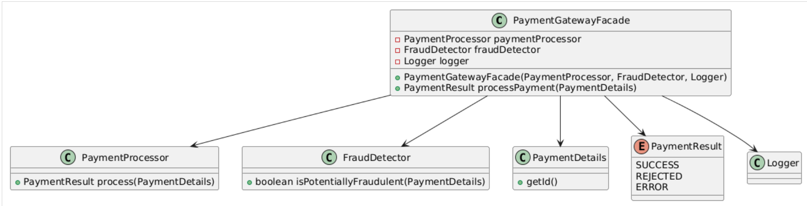

The Facade pattern is a structural design pattern that provides a simplified interface to a complex subsystem of classes, library, or framework. It defines a higher-level interface that makes the subsystem easier to use.

## When to Use It?

Use the Facade pattern when:

1.  You want to provide a simple interface to a complex subsystem.
2.  You need to layer your subsystems.
3.  You want to decouple your client implementation from any one subsystem.
4.  You need to integrate your application with a sophisticated library or API.

### 1\. Service Layer as a Facade

In a typical Spring Boot application, the service layer often acts as a facade for underlying repositories and external services:

```java
@Service
public class OrderFacade {
    private final OrderRepository orderRepository;
    private final PaymentService paymentService;
    private final InventoryService inventoryService;
    private final NotificationService notificationService;

    public OrderFacade(OrderRepository orderRepository,
                       PaymentService paymentService,
                       InventoryService inventoryService,
                       NotificationService notificationService) {
        this.orderRepository = orderRepository;
        this.paymentService = paymentService;
        this.inventoryService = inventoryService;
        this.notificationService = notificationService;
    }

    public OrderResult placeOrder(Order order) {
        // Check inventory
        if (!inventoryService.checkAvailability(order.getItems())) {
            return OrderResult.INSUFFICIENT_INVENTORY;
        }

        // Process payment
        PaymentResult paymentResult = paymentService.processPayment(order.getPaymentDetails());
        if (paymentResult != PaymentResult.SUCCESS) {
            return OrderResult.PAYMENT_FAILED;
        }

        // Save order
        Order savedOrder = orderRepository.save(order);

        // Update inventory
        inventoryService.updateInventory(order.getItems());

        // Send notification
        notificationService.sendOrderConfirmation(savedOrder);

        return OrderResult.SUCCESS;
    }
}
```

The `placeOrder` method in `OrderFacade` encapsulates the entire workflow of placing an order. It hides the details of interacting with multiple services (`PaymentService`, `InventoryService`, `NotificationService`) and the repository (`OrderRepository`).

&nbsp;

The `OrderFacade` acts as a layer of abstraction between the client and the various services and repositories

* * *

### 2\. Spring's `JdbcTemplate`

Spring's `JdbcTemplate` is a facade over JDBC, simplifying database operations:

```java
@Repository
public class UserRepository {
    private final JdbcTemplate jdbcTemplate;

    public UserRepository(JdbcTemplate jdbcTemplate) {
        this.jdbcTemplate = jdbcTemplate;
    }

    public User findById(Long id) {
        return jdbcTemplate.queryForObject(
            "SELECT * FROM users WHERE id = ?",
            new Object[]{id},
            (rs, rowNum) ->
                new User(
                    rs.getLong("id"),
                    rs.getString("username"),
                    rs.getString("email")
                )
        );
    }
}
```

&nbsp;`JdbcTemplate` simplifies JDBC interactions by encapsulating low-level details like:

- Establishing connections to the database.
- Creating and preparing statements.
- Managing result sets.
- Handling exceptions.
- Closing resources (connections, statements, result sets) to avoid leaks.

* * *

### 3\. Spring Boot Actuator

Spring Boot Actuator provides a facade for monitoring and managing your application:

```java
@Configuration
public class ActuatorConfig {
    @Bean
    public HealthIndicator databaseHealthIndicator() {
        return new HealthIndicator() {
            @Override
            public Health health() {
                // Check database health
                if (isDatabaseHealthy()) {
                    return Health.up().withDetail("Database", "Operational").build();
                }
                return Health.down().withDetail("Database", "Not Available").build();
            }
        };
    }
}
```

&nbsp;

The `HealthIndicator` interface provides a simple and consistent way to expose the health status of different components (database, disk space, external services, etc.).

`databaseHealthIndicator` encapsulates the complex logic for checking the database health (e.g., executing a simple query, checking connection status).

Actuator's health endpoint (`/actuator/health`) uses the `HealthIndicator` interface to aggregate the health status from all registered indicators, hiding the complexity of individual health checks.

The clients (e.g., monitoring tools, administrators) only need to interact with Actuator's endpoints. They don't need to know the specifics of how each health check is implemented.

* * *

&nbsp;

### 4\. Spring's `RestTemplate`

`RestTemplate` is a facade for making HTTP requests:

```java
@Service
public class ExternalServiceClient {
    private final RestTemplate restTemplate;

    public ExternalServiceClient(RestTemplate restTemplate) {
        this.restTemplate = restTemplate;
    }

    public ExternalData fetchData(String id) {
        return restTemplate.getForObject("http://api.example.com/data/{id}", ExternalData.class, id);
    }
}
```

`RestTemplate` provides a higher-level, more intuitive API for making HTTP requests compared to working directly with lower-level libraries like `HttpURLConnection` or Apache `HttpClient`

Methods like `getForObject`, `postForEntity`, `exchange`, etc., abstract away the complexities of creating connections, setting headers, encoding parameters, and handling responses.

The internal workings of `RestTemplate` involve establishing connections, managing HTTP protocols, dealing with encoding and decoding, and handling potential errors.

* * *

### 5\. Custom Facade for External Services

When integrating with complex external services, you might create a facade:

&nbsp;

```java
@Service
public class PaymentGatewayFacade {
    private final PaymentProcessor paymentProcessor;
    private final FraudDetector fraudDetector;
    private final Logger logger;

    public PaymentGatewayFacade(PaymentProcessor paymentProcessor,
                                FraudDetector fraudDetector,
                                Logger logger) {
        this.paymentProcessor = paymentProcessor;
        this.fraudDetector = fraudDetector;
        this.logger = logger;
    }

    public PaymentResult processPayment(PaymentDetails details) {
        try {
            if (fraudDetector.isPotentiallyFraudulent(details)) {
                logger.warn("Potential fraud detected for payment: " + details.getId());
                return PaymentResult.REJECTED;
            }
            
            PaymentResult result = paymentProcessor.process(details);
            logger.info("Payment processed: " + details.getId() + ", Result: " + result);
            return result;
        } catch (Exception e) {
            logger.error("Error processing payment: " + details.getId(), e);
            return PaymentResult.ERROR;
        }
    }
}
```

&nbsp;

This facade simplifies payment processing by coordinating fraud detection, payment processing, and logging.

client only need to call `processPayments()`