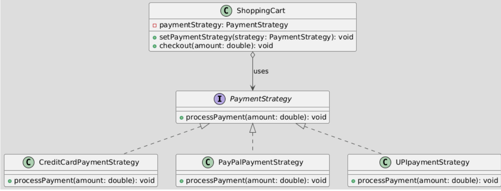

**The Strategy Design Pattern: A Conceptual Overview**

The Strategy Design Pattern ==lets you define a family of algorithms (strategies), encapsulate each one, and make them interchangeable.==

This allows the algorithm to vary independently from the client that uses it.

Strategy Design Pattern is a behavioral design pattern that allows the behavior of an object to be selected at runtime.

**Components of the Strategy Design Pattern**

&nbsp;

**Strategy Interface**: The strategy interface defines a set of methods that encapsulate the different algorithms. All concrete strategy classes must implement this interface to provide their specific implementations.

> The `PaymentStrategy` interface defines a contract for all payment strategies.

&nbsp;

**Concrete Strategies**: These are the actual algorithm implementations. Each concrete strategy class implements the strategy interface, providing a specific behavior or algorithm.

> `CreditCardPaymentStrategy`, `PayPalPaymentStrategy`, `UPIpaymentStrategy` implement the interface, providing specific payment logic.

&nbsp;

**Context**: The context is the class that contains a reference to the strategy interface. It is the class that delegates the algorithm responsibilities to the strategy.

> The `ShoppingCart` class holds a reference to a `PaymentStrategy` object. Its `checkout` method delegates payment processing to the chosen strategy.



```java
// Strategy Interface
interface PaymentStrategy {
    void processPayment(double amount);
}

// Concrete Strategies
class CreditCardPaymentStrategy implements PaymentStrategy {
    @Override
    public void processPayment(double amount) {
        System.out.println("Processing credit card payment of $" + amount);
        // ... (Logic for credit card processing)
    }
}

class PayPalPaymentStrategy implements PaymentStrategy {
    @Override
    public void processPayment(double amount) {
        System.out.println("Processing PayPal payment of $" + amount);
        // ... (Logic for PayPal processing)
    }
}

class UPIpaymentStrategy implements PaymentStrategy {
    @Override
    public void processPayment(double amount) {
        System.out.println("Processing UPI payment of $" + amount);
        // ... (Logic for UPI processing)
    }
}

// Context Class
class ShoppingCart {
    private PaymentStrategy paymentStrategy;

    public void setPaymentStrategy(PaymentStrategy paymentStrategy) {
        this.paymentStrategy = paymentStrategy;
    }

    public void checkout(double amount) {
        paymentStrategy.processPayment(amount);
        // ... (Additional checkout logic)
    }
}
```

  
Now for usages   
<br/><br/>

```java
public class Main {
    public static void main(String[] args) {
    ShoppingCart cart = new ShoppingCart();
    // The user selects credit card payment
    cart.setPaymentStrategy(new CreditCardPaymentStrategy());
    cart.checkout(100.0);
    
    // Later, the user switches to UPI payment
    cart.setPaymentStrategy(new UPIpaymentStrategy());
    cart.checkout(50.0);       
        
    }
}
```