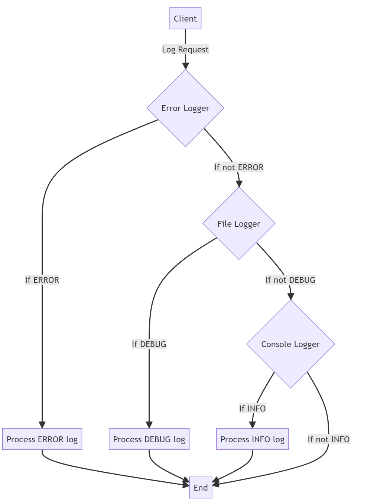
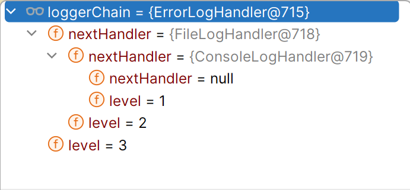

The Chain of Responsibility is a behavioral design pattern **==that lets you pass requests along a chain of handlers.==**

Upon receiving a request, each handler decides either to process the request or to pass it to the next handler in the chain.

### When to Use It?

Use the Chain of Responsibility pattern when:

1.  **When multiple handlers can process a request:** This is useful in scenarios where the exact handler that will process the request is not known in advance.
2.  **When you want to decouple the sender from the receiver:** This allows for more flexible and maintainable code.
3.  **When the order of processing is important:** The chain can be configured to ensure that requests are processed in a specific sequence.
4.  The set of objects that can handle a request should be specified dynamically.(like in logging systems we specify if the message should be treated as error, debug or info).

### Common Real-Life Usages in Java

1.  Event Handling in GUI Applications: In graphical user interfaces, events (like button clicks) are often propagated through a chain of components until one of them handles the event.
    
2.  Logging Frameworks: Different logging levels (info, debug, error) can be handled by different loggers in a chain, allowing for flexible logging configurations.
    
3.  Middleware in Web Applications: ==Middleware components can process HTTP requests in a chain, allowing for tasks like authentication, logging, and data validation to be handled sequentially.==
    
4.  Customer Support Systems: Different levels of support staff can handle customer inquiries based on their complexity, passing the request up the chain if they cannot resolve it.
    

&nbsp;

### Key Components:

1.  **Handler**: An interface defining a method for handling requests.
2.  **Concrete Handlers**: Classes implementing the Handler interface.
3.  **Client**: Initiates the request to the first handler in the chain.

&nbsp;

* * *

## Logging System Example

&nbsp;

### Key Components

1.  **LogHandler**: An abstract class defining the structure for handling log messages.
2.  **Concrete Handlers**: ErrorLogHandler, FileLogHandler, and ConsoleLogHandler, each responsible for a specific log level.
3.  **Client**: Initiates the log request to the first handler in the chain.

### How It Works

1.  We create a chain of log handlers in order of decreasing severity: ERROR -> DEBUG -> INFO.
2.  When a log message comes in, it starts with the first handler (ErrorLogHandler).
3.  Each handler checks if it should handle the message based on the log level:
    - If the handler's level matches or is lower than the message's level, it processes the message and the chain stops.
    - If not, it passes the message to the next handler in the chain.
4.  This continues until an appropriate handler processes the message or the end of the chain is reached.

&nbsp;



&nbsp;

**Handler Interface:**

here handlers are linked together in chain , in each handler we will set next handler , in case current handler was not the intended one to process the request , it will pass the request next up in the chain of handlers, last handler will set the next handler as null

//logMessage() checks if the current handler is intended one ,if it is it will call the write() method to process otherwise it will call logMessage() method of next handler in chain

&nbsp;

```java
public abstract class LogHandler {
    protected LogHandler nextHandler;
    protected int level;

    public void setNextHandler(LogHandler nextHandler) {
        this.nextHandler = nextHandler;
    }

    public void logMessage(int level, String message) {
        if (this.level <= level) {
            write(message);
            return; // Stop here after handling the message
        }
        if (nextHandler != null) {
            nextHandler.logMessage(level, message);
        }
    }

    abstract protected void write(String message);
}
```

&nbsp;

**Concrete Handlers:**

```java
//Info log(console logs)
public class ConsoleLogHandler extends LogHandler {
    public ConsoleLogHandler(int level) {
        this.level = level;
    }

    @Override
    protected void write(String message) {
        System.out.println("Standard Console::Logger: " + message);
    }
}

//Debug logs (file level logs)
public class FileLogHandler extends LogHandler {
    public FileLogHandler(int level) {
        this.level = level;
    }

    @Override
    protected void write(String message) {
        System.out.println("File::Logger: " + message);
    }
}

//error logs
public class ErrorLogHandler extends LogHandler {
    public ErrorLogHandler(int level) {
        this.level = level;
    }

    @Override
    protected void write(String message) {
        System.out.println("Error Console::Logger: " + message);
    }
}
```

loggerchain object:



&nbsp;