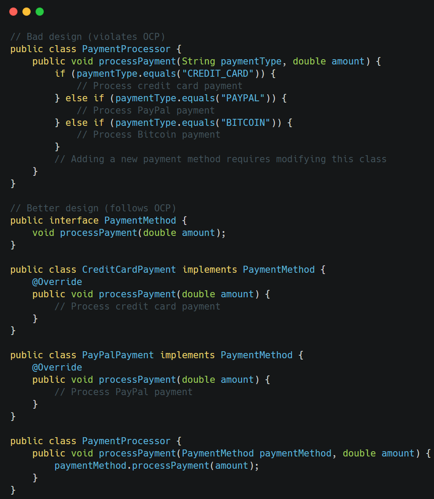
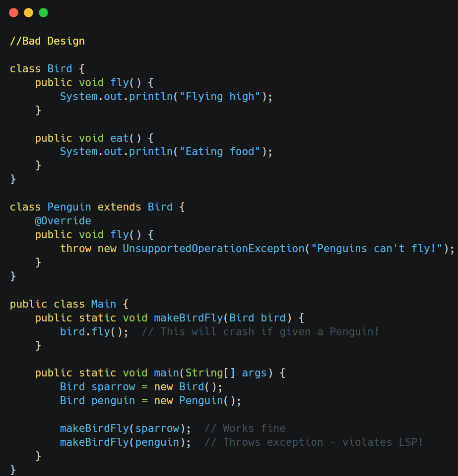
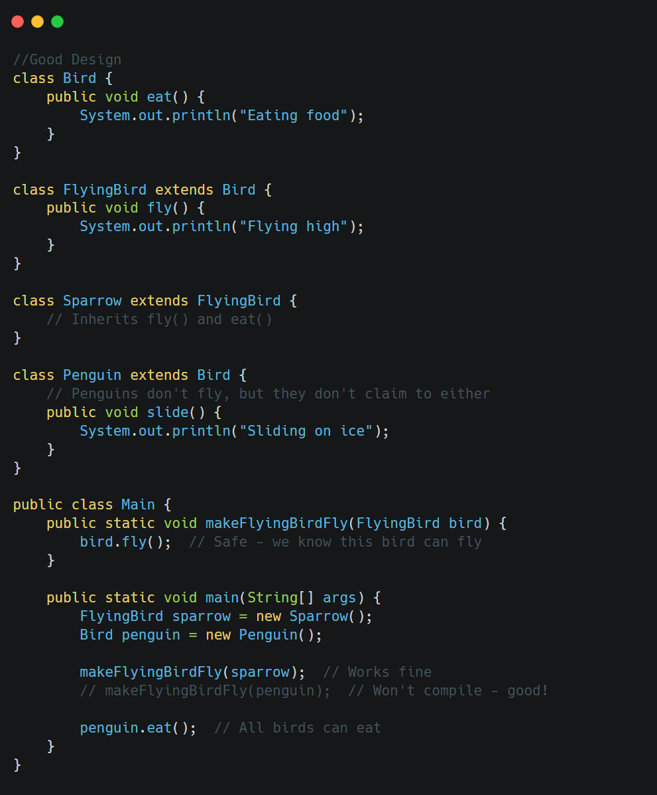
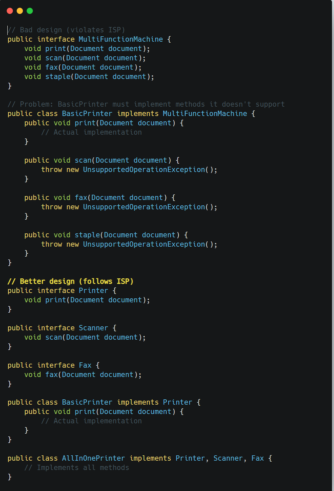
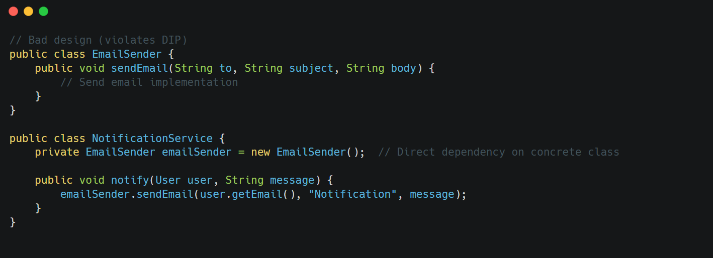
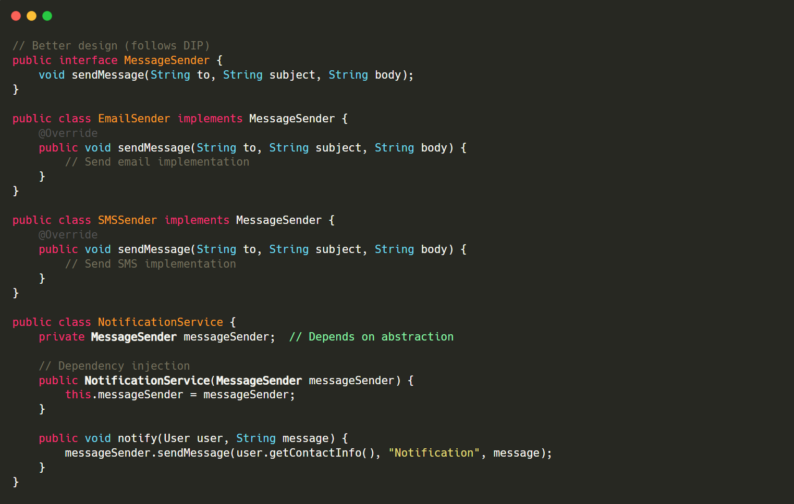

## SOLID Principles

SOLID is an acronym for five design principles that work together to create more maintainable, understandable, and flexible code. These principles were introduced by Robert C. Martin (Uncle Bob).

&nbsp;

### 1\. Single Responsibility Principle (SRP)

**Core idea**: A class should have only one responsibility or job.

**Example**: Consider a `UserManager` class that handles both user authentication and sending email notifications. According to SRP, these are separate responsibilities that should be in different classes.

```java
// Bad design (violates SRP)
public class UserManager {
    public void register(User user) {
        // Save user to database
        database.save(user);
        
        // Send welcome email
        String message = "Welcome " + user.getName();
        emailService.send(user.getEmail(), message);
    }
}

// Better design (follows SRP)
public class UserManager {
    private NotificationService notificationService;
    
    public UserManager(NotificationService notificationService) {
        this.notificationService = notificationService;
    }
    
    public void register(User user) {
        // Save user to database
        database.save(user);
        // Delegate notification to a specialized service
        notificationService.sendWelcomeMessage(user);
    }
}

public class NotificationService {
    public void sendWelcomeMessage(User user) {
        String message = "Welcome " + user.getName();
        emailService.send(user.getEmail(), message);
    }
}
```

&nbsp;

&nbsp;

### 2\. Open/Closed Principle (OCP)

**Core idea**: Software entities should be open for extension but closed for modification.

You should be able to add new functionality without changing existing code.

&nbsp;

**Example**: A payment processing system that needs to support different payment methods:

&nbsp;



&nbsp;

**Benefits**:

- Adding new payment methods doesn't require changing existing code
- Reduces risk of breaking working functionality
- Makes the code more maintainable and extensible

&nbsp;

&nbsp;

### 3\. Liskov Substitution Principle (LSP)

**Core idea**: Objects of a superclass should be replaceable with objects of its subclasses without affecting the correctness of the program.

<span style="color: #f8faff;">In other words, ==a child class should be able to do everything its parent class can do.==</span>



&nbsp;

**Good Design:**

&nbsp;

&nbsp;



&nbsp;

### 4\. Interface Segregation Principle (ISP)

**Core idea**: Clients should not be forced to depend on interfaces they do not use.

==Many specific interfaces are better than one general-purpose interface. So break into smaller interfaces==

**Example**: Consider a multipurpose machine interface:



**Benefits**:

- Classes only need to implement relevant methods
- Reduces the impact of changes to unused methods
- Creates more focused and cohesive interfaces

&nbsp;

### 5\. Dependency Inversion Principle (DIP)

**Core idea**: High-level modules should not depend on low-level modules.

Both should depend on abstractions.

Abstractions should not depend on details;

details should depend on abstractions.

&nbsp;



Good Design  
<br/>

**Benefits**:

- High-level modules are insulated from changes in low-level modules
- Easier to test with mock implementations
- More flexible system architecture
- Supports dependency injection

&nbsp;

&nbsp;

&nbsp;