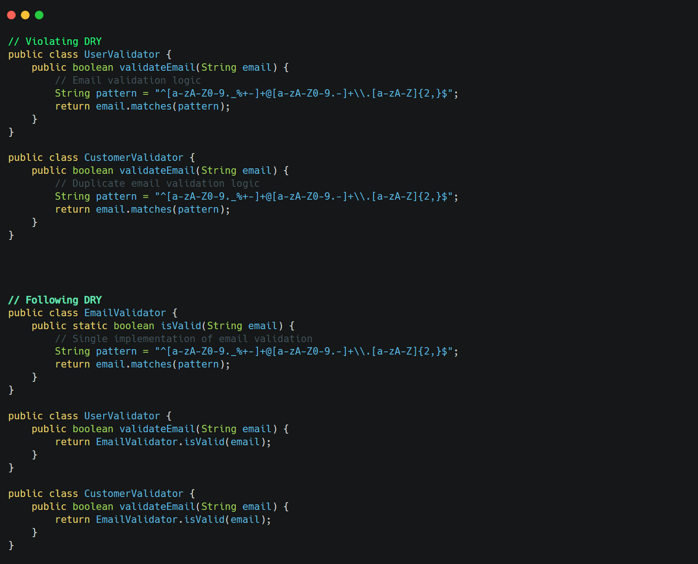

**Core idea**: Every piece of knowledge or logic should have a single, unambiguous representation within a system.

&nbsp;

&nbsp;

&nbsp;

- Easier maintenance (change logic in one place)
- Reduces bugs (fixes apply everywhere)
- Results in more concise code
- Improves consistency