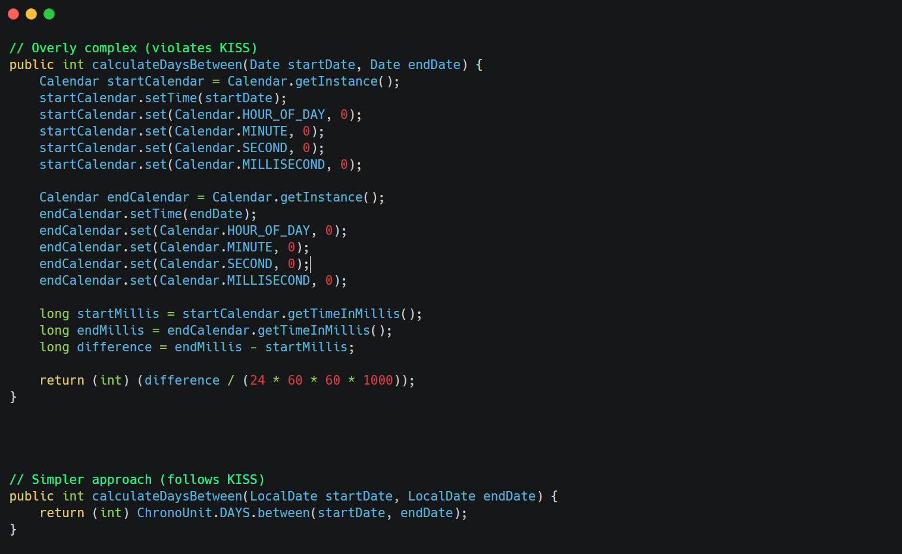

**Core idea**: Systems work best when they are kept simple rather than made complex. Simplicity should be a key goal in design, and unnecessary complexity should be avoided.

&nbsp;

&nbsp;

**Benefits**:

- Easier to understand and maintain
- Fewer bugs and edge cases
- Lower cognitive load for developers
- Often results in better performance

&nbsp;