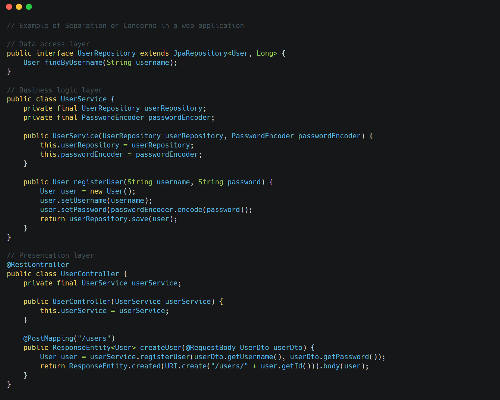

### Separation of Concerns (SoC)

**Core idea**: Different aspects of a program should be handled by distinct and minimally overlapping modules.

**Example**: In a web application, separation might include:

- Data access layer (repositories)
- Business logic layer (services)
- Presentation layer (controllers)
- Cross-cutting concerns (logging, security)

&nbsp;

