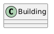
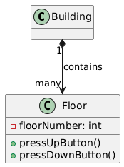
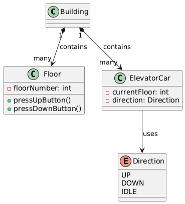
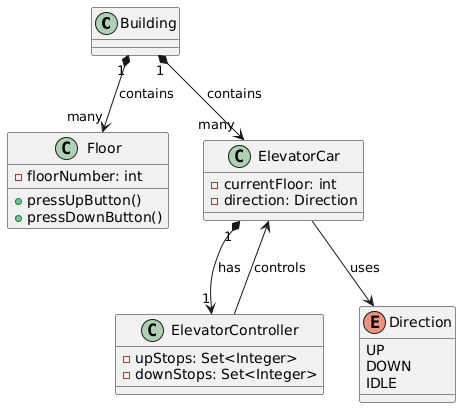
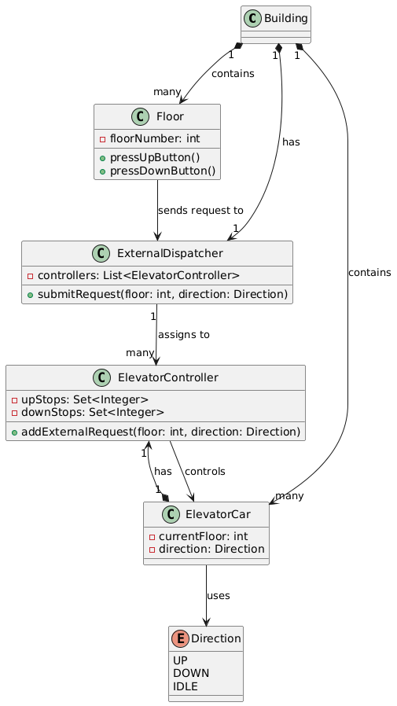
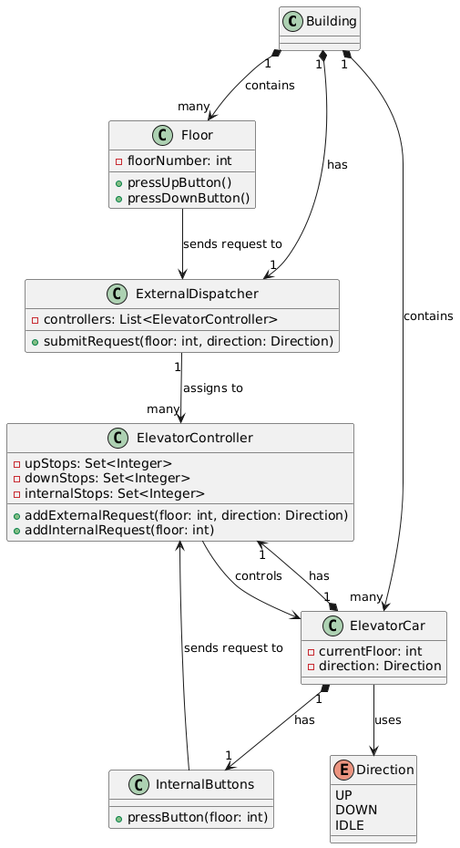
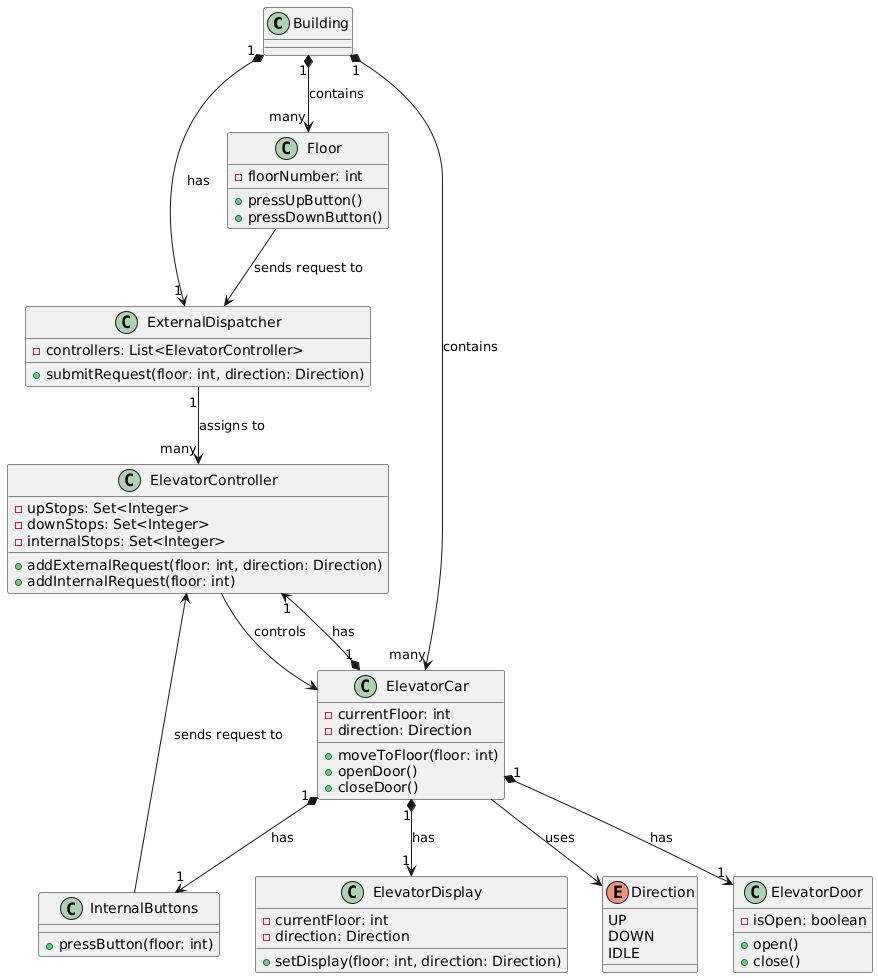

### Step 1: Rough Idea and Core Requirements

we’re in a building, and people need to move between floors. They press buttons on their floor to call an elevator, step inside, pick their destination, and off they go.

So we can say key players would be Building with floors, elevators to ride in and buttons to call the elevator on the floor

Basic Flow : Someone presses button on a floor (up or down) an elevator shows up doors open , people hop in press floor number button they want to go to and elevator takes them there.

&nbsp;

Let’s pick our first object: the **Building**. It’s the big boss holding everything together—floors and elevators live inside it.

* * *

### Step 2: Adding Floors

Okay, a building’s nothing without floors. Let’s add **Floor** to the mix. Each floor has a number (like 0 for ground, 1, 2, etc.) and buttons for calling an elevator—up, down, or both, depending on where it is

&nbsp;

#### Updated Requirements:

- Floors have numbers and buttons.
- Button presses signal a request (e.g., “I’m on floor 3, going up!”).  
     

* * *

### Step 3: Bringing in the Elevators

Now, lets add ElevatorCar, It’s got a current floor (where it’s at), a direction (up, down, or chilling as idle), and it needs to know where to stop next

#### Updated Requirements:

- Elevators move between floors, have a location, and a direction.
- They respond to requests (we’ll figure out how in a bit).

#### New Objects:

- **ElevatorCar**: The elevator itself—current floor and direction.
- **Direction**: Enum with UP, DOWN, IDLE.

* * *

### Step 4: Controlling the Chaos with ElevatorController

When a floor button’s pressed, *something* needs to decide which elevator goes where.

Let’s add **ElevatorController** to boss each ElevatorCar around. It’ll track requests (like “stop at floor 5”) and tell the car to move, stop, or chill.

#### Updated Requirements:

- Each elevator has a brain to manage its movement.
- It handles a list of floors to visit based on requests.

#### New Object:

- **ElevatorController**: Controls one ElevatorCar, managing its stops and movement.

#### Relationships:

- **ElevatorCar** has one **ElevatorController** (composition again).
- **ElevatorController** controls **ElevatorCar**.

* * *

### Step 5: Dispatching External Requests

Now, when someone presses a floor button, who decides which elevator answers the call? Enter **ExternalDispatcher**! It’s like the building’s air traffic controller, picking the best ElevatorController for the job based on where elevators are and what they’re doing.

#### Updated Requirements:

- Floor button presses go to a central system.
- That system assigns the request to an elevator.

#### New Object:

- **ExternalDispatcher**: Takes floor requests and assigns them to an ElevatorController.

#### Relationships:

- **Floor** talks to **ExternalDispatcher** (association).
- **ExternalDispatcher** manages many **ElevatorControllers**.
- **Building** has one **ExternalDispatcher**.

&nbsp;

* * *

### Step 6: Inside the Elevator—InternalButtons

Once people step into the elevator, they need to pick their floors. Let’s add **InternalButtons** so passengers can tell the elevator where to go. These buttons talk directly to the ElevatorController to add destination stops.

#### Updated Requirements:

- Passengers inside the elevator request floors.
- Those requests go to the elevator’s controller.

#### New Object:

- **InternalButtons**: The panel inside the elevator for picking floors.

#### Relationships:

- **ElevatorCar** has **InternalButtons**.
- **InternalButtons** sends requests to **ElevatorController**.

Added InternalButtons to ElevatorCar and a new set internalStops in ElevatorController for destinations.

* * *

### Step 7: Doors and Displays

Let’s make this elevator feel real with **ElevatorDoor** and **ElevatorDisplay**. The door opens and closes , and the display shows the current floor and direction.

#### Updated Requirements:

- Elevators have doors that open/close.
- A display shows where the elevator is and where it’s headed.

#### New Objects:

- **ElevatorDoor**: Manages door state.
- **ElevatorDisplay**: Shows floor and direction.

#### Relationships:

- **ElevatorCar** has **ElevatorDoor** and **ElevatorDisplay** (composition).

ElevatorDoor and ElevatorDisplay are snug inside ElevatorCar. We added methods to ElevatorCar that the controller can call

* * *

### How It All Works Together

Imagine this: You’re on floor 3, press the up button. Floor tells ExternalDispatcher, which picks an ElevatorController. That controller adds floor 3 to upStops.

The ElevatorCar moves up, stops, opens its ElevatorDoor, and updates the ElevatorDisplay.

You step in, hit floor 7 on the InternalButtons, and the controller adds 7 to internalStops. 

&nbsp;