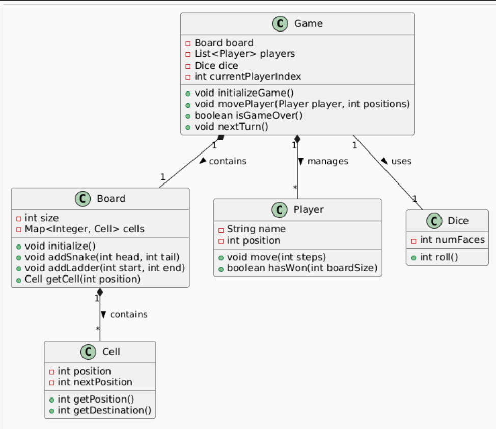

## Rough Core Requirements

A board with numbered cells (typically 1-100)  
\- Players taking turns rolling dice and moving  
\- Snakes that send players backward  
\- Ladders that move players forward  
\- First player to reach the final cell wins

&nbsp;

The key components would be: Game, Board, Players, Dice, Snakes, Ladders, and Cells.

Basic Flow: A player rolls a dice, moves their piece, checks if they landed on a snake or ladder, and adjusts position accordingly. Players take turns until someone reaches the final cell.

&nbsp;

## Class Design Overview

### Game

- **Fields**: Board, List of Players, Dice, currentPlayerIndex
- **Methods**:
    - `initializeGame()`: Sets up the board with snakes, ladders, and players
    - `movePlayer()`: Updates player position based on dice roll and handles snake/ladder effects
    - `isGameOver()`: Checks if any player has reached the final position
    - `nextTurn()`: Advances to the next player in the list

&nbsp;

### Board

- **Fields**: size, Map of position to Cell
- **Methods**:
    - `initialize()`: Creates all cells for the board
    - `addSnake(head, tail)`: Creates a snake from head position to tail position
    - `addLadder(start, end)`: Creates a ladder from start position to end position
    - `getCell(position)`: Returns the cell at a given position

&nbsp;

### Cell

- **Fields**: position, nextPosition (same as position unless it's a snake or ladder)
- **Methods**:
    - `getPosition()`: Returns the cell's position on the board
    - `getNextPosition()`: Returns where a player should end up after landing on this cell
    - `isSnake()/isLadder()`: Checks if this cell is a snake head or ladder start

&nbsp;

### Player

- **Fields**: name, position
- **Methods**:
    - `move(steps)`: Updates the player's position by given number of steps
    - `hasWon(boardSize)`: Checks if player has reached the final position

&nbsp;

&nbsp;

### Dice

- **Fields**: numFaces
- **Methods**:
    - `roll()`: Returns a random number between 1 and numFaces

&nbsp;

&nbsp;

## Design Patterns Used

1.  **Factory Pattern** (GameFactory):
    - Creates preconfigured game instances
    - Encapsulates the complex initialization logic for board setup
    - Makes it easy to create standard or custom game configurations
2.  **Optional - Singleton Pattern** (for Game):
    - Could ensure only one game instance exists
    - Useful if extending to networked gameplay

&nbsp;

