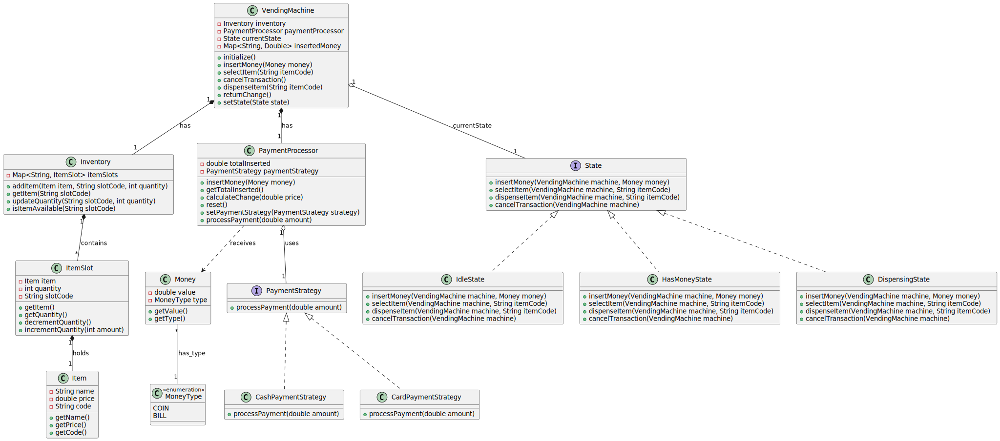

**Core Classes**:

- `VendingMachine`: Controls the overall system as a Singleton
- `Item`: Represents individual products with price and code
- `ItemSlot`: Manages product quantity at specific locations
- `Inventory`: Tracks all items and their availability
- `PaymentProcessor`: Handles money operations
- `State`: Manages different operational modes

&nbsp;

&nbsp;

&nbsp;