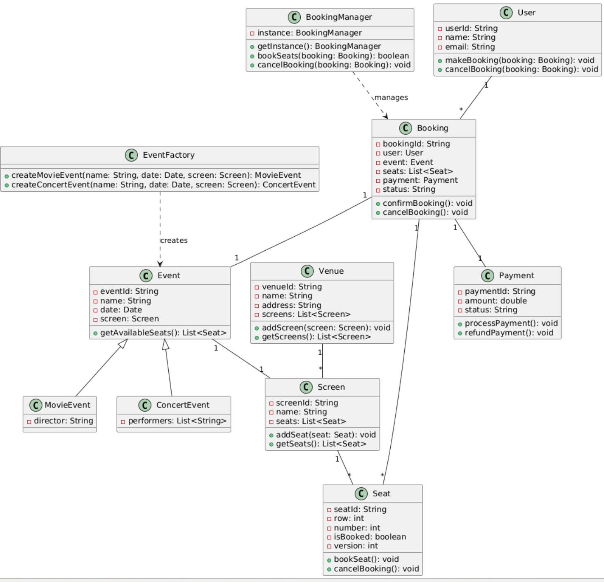

&nbsp;

### Requirements

A ticket booking system needs to:

- Allow users to browse and select events (e.g., movies, concerts).
- Enable seat selection and booking.
- Process payments securely.
- Manage bookings and cancellations.
- Prevent double-booking of seats (handle concurrency).

&nbsp;

* * *

&nbsp;

### Key Classes

Here are the main classes we'll design:

- **Event**: Represents an event (e.g., a movie or concert).
- **Venue**: The physical location hosting events, containing multiple screens.
- **Screen**: A specific hall or stage within the venue.
- **Seat**: Individual seats that users can book.
- **User**: The person making the booking.
- **Booking**: A user's reservation for specific seats.
- **Payment**: Manages payment transactions.

To manage these effectively, we’ll need:

- **EventFactory**: A factory to create different types of events.
- **BookingManager**: A singleton to centralize booking operations and handle concurrency.

&nbsp;

* * *

&nbsp;

### Class Relationships

The relationships between these classes are:

- **Venue** has many **Screens** (1-to-many).
- **Screen** has many **Seats** (1-to-many).
- **Event** is associated with one **Screen** (1-to-1).
- **User** can have many **Bookings** (1-to-many).
- **Booking** is associated with one **Event**, many **Seats**, and one **Payment** (1-to-1, 1-to-many, 1-to-1).
- **EventFactory** creates **Events**.
- **BookingManager** manages **Bookings**.

&nbsp;

* * *

&nbsp;

&nbsp;

&nbsp;

### Class Design : Attributes and Methods

#### ==Event== (Abstract/Base Class)

- Represents a generic event, serving as the base for specific event types (e.g., movies, concerts).
- **Attributes**:
    - eventId: String - Unique identifier for the event.
    - name: String - Event name (e.g., "Inception").
    - date: Date - Date and time of the event.
    - screen: Screen - The screen hosting the event.
- **Methods**:
    - getAvailableSeats(): List&lt;Seat&gt; - Returns a list of unbooked seats for the event.

&nbsp;

#### ==MovieEvent== (Extends Event)

- Represents a movie event, inheriting from Event.
- **Attributes**:
    - director: String - Director of the movie.  
         

#### ==ConcertEvent== (Extends Event)

- **Purpose**: Represents a concert event, inheriting from Event.
- **Attributes**:
    - performers: List&lt;String&gt; - List of performers in the concert.

&nbsp;

#### ==EventFactory== (Factory Pattern)

- **Purpose**: Encapsulates the creation of Event objects (e.g., MovieEvent, ConcertEvent) to hide instantiation logic and make the system extensible.
- **Methods**:
    - createMovieEvent(name: String, date: Date, screen: Screen): MovieEvent - Creates a MovieEvent.
    - createConcertEvent(name: String, date: Date, screen: Screen): ConcertEvent - Creates a ConcertEvent. 

&nbsp;                       

#### ==Venue==

- **Represents a physical location (e.g., a multiplex) hosting events.**
- **Attributes**:
    - venueId: Unique identifier (String)
    - name: Venue name (String)
    - address: Venue location (String)
    - screens: List of screens (List&lt;Screen&gt;)
- **Methods**:
    - addScreen(screen): Adds a screen to the venue
    - getScreens(): Returns the list of screens

#### ==Screen==

- **Represents a specific hall or stage within a venue.**
- **Attributes**:
    - screenId: Unique identifier (String)
    - name: Screen name (e.g., "Screen 1") (String)
    - seats: List of seats (List&lt;Seat&gt;)
- **Methods**:
    - addSeat(seat): Adds a seat to the screen
    - getSeats(): Returns the list of seats

&nbsp;

#### ==Seat==

- **Represents an individual seat that can be booked.**
- **Attributes**:
    - seatId: Unique identifier (String)
    - row: Row number (int)
    - number: Seat number in the row (int)
    - isBooked: Booking status (boolean)
    - version: Version number for concurrency control (int)
- **Methods**:
    - bookSeat(): Marks the seat as booked and increments the version.
    - cancelBooking(): Marks the seat as available and increments the version.

&nbsp;

#### ==User==

- **Represents a user booking tickets.**
- **Attributes**:
    - userId: Unique identifier (String)
    - name: User's name (String)
    - email: User's email (String)
- **Methods**:
    - makeBooking(booking): Creates a new booking
    - cancelBooking(booking): Cancels an existing booking

&nbsp;

#### ==Booking==

- **Represents a user’s reservation for an event.**
- **Attributes**:
    - bookingId: Unique identifier (String)
    - user: The user who made the booking (User)
    - event: The booked event (Event)
    - seats: List of booked seats (List&lt;Seat&gt;)
    - payment: Associated payment (Payment)
    - status: Booking status (e.g., "confirmed", "cancelled") (String)
- **Methods**:
    - confirmBooking(): Confirms the booking post-payment
    - cancelBooking(): Cancels the booking and releases seats

&nbsp;

#### ==Payment==

- **Manages payment transactions.**
- **Attributes**:
    - paymentId: Unique identifier (String)
    - amount: Payment amount (double)
    - status: Payment status (e.g., "pending", "completed") (String)
- **Methods**:
    - processPayment(): Processes the payment
    - refundPayment(): Refunds the payment if cancelled

&nbsp;

&nbsp;

&nbsp;**BookingManager**

- Manages all booking-related operations across the system, ensuring thread safety and consistency.
- **Attributes**:
    - instance: BookingManager - Static reference to the single instance (private).
- **Methods**:
    - getInstance(): BookingManager (Static)
        - Returns the single instance of BookingManager, creating it if it doesn’t exist.
    - bookSeats(booking: Booking): boolean
        - Attempts to book the seats specified in the Booking object. Returns true if successful, false otherwise (e.g., if seats are unavailable).
    - cancelBooking(booking: Booking): void
        - Cancels the specified booking, releasing the associated seats.

* * *

&nbsp;

### Concurrency Control

To prevent double-booking, we use **optimistic locking** on the Seat class via the version attribute:

- When a user tries to book a seat, the system checks the seat’s current version against the database.
- If they match, the booking proceeds, the seat is marked as booked, and the version increments.
- If they don’t match (another user booked it), the booking fails, and the user is prompted to select different seats.

&nbsp;

**Optimistic Locking** is a technique used to prevent such race conditions. It assumes that conflicts (like double-booking) are rare but still possible. Instead of locking resources upfront (as in **Pessimistic Locking** ), it allows operations to proceed normally but checks for conflicts **at the last moment** before committing changes.

* * *

### General Flow

Here’s how the system works in a typical ticket booking scenario (happy path):

1.  **Browse Events**:
    - The user browses available events (e.g., movies, concerts).
    - The system retrieves Event objects, created by EventFactory (e.g., EventFactory.createMovieEvent("Inception", date, screen)).
2.  **Select Event**:
    - The user selects an event, and the system calls event.getAvailableSeats() to display unbooked seats for the associated Screen.
3.  **Select Seats**:
    - The user chooses seats from the list. The system temporarily holds these seats to prevent other users from booking them (e.g., using a timeout mechanism).
4.  **Create Booking**:
    - A Booking object is created with the User, Event, selected Seats, and a Payment in "Pending" status.
    - The user initiates the booking via user.makeBooking(booking).
5.  **Book Seats**:
    - The BookingManager (accessed via BookingManager.getInstance()) handles the booking process.
    - BookingManager.bookSeats(booking) checks each seat’s version to ensure it’s not booked by another user (optimistic locking).
    - If all seats are available, each seat’s bookSeat() method is called, marking it as booked and incrementing its version.
6.  **Process Payment**:
    - The Payment object’s processPayment() method is invoked to process the payment (e.g., via a payment gateway).
    - If the payment succeeds, the Payment status updates to "Completed".
7.  **Confirm Booking**:
    - On successful payment, booking.confirmBooking() updates the Booking status to "Confirmed".
    - The user receives a confirmation (e.g., via email).
8.  **Handle Concurrency**:
    - If another user tries to book the same seat simultaneously, BookingManager detects a version mismatch during bookSeats(), and the booking fails.
    - The user is prompted to select different seats.
9.  **Cancel Booking (Optional)**:
    - If the user cancels, user.cancelBooking(booking) calls BookingManager.cancelBooking(booking).
    - The Booking status is set to "Cancelled", payment.refundPayment() is called, and each seat’s cancelBooking() method releases it, incrementing the version.

&nbsp;

&nbsp;

&nbsp;

* * *

### Design Patterns Used

#### Factory Pattern

- Used to create Event objects (e.g., MovieEvent, ConcertEvent) without exposing instantiation logic.
- Example: EventFactory with methods like createMovieEvent().

#### Singleton Pattern

- A BookingManager class (not detailed here) could be a singleton to centralize booking coordination.

#### Observer Pattern

- Optionally, notify users of booking updates (e.g., via email/SMS). We'll keep this as an extension for simplicity.

&nbsp;

* * *

&nbsp;