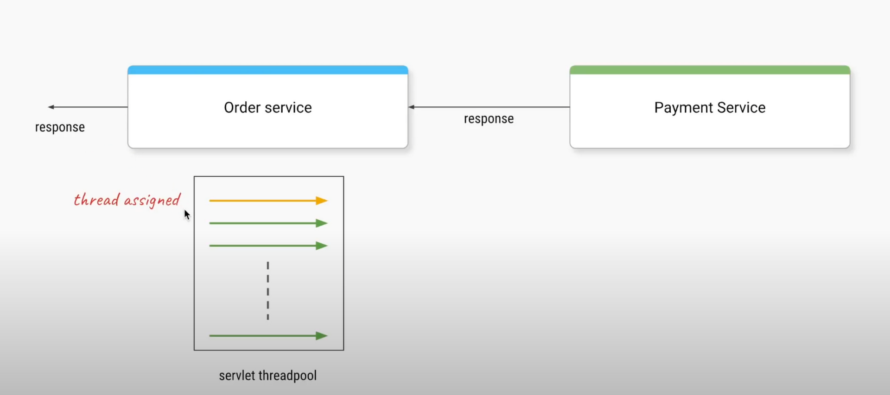
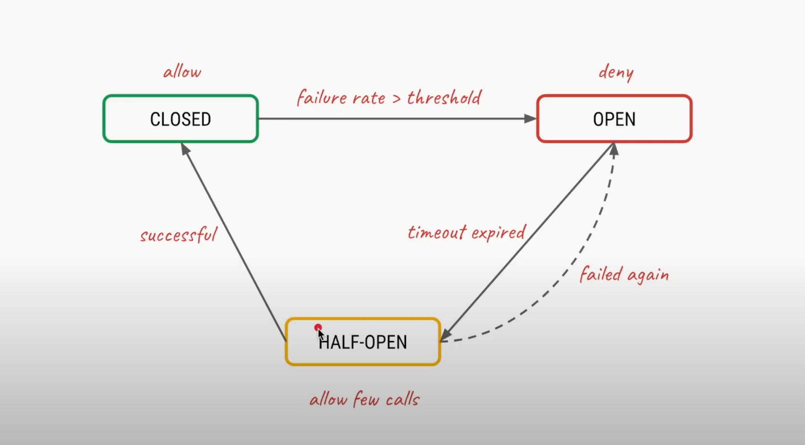

The circuit breaker pattern helps microservices handle failures more gracefully.

It detects when a service fails and stops calling it for a while, giving it time to recover. This way, the whole application doesn't get bogged down by repeated failures, improving overall reliability.

**Basic request flow :**



&nbsp;

- Client sends a request to create an order to the Order service.
- Order service processes the order and calls the Payment service to handle the payment.
- Payment service processes the payment and returns the result.
- Order service completes the order creation based on the payment result.

**Problems in Microservices Communication**

&nbsp;

### 1\. *Immediate Failures*

If the Payment service is down or unreachable, the Order service will receive an immediate failure response. This can lead to a poor user experience if not handled properly.

We can catch exceptions when the Payment microservice fails and handle them gracefully. For example:

```java
try {
    paymentService.processPayment(order);
} catch (PaymentException e) {
    // Handle payment failure
}
```

### 2\. *Timeout Failures*

Sometimes, the Payment service might be slow to respond, causing a timeout in the Order service. This ties up resources in the Order service and can lead to degraded performance.

### 3\. *Cascading Failures*

If the Payment service is consistently failing or timing out, it can lead to a cascading failure where the Order service also becomes unresponsive due to exhausted resources.

### 4\. *Overhead of Remote Calls*

Each call to the Payment service incurs network overhead. Making repeated calls to a failing service wastes resources and degrades overall system performance.

&nbsp;

**We can use an interceptor to wrap all requests with the circuit breaker pattern. This interceptor can catch and handle exceptions.**

&nbsp;

## Circuit Breaker Pattern

The Circuit Breaker pattern ==addresses these issues by wrapping remote service calls and monitoring their behavior==. It has three states:

1.  Closed: Normal operation, requests pass through to the remote service.
2.  Open: Requests fail fast without calling the remote service.
3.  Half-Open: A limited number of requests are allowed through to test if the remote service has recovered. the circuit breaker is allowing a limited number of "test" requests to pass through to the Payment Service to determine if the service has recovered.

&nbsp;  
  
<br/>

### How it works:

1.  The circuit starts in the Closed state.
2.  If failures exceed a threshold, the circuit Opens.(causing break in flow)
3.  In the Open state, requests fail fast without calling the remote service.
4.  After a timeout, the circuit moves to Half-Open state.
5.  In Half-Open state, a limited number of requests are allowed through.
6.  If these requests succeed, the circuit Closes; if they fail, it Opens again.

  
**Implementing Circuit Breaker with Resilience4j  
<br/>**

```java
import io.github.resilience4j.circuitbreaker.annotation.CircuitBreaker;

@Service
public class OrderService {

    @CircuitBreaker(name = "paymentService", fallbackMethod = "paymentFallback")
    public String placeOrder(Order order) {
        return paymentService.processPayment(order);
    }

    public String paymentFallback(Order order, Throwable t) {
        // Handle fallback logic
        return "Payment service is currently unavailable. Please try again later.";
    }
}
```

Resilience4j uses the Decorator pattern to wrap the target method with the circuit breaker functionality. This allows for easy configuration and customization of the circuit breaker behavior.

&nbsp;

### Custom Configuration

You can customize the Circuit Breaker behavior in your `application.yml`:  
<br/>

```yaml
resilience4j.circuitbreaker:
  instances:
    paymentService:
      registerHealthIndicator: true
      slidingWindowSize: 10
      minimumNumberOfCalls: 5
      permittedNumberOfCallsInHalfOpenState: 3
      waitDurationInOpenState: 10000
      failureRateThreshold: 50
```

&nbsp;

or we can also customize in java level also  
<br/><br/>

```java
@CircuitBreakerConfiguration(name = "paymentService")
public class PaymentCircuitBreakerConfiguration {

    @Bean
    public CircuitBreakerConfig circuitBreakerConfig() {
        return CircuitBreakerConfig.custom()
                .failureRateThreshold(50)
                .waitDurationInOpenState(Duration.ofSeconds(30))
                .permittedNumberOfCallsInHalfOpenState(2)
                .build();
    }
}
```

This java based configuration sets the failure rate threshold to 50%,  
the open state duration to 30 seconds,  
and allows 2 "test" requests in the half-open state.

&nbsp;

&nbsp;

**Request flow using circuit breaker:**  
<br/>

1.  The client sends a request to the Order Service.
2.  The Order Service invokes the Payment Service through the Circuit Breaker.
3.  If the Payment Service is available, the request is processed normally.
4.  If the Payment Service is unavailable or exhibiting high latency, the Circuit Breaker trips and fails the request immediately, without waiting for a response.
5.  The fallback method is called to provide a default response, such as returning a default payment status or offering an alternative payment method.