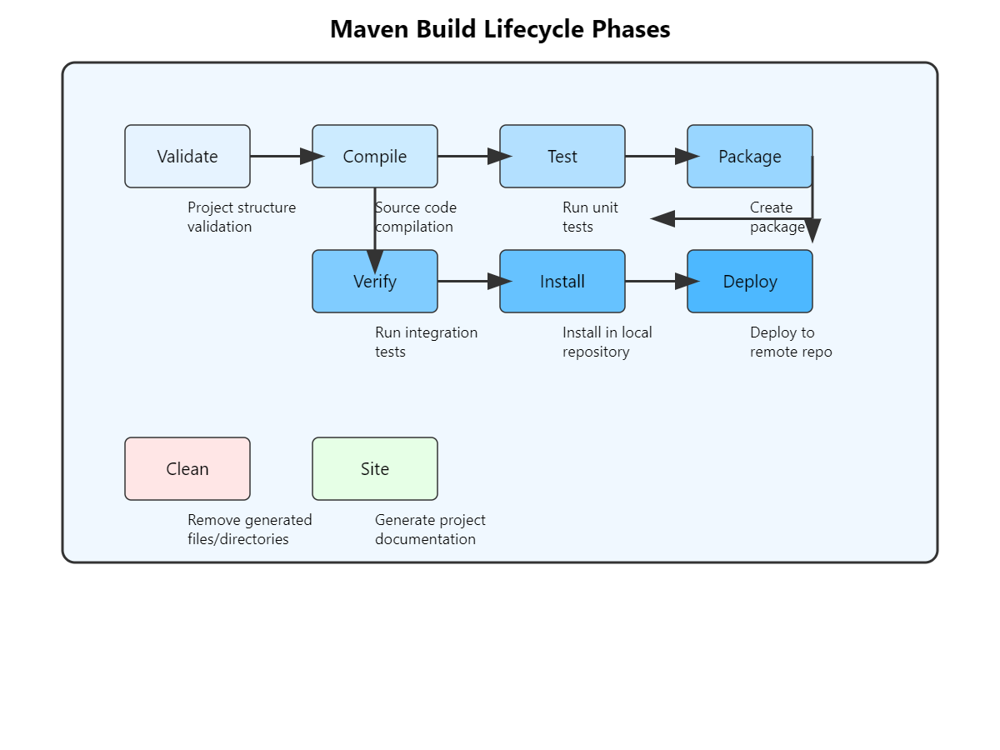

Maven defines three major lifecycles, each with specific phases tailored to manage different aspects of project management:

1.  **Default Lifecycle**:
    
    - Manages project deployment and includes phases from validating the project setup to deploying the final artifact.
2.  **Clean Lifecycle**:
    
    - Handles project cleaning, primarily removing files generated in previous builds.
    - Key phases: `pre-clean`, `clean`, `post-clean`.
3.  **Site Lifecycle**:
    
    - Handles the generation of project documentation and reports.
    - Key phases: `pre-site`, `site`, `post-site`, `site-deploy`.

  
<br/>  
<br/>

* * *

### Default Lifecycle 

The default lifecycle is the most commonly used and involves a series of sequential phases.  
We can add custom jobs to these phases by configuring plugins in the `build` section of the POM.  
<br/>

### 1\. Validate Phase  
<br/>

**Purpose**: This phase validates the project structure and checks if all necessary information is available. Maven does not enforce any specific checks, but custom validation tasks can be added using plugins.

**Example Use Case**: Adding code style checks or validating XML configurations before the build process.

**Adding Custom Jobs via Plugins**: To add custom checks in the validate phase, you can use the `maven-antrun-plugin` or any other validation-specific plugins.

```xml
<build>
    <plugins>
        <plugin>
            <groupId>org.apache.maven.plugins</groupId>
            <artifactId>maven-antrun-plugin</artifactId>
            <version>1.8</version>
            <executions>
                <execution>
                    <id>validate-code-style</id>
                    <phase>validate</phase>
                    <goals>
                        <goal>run</goal>
                    </goals>
                    <configuration>
                        <tasks>
                            <!-- Example: Executing a custom validation script -->
                            <echo message="Validating project structure and code style..." />
                            <!-- Add custom checks here -->
                        </tasks>
                    </configuration>
                </execution>
            </executions>
        </plugin>
    </plugins>
</build>

```

Maven command:

```bash
mvn validate

```

- **Execution ID**: A unique identifier for the plugin execution (`validate-code-style`).
- **Phase**: Specifies the phase during which the plugin should run (`validate`).
- **Goals**: Specifies what the plugin should do (`run` for the Antrun plugin).
- **Tasks**: Contains the specific actions to perform, like executing scripts or commands.

* * *

### 2\. Compile Phase

**Purpose**: Compiles the source code of the project.

**Example Use Case**: Compiling Java code and ensuring all dependencies are available.

**Adding Custom Jobs via Plugins**: You can customize the compile phase by adding additional compiler settings or running pre-compilation checks.

```xml
<build>
    <plugins>
        <plugin>
            <groupId>org.apache.maven.plugins</groupId>
            <artifactId>maven-compiler-plugin</artifactId>
            <version>3.8.1</version>
            <executions>
                <execution>
                    <id>default-compile</id>
                    <phase>compile</phase>
                    <goals>
                        <goal>compile</goal>
                    </goals>
                    <configuration>
                        <source>17</source>
                        <target>17</target>
                        <encoding>UTF-8</encoding>
                    </configuration>
                </execution>
            </executions>
        </plugin>
    </plugins>
</build>

```

&nbsp;

```bash
mvn compile

```

- **Execution ID**: `default-compile` is the identifier for this plugin execution.
- **Phase**: Runs during the `compile` phase.
- **Goals**: Executes the `compile` goal of the Maven Compiler Plugin.
- **Configuration**: Sets the Java source and target versions, ensuring compatibility with Java 17.

  
<br/>

* * *

### 3\. Test Phase

**Purpose**: Runs unit tests using a suitable testing framework like JUnit or TestNG.

**Example Use Case**: Executing unit tests to validate that the code behaves as expected.

**Adding Custom Jobs via Plugins**: You can configure additional test parameters or set up test reports.  
<br/>

```xml
<build>
    <plugins>
        <plugin>
            <groupId>org.apache.maven.plugins</groupId>
            <artifactId>maven-surefire-plugin</artifactId>
            <version>2.22.2</version>
            <executions>
                <execution>
                    <id>default-test</id>
                    <phase>test</phase>
                    <goals>
                        <goal>test</goal>
                    </goals>
                    <configuration>
                        <includes>
                            <include>**/*Test.java</include>
                        </includes>
                    </configuration>
                </execution>
            </executions>
        </plugin>
    </plugins>
</build>

```

&nbsp;

```bash
mvn test
```

&nbsp;

- **Execution ID**: `default-test`.
- **Phase**: Executes during the `test` phase.
- **Goals**: Runs the `test` goal of the Maven Surefire Plugin.
- **Configuration**: Specifies which test classes to include in the test execution.

* * *

#### 4\. **Package Phase**

**Purpose**: Packages the compiled code into a distributable format, such as a JAR or WAR file.

**Example Use Case**: Creating an executable JAR for a Spring Boot application.

**Adding Custom Jobs via Plugins**: The packaging can be customized by using plugins like `maven-jar-plugin` or `spring-boot-maven-plugin`.

&nbsp;

```xml
<build>
    <plugins>
        <plugin>
            <groupId>org.springframework.boot</groupId>
            <artifactId>spring-boot-maven-plugin</artifactId>
            <version>3.1.6</version>
            <executions>
                <execution>
                    <id>default-package</id>
                    <phase>package</phase>
                    <goals>
                        <goal>repackage</goal>
                    </goals>
                    <configuration>
                        <mainClass>com.example.MyApplication</mainClass>
                    </configuration>
                </execution>
            </executions>
        </plugin>
    </plugins>
</build>

```

```bash
mvn package

```

  
<br/><br/>

- **Execution ID**: `default-package`.
- **Phase**: Runs during the `package` phase.
- **Goals**: Executes the `repackage` goal, which repackages the application as an executable JAR with dependencies.
- **Configuration**: Specifies the main class to be used when running the executable JAR.

&nbsp;

* * *

### 5\. **Verify Phase**

**Purpose**: This phase runs checks on the results of integration tests to ensure that the quality criteria are met before the package is deployed.

**Example Use Case**: Running static code analysis or other quality gates to validate code quality before proceeding.

**Adding Custom Jobs via Plugins**: You can use plugins like the `maven-verify-plugin` or a static analysis tool like SonarQube to add custom jobs during the verify phase.

```xml
<build>
    <plugins>
        <plugin>
            <groupId>org.sonarsource.scanner.maven</groupId>
            <artifactId>sonar-maven-plugin</artifactId>
            <version>3.9.0.2155</version>
            <executions>
                <execution>
                    <id>default-verify</id>
                    <phase>verify</phase>
                    <goals>
                        <goal>sonar</goal>
                    </goals>
                    <configuration>
                        <sonar.host.url>http://localhost:9000</sonar.host.url>
                        <sonar.login>${env.SONAR_TOKEN}</sonar.login>
                    </configuration>
                </execution>
            </executions>
        </plugin>
    </plugins>
</build>

```

&nbsp;

```bash
mvn verify

```

- **Execution ID**: `default-verify`.
- **Phase**: Runs during the `verify` phase.
- **Goals**: Executes the `sonar` goal, which runs SonarQube analysis on the project.
- **Configuration**: Specifies SonarQube server details and authentication.

* * *

#### 6\. **Install Phase**

**Purpose**: This phase installs the package into the local Maven repository (`~/.m2/repository`), making it available for use as a dependency in other projects on the local machine.

**Example Use Case**: Preparing the built artifact for local development and testing, ensuring dependencies are resolved locally without requiring remote repository access.

**Adding Custom Jobs via Plugins**: Use plugins like the `maven-install-plugin` to add custom installation steps, such as installing additional metadata or performing environment-specific tasks.

&nbsp;

```xml
<build>
    <plugins>
        <plugin>
            <groupId>org.apache.maven.plugins</groupId>
            <artifactId>maven-install-plugin</artifactId>
            <version>2.5.2</version>
            <executions>
                <execution>
                    <id>default-install</id>
                    <phase>install</phase>
                    <goals>
                        <goal>install</goal>
                    </goals>
                    <configuration>
                        <skip>false</skip>
                    </configuration>
                </execution>
            </executions>
        </plugin>
    </plugins>
</build>

```

```bash
mvn install
```

**Explanation**:

- **Execution ID**: `default-install`.
- **Phase**: Runs during the `install` phase.
- **Goals**: Executes the `install` goal, which installs the built artifact into the local repository.
- **Configuration**: Can include additional configurations like skipping installation in specific profiles or conditions.

* * *

#### 7\. **Deploy Phase**

**Purpose**: The deploy phase copies the final package to a remote repository, making it available to other developers and CI/CD pipelines. This phase usually follows the install phase, assuming all quality checks have passed.

**Example Use Case**: Deploying artifacts to a central Nexus or Artifactory repository, making them available for other teams or projects.

**Adding Custom Jobs via Plugins**: The `maven-deploy-plugin` is used to handle the deployment process, and you can customize it extensively to handle various deployment requirements.

&nbsp;

```xml
<build>
    <plugins>
        <plugin>
            <groupId>org.apache.maven.plugins</groupId>
            <artifactId>maven-deploy-plugin</artifactId>
            <version>2.8.2</version>
            <executions>
                <execution>
                    <id>default-deploy</id>
                    <phase>deploy</phase>
                    <goals>
                        <goal>deploy</goal>
                    </goals>
                    <configuration>
                        <altDeploymentRepository>internal.repo::default::http://repo.example.com/releases</altDeploymentRepository>
                    </configuration>
                </execution>
            </executions>
        </plugin>
    </plugins>
</build>

```

&nbsp;

```bash
mvn deploy

```

&nbsp;

- **Execution ID**: `default-deploy`.
- **Phase**: Runs during the `deploy` phase.
- **Goals**: Executes the `deploy` goal, which uploads the artifact to a remote repository.
- **Configuration**: Specifies an alternative deployment repository if needed, overriding default settings in the POM.

&nbsp;

&nbsp;