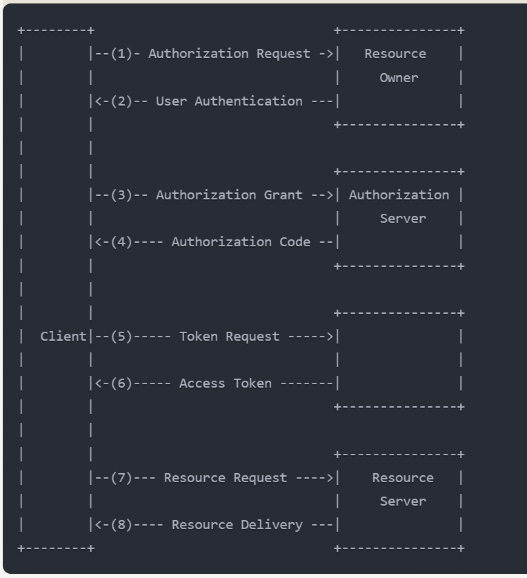

Real-Life Scenario: Social Media Photo Printing Service

Let's consider a scenario where you want to use a photo printing service to create physical prints of your Facebook photos. We'll call this service "PrintMyPics."

Key Entities in OAuth 2.0:

1.  Resource Owner: You (the user who owns the Facebook photos)
2.  Client: PrintMyPics (the application requesting access to your photos)
3.  Authorization Server: Facebook's OAuth server
4.  Resource Server: Facebook's API server that holds your photos

&nbsp;

* * *

&nbsp;

OAuth 2.0 Flow (Authorization Code Grant):

1.  Authorization Request:
    - You visit PrintMyPics website and click "Print my Facebook photos."
    - PrintMyPics redirects you to Facebook's login page.
2.  User Authentication:
    - You log in to Facebook (if not already logged in).
3.  Authorization Grant:
    - Facebook asks if you want to grant PrintMyPics access to your photos.
    - You approve the request.
4.  Authorization Code:
    - Facebook redirects you back to PrintMyPics with an authorization code.
5.  Token Request:
    - PrintMyPics sends the authorization code to Facebook's token endpoint.
6.  Access Token:
    - Facebook verifies the code and sends back an access token to PrintMyPics.
7.  Resource Access:
    - PrintMyPics uses this access token to request your photos from Facebook's API.
8.  Resource Delivery:
    - Facebook's API verifies the token and sends the requested photos to PrintMyPics.

&nbsp;

&nbsp;

Benefits in Our Scenario:

1.  Security: You never share your Facebook password with PrintMyPics.
2.  Limited Access: PrintMyPics only gets access to your photos, not your entire Facebook account.
3.  Revocable Access: You can revoke PrintMyPics' access from your Facebook settings at any time.
4.  Time-Limited: The access token expires after a set time, limiting the window of potential misuse.

&nbsp;