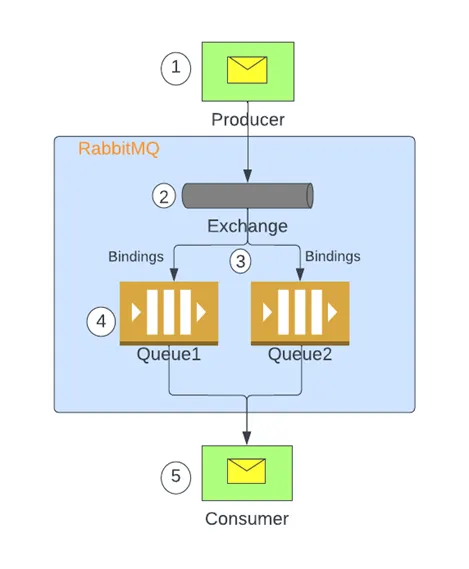

&nbsp;

&nbsp;

### Exchanges

Exchanges are message routing agents. They receive messages from producers and route them to queues based on rules defined by "bindings."

- **Direct Exchange**:
    - Routes messages to queues based on an exact match between the routing key and binding key
    - Good for direct point-to-point communication
    - Default exchange (unnamed) is a direct exchange that automatically binds to all queues using queue name as routing key
- **Fanout Exchange**:
    - Broadcasts messages to all bound queues regardless of routing key
    - **Ideal for publish/subscribe patterns where all subscribers should receive the message**
    - Most efficient exchange type as no routing evaluation is needed
- **Topic Exchange**:
    - Routes messages based on wildcard matching between routing key and pattern
    - Routing keys are typically dot-separated strings like "stock.nyse.ibm"
    - `*` matches exactly one word, `#` matches zero or more words
    - Powerful for content-based routing while maintaining loose coupling

&nbsp;

Exchanges have properties including:

- **Name**: Unique identifier within a vHost
- **Durability**: Whether they survive broker restarts
- **Auto-delete**: Whether they're removed when no more bindings exist
- **Arguments**: Optional parameters for plugins or specialized behavior

&nbsp;

* * *

### Queues

Queues are where messages live until consumed by applications. They have several important characteristics:

1.  **Properties**:
    - **Name**: Can be server-generated or explicitly specified
    - **Durable**: Whether the queue survives broker restarts
    - **Auto-delete**: Whether the queue is deleted when last consumer disconnects
2.  **Message Ordering**:
    - Messages are delivered in FIFO order by default (with some exceptions)
    - Priority queues can alter this ordering
3.  **Message Lifecycle**:
    - Messages remain in queues until acknowledged by consumers
    - Messages can be requeued if a consumer fails to process them
    - TTL (Time-To-Live) can be set for messages or queues  
         

* * *

### Bindings

Bindings connect exchanges to queues and specify how messages should be routed. A binding consists of:

- The source exchange
- The destination queue
- An optional routing key (or pattern)

* * *

&nbsp;

### Prefetch Count

&nbsp;

****Prefetch count** in RabbitMQ controls how many messages a consumer can receive and hold (unacknowledged) at the same time before it must acknowledge one to get more  
 **

**How It Works**

- When a consumer connects, RabbitMQ can send it multiple messages at once.
    
- The **prefetch count** sets a limit: RabbitMQ will not send more than this number of unacknowledged messages to the consumer.
    
- This helps balance the load between consumers and prevents any single consumer from being overwhelmed or hogging all messages.
    

&nbsp;

### Example:

Suppose you set the prefetch count to **2** for a consumer:

1.  **Consumer connects** to the queue.
    
2.  RabbitMQ sends **2 messages** to the consumer.
    
3.  The consumer processes the first message, but does **not acknowledge** it yet.
    
4.  The consumer processes the second message, but still **no acknowledgment**.
    
5.  **No more messages** will be sent to this consumer until it acknowledges at least one of the two messages.
    
6.  Once the consumer acknowledges a message, RabbitMQ sends the next message from the queue.
    

**If you set prefetch count to 1:**

- The consumer receives **only one message at a time** and must acknowledge it before getting the next one.
    
- This ensures **fair distribution** among multiple consumers (each gets one message at a time)[1](https://www.cloudamqp.com/blog/how-to-optimize-the-rabbitmq-prefetch-count.html)[5](https://www.cloudamqp.com/blog/part1-rabbitmq-best-practice.html).
    

&nbsp;

**All pre-fetched messages are removed from the queue and invisible to other consumers.**

**Sent messages are cached by the RabbitMQ client library (in the consumer) until processed."**

&nbsp;

Setting the right prefetch count depends on:

- Consumer processing speed
- Message processing complexity
- Available consumer resources
- Desired throughput vs. distribution balance

* * *

## Message Flow in RabbitMQ

&nbsp;

1.  Producer **publishes messages to exchange** via a channel established between them at the time of application startup.
2.  Exchange receives the message and **finds appropriate bindings** based on message attributes and exchange types.
3.  Selected binding is then used to **route messages to intended queues.**
4.  The message stays in the queue until handled by the consumer.
5.  Consumers receive the messages using channels established usually at application startup.

&nbsp;

&nbsp;

* * *

&nbsp;