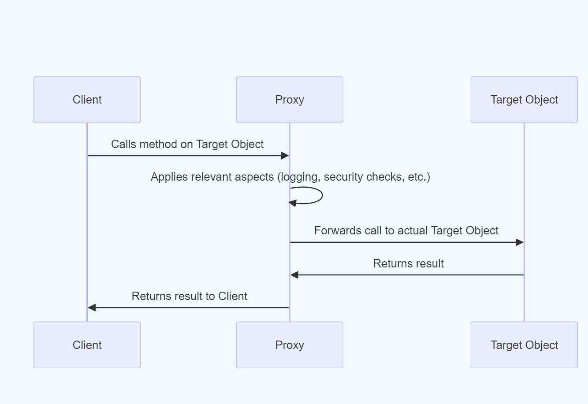

Spring AOP uses the Proxy design pattern to implement aspects. A proxy is an object that looks like another object but adds special functionality.

There are two types of proxies in Spring AOP:

1.  JDK dynamic proxies (for interfaces) :  
    When your class implements one or more interfaces, Spring AOP creates a new class at runtime that implements those same interfaces. This dynamically created class is the proxy.  
     JDK dynamic proxies are built into Java and don't require additional libraries.  
     JDK dynamic proxies can only be created for classes that implement interfaces. If your class doesn't implement any interfaces, you'll need to use CGLIB proxies.  
      
2.  CGLIB proxies: Used when your code is already a complete "thing" (classes).  
    When your class doesn't implement any interfaces, Spring AOP uses a library called CGLIB to create a proxy. CGLIB generates a subclass of your original class at runtime. This subclass is the proxy, and it can override the original class's methods to weave in the aspects' advice.  
       

In this diagram:

- The Client calls methods on what it thinks is the Target Object
- The Proxy intercepts these calls
- The Proxy applies any relevant aspects (like logging or security checks)
- The Proxy then forwards the call to the actual Target Object

&nbsp;

&nbsp;