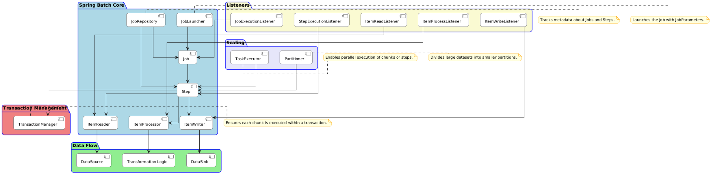
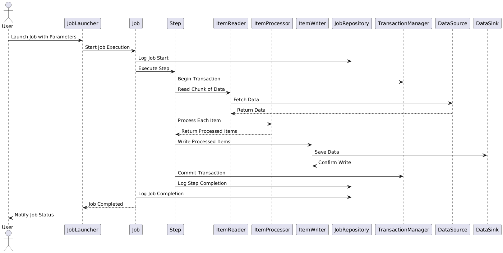

  
  

1.  **Job Launching** :
    
    - The `JobLauncher` starts a job by invoking the `run()` method with a `Job` and `JobParameters`.
    - Example: `jobLauncher.run(processOrdersJob, new JobParametersBuilder().addString("input.file", "orders.csv").toJobParameters());`
2.  **Job Execution** :
    
    - The `Job` retrieves its configuration from the `JobRepository` and starts executing its steps sequentially or in parallel (depending on the configuration).
3.  **Step Execution** :
    
    - Each `Step` executes in a loop, processing data in chunks:
        - **Chunk-Oriented Processing** :
            - The `ItemReader` reads a chunk of data (e.g., 100 items).
            - The `ItemProcessor` processes each item in the chunk (optional).
            - The `ItemWriter` writes the processed items to the destination.
        - The `TransactionManager` ensures that the entire chunk is executed within a transaction. If any item fails, the transaction is rolled back.
4.  **Metadata Tracking** :
    
    - The `JobRepository` tracks the progress of the job and step executions. It stores information such as:
        - Job status (e.g., STARTED, COMPLETED, FAILED).
        - Step status (e.g., STARTED, COMPLETED, FAILED).
        - Number of items read, processed, and written.
5.  **Listeners** :
    
    - Listeners are invoked at various points in the lifecycle of the job and steps:
        - Before/after job execution.
        - Before/after step execution.
        - Before/after reading, processing, or writing an item.
6.  **Scaling** :
    
    - For large datasets, the `Partitioner` divides the data into smaller partitions.
    - The `TaskExecutor` processes these partitions in parallel, improving throughput.

