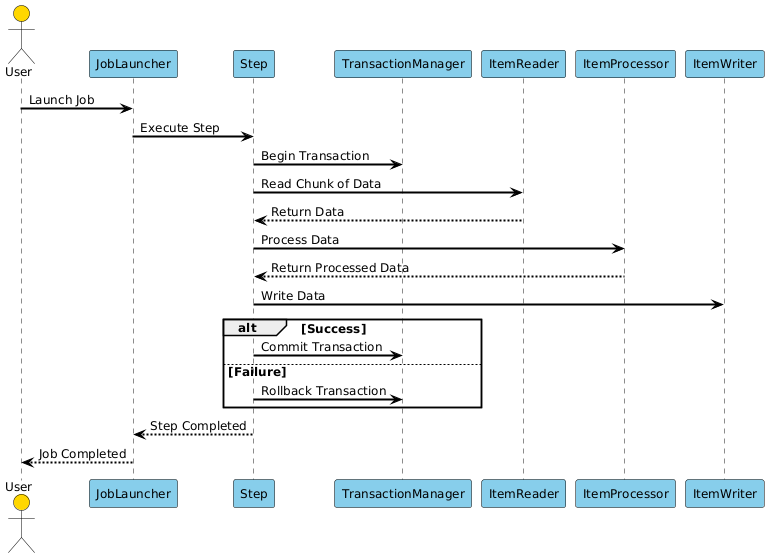

### **1\. What Transaction Management Does**

In Spring Batch, **Transaction Management** ensures that each chunk of data is processed reliably. If something goes wrong during processing, the transaction is rolled back, and the system can recover gracefully.

#### **Key Goals** :

- **Data Integrity** : Ensure that incomplete or erroneous data is not written to the target system.
- **Fault Tolerance** : Handle failures gracefully by retrying or skipping problematic records.
- **Performance** : Minimize the overhead of managing transactions while processing large datasets.

* * *

### **2\. How It Works in Spring Batch**

Spring Batch integrates seamlessly with Spring’s **declarative transaction management** . Each **chunk** of data is executed within a transaction. Here’s how it works:

1.  **Start Transaction** :
    
    - When a chunk begins processing, a transaction is started.
2.  **Read, Process, Write** :
    
    - The `ItemReader` reads data.
    - The `ItemProcessor` processes the data.
    - The `ItemWriter` writes the data.
3.  **Commit or Rollback** :
    
    - If all operations succeed, the transaction is committed.
    - If any operation fails, the transaction is rolled back, and the chunk is retried or skipped based on the configuration.

* * *

### **3\. Chunk-Oriented Transactions**

Spring Batch uses a **chunk-oriented processing model** , where data is processed in small batches (chunks). Each chunk is executed within a transaction.

#### **Example** :

- Suppose you’re processing 1,000 records with a chunk size of 10.
- Spring Batch will:
    - Read 10 records.
    - Process the 10 records.
    - Write the 10 records.
    - Commit the transaction.
- This process repeats until all 1,000 records are processed.

#### **Why Use Chunk-Oriented Transactions?**

- **Efficiency** : Processing data in chunks reduces the number of I/O operations and improves performance.
- **Reliability** : If a chunk fails, only that chunk is rolled back, not the entire job.

* * *

### **4\. Error Handling and Rollbacks**

Spring Batch provides robust mechanisms for handling errors during batch processing. Here are some common strategies:

#### **Retry** :

- If an operation fails due to a transient error (e.g., network timeout), Spring Batch can retry the operation a specified number of times.
- Example:
    
    ```java
    .faultTolerant()
    .retry(Exception.class)
    .retryLimit(3)
    ```
    

#### **Skip** :

- If an item cannot be processed (e.g., invalid data), Spring Batch can skip it and continue processing the rest of the chunk.
- Example:
    
    ```java
    .faultTolerant()
    .skip(Exception.class)
    .skipLimit(10)
    ```
    

#### **Rollback** :

- If an unrecoverable error occurs, Spring Batch rolls back the transaction and marks the job as failed.
    
- You can customize which exceptions trigger a rollback:
    
    ```java
    .faultTolerant()
    .noRollback(CustomException.class)
    ```
    



* * *

### **5\. Configuration Example**

Here’s how you configure transaction management and error handling in a Spring Batch step:

```java
@Bean
public Step processOrdersStep(StepBuilderFactory stepBuilderFactory, ItemReader<Order> reader,
                              ItemProcessor<Order, Invoice> processor, ItemWriter<Invoice> writer) {
    return stepBuilderFactory.get("processOrdersStep")
                             .<Order, Invoice>chunk(10)
                             .reader(reader)
                             .processor(processor)
                             .writer(writer)
                             .faultTolerant() // Enable fault tolerance
                             .retry(Exception.class) // Retry on exceptions
                             .retryLimit(3) // Retry up to 3 times
                             .skip(Exception.class) // Skip on exceptions
                             .skipLimit(10) // Allow up to 10 skips
                             .noRollback(CustomException.class) // Don't rollback for CustomException
                             .build();
}
```