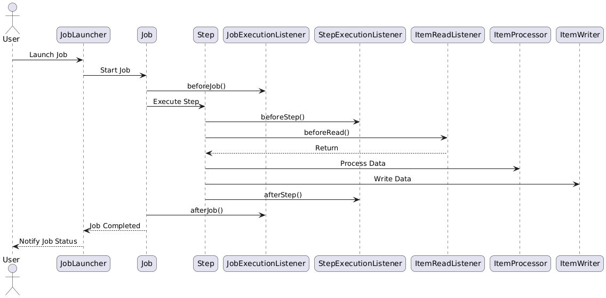

### **1\. What Are Listeners?**

Listeners in Spring Batch allow you to execute custom logic at various points during the execution of a job or step. They are particularly useful for logging, monitoring, and handling events like job start, job completion, or item processing errors.

#### **Key Benefits** :

- **Logging** : Log the start and end of jobs or steps.
- **Monitoring** : Track progress and performance metrics.
- **Error Handling** : Perform custom actions when errors occur.
- **Custom Actions** : Execute additional logic (e.g., sending notifications) at specific points in the lifecycle.

&nbsp;

&nbsp;

&nbsp;

* * *

### **2\. Types of Listeners**

Spring Batch provides several types of listeners, each targeting a different level of granularity:

#### **2.1 JobExecutionListener**

- **Purpose** : Hooks into the lifecycle of a job.
- **Methods** :
    - `beforeJob(JobExecution jobExecution)`: Called before the job starts.
    - `afterJob(JobExecution jobExecution)`: Called after the job completes.

#### **2.2 StepExecutionListener**

- **Purpose** : Hooks into the lifecycle of a step.
- **Methods** :
    - `beforeStep(StepExecution stepExecution)`: Called before the step starts.
    - `afterStep(StepExecution stepExecution)`: Called after the step completes.

#### **2.3 ItemReadListener**

- **Purpose** : Hooks into the lifecycle of reading items.
- **Methods** :
    - `beforeRead()`: Called before an item is read.
    - `afterRead(T item)`: Called after an item is successfully read.
    - `onReadError(Exception ex)`: Called if an error occurs while reading.

#### **2.4 ItemProcessListener**

- **Purpose** : Hooks into the lifecycle of processing items.
- **Methods** :
    - `beforeProcess(T item)`: Called before an item is processed.
    - `afterProcess(T item, S result)`: Called after an item is successfully processed.
    - `onProcessError(T item, Exception e)`: Called if an error occurs while processing.

#### **2.5 ItemWriteListener**

- **Purpose** : Hooks into the lifecycle of writing items.
- **Methods** :
    - `beforeWrite(List<? extends S> items)`: Called before items are written.
    - `afterWrite(List<? extends S> items)`: Called after items are successfully written.
    - `onWriteError(Exception exception, List<? extends S> items)`: Called if an error occurs while writing.

&nbsp;

&nbsp;