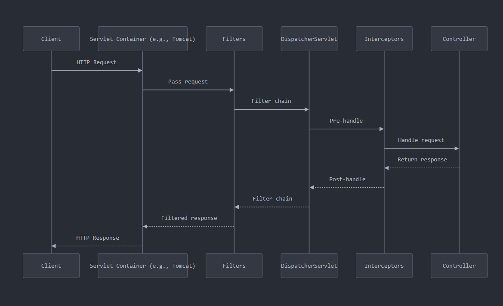

&nbsp;

## 1\. Client Request

The process begins when a client (e.g., web browser, mobile app) sends an HTTP request to the Spring Boot application.

## 2\. Servlet Container

The request first reaches the Servlet Container, such as Apache Tomcat. A Servlet Container is a web server that provides an environment for Java servlets to run.

### Key Term: Servlet

A servlet is a Java class that handles web requests. It receives requests from clients, processes them, and sends back responses.

## 3\. Filters

Before reaching the DispatcherServlet, the request passes through a chain of Filters.

### Key Term: Filter

Filters are components that intercept requests before they reach the servlet (or responses before they return to the client). They can modify the request/response or perform actions like logging, authentication, or compression.

## 4\. DispatcherServlet

The DispatcherServlet is a front controller in Spring MVC that handles all incoming HTTP requests.

### Key Term: DispatcherServlet

It's a special servlet that centralizes request handling, dispatching requests to appropriate handlers (usually controllers) based on the request URL.

## 5\. Interceptors

After the DispatcherServlet, but before reaching the controller, the request goes through Interceptors.

### Key Term: Interceptor

Interceptors can perform operations before the request reaches the controller, after the controller has processed it, or after the complete request has been processed.

## 6\. Controller

The Controller handles the request, performs necessary operations, and prepares the response.

### Key Term: Controller

In Spring MVC, a controller is a component that handles web requests, processes them (often interacting with services and repositories), and returns a response.

## 7\. Response Path

The response follows the reverse path: Controller → Interceptors → DispatcherServlet → Filters → Servlet Container → Client.

# Use Cases

1.  **Filters**:
    - Authentication and authorization
    - Request/response logging
    - CORS handling
    - Request/response transformation
2.  **Interceptors**:
    - Handling cross-cutting concerns (e.g., logging, auditing)
    - Modifying the ModelAndView
    - Validating user session
3.  **Controllers**:
    - Handling specific business logic
    - Processing form submissions
    - Returning API responses
    - Rendering views

# Summary

In a Spring Boot application, an HTTP request flows through several layers:

1.  It first reaches the Servlet Container (e.g., Tomcat).
2.  Then it passes through a chain of Filters for pre-processing.
3.  The DispatcherServlet receives the request and determines which handler (Controller) should process it.
4.  Before reaching the Controller, the request may be intercepted by Interceptors.
5.  The Controller processes the request and prepares a response.
6.  The response then flows back through Interceptors, DispatcherServlet, and Filters before being sent back to the client.

This layered approach allows for separation of concerns, making the application more modular and easier to maintain. Filters and Interceptors provide hooks for cross-cutting concerns, while Controllers focus on specific business logic.