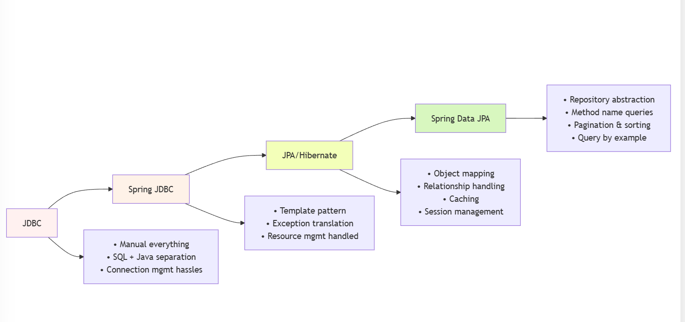

###   
  
<br/>Plain JDBC Example and Problems

Plain JDBC is the basic way to connect Java to databases, like connecting to MySQL to fetch book titles. Here's a simple example:

&nbsp;

```java
public class DatabaseConnection {

    private static final String JDBC_DRIVER = "org.h2.Driver"; // Example for H2 database
    private static final String DB_URL = "jdbc:h2:~/test"; // Example for H2 database
    private static final String USER = "sa"; // Example user
    private static final String PASS = ""; // Example password

    public Connection getConnection() {
        try {
            Class.forName(JDBC_DRIVER);
            return DriverManager.getConnection(DB_URL, USER, PASS);
        } catch (ClassNotFoundException | SQLException e) {
            e.printStackTrace(); // Handle the exception properly in a real application
            return null;
        }
    }
}
```

&nbsp;

&nbsp;

```java
public class DatabaseOperations {

    private DatabaseConnection dbConnection;

    public DatabaseOperations(DatabaseConnection dbConnection) {
        this.dbConnection = dbConnection;
    }

    public void createTable() {
        try (Connection connection = dbConnection.getConnection();
             Statement statement = connection.createStatement()) {

            String sql = "CREATE TABLE Users (id INT AUTO_INCREMENT PRIMARY KEY, name VARCHAR(255), age INT)";
            statement.executeUpdate(sql);
            System.out.println("Table created successfully.");

        } catch (SQLException e) {
            e.printStackTrace(); // Handle the exception properly in a real application
        }
    }

    public void insertUser(String name, int age) {
        try (Connection connection = dbConnection.getConnection();
             PreparedStatement preparedStatement = connection.prepareStatement("INSERT INTO Users (name, age) VALUES (?, ?)")) {

            preparedStatement.setString(1, name);
            preparedStatement.setInt(2, age);
            preparedStatement.executeUpdate();
            System.out.println("User inserted successfully.");

        } catch (SQLException e) {
            e.printStackTrace(); // Handle the exception properly in a real application
        }
    }

    public void readUsers() {
        try (Connection connection = dbConnection.getConnection();
             PreparedStatement preparedStatement = connection.prepareStatement("SELECT * FROM Users");
             ResultSet resultSet = preparedStatement.executeQuery()) {

            while (resultSet.next()) {
                int id = resultSet.getInt("id");
                String name = resultSet.getString("name");
                int age = resultSet.getInt("age");
                System.out.println("User [ID: " + id + ", Name: " + name + ", Age: " + age + "]");
            }

        } catch (SQLException e) {
            e.printStackTrace(); // Handle the exception properly in a real application
        }
    }
}

```

&nbsp;

However, this approach has issues:

- **Boilerplate Overload**: Notice how much code is dedicated to connection management, statement creation, and resource cleanup versus actual business logic.
- **Manual Resource Management**: We have to manually close connections, statements, and result sets in finally blocks, which is error-prone.
- **Exception Handling Complexity**: SQLException is a checked exception that must be caught or declared, leading to cluttered code.
- **Manual Mapping**: We have to manually map database rows to Java objects by working with the ResultSet.
- **SQL String Literals**: SQL queries are written as strings, which are not checked at compile time.
- **No Object-Relational Mapping**: There's a disconnect between our object model and the relational database structure.

&nbsp;

* * *

### Enter Spring JDBC: The First Improvement

Spring JDBC aims to simplify the process by handling the boilerplate code for you. Think of it as having pre-fabricated walls for your house - still not a complete solution, but much better than doing everything manually.

&nbsp;

```java
import org.springframework.beans.factory.annotation.Autowired;
import org.springframework.jdbc.core.JdbcTemplate;
import org.springframework.stereotype.Repository;

import java.util.List;

@Repository
public class UserRepository {

    private final JdbcTemplate jdbcTemplate;

    @Autowired
    public UserRepository(JdbcTemplate jdbcTemplate) {
        this.jdbcTemplate = jdbcTemplate;
    }

    public void createTable() {
        jdbcTemplate.execute("CREATE TABLE Users (userId INT AUTO_INCREMENT PRIMARY KEY, userName VARCHAR(255), age INT)");
    }

    public void insertUser(String userName, int age) {
        String insertQuery = "INSERT INTO Users (userName, age) VALUES (?, ?)";
        jdbcTemplate.update(insertQuery, userName, age);
    }

    public List<User> getUsers() {
        String selectQuery = "SELECT * FROM Users";
        return jdbcTemplate.query(selectQuery, (rs, rowNum) -> {
            User user = new User();
            user.setUserId(rs.getInt("userId"));
            user.setUserName(rs.getString("userName"));
            user.setAge(rs.getInt("age"));
            return user;
        });
    }
}
```

  

```java
public class User {
    private int userId;
    private String userName;
    private int age;
}
```

&nbsp;

&nbsp;

```java
import org.springframework.beans.factory.annotation.Autowired;
import org.springframework.stereotype.Service;

import java.util.List;

@Service
public class UserService {

    private final UserRepository userRepository;

    @Autowired
    public UserService(UserRepository userRepository) {
        this.userRepository = userRepository;
    }

    public void createTable() {
        userRepository.createTable();
    }

    public void insertUser(String userName, int age) {
        userRepository.insertUser(userName, age);
    }

    public List<User> getUsers() {
        List<User> users = userRepository.getUsers();
        users.forEach(user -> System.out.println(user)); // Print users
        return users;
    }
}
```

&nbsp;

```java
spring.datasource.url=jdbc:h2:mem:userDB
spring.datasource.driver-class-name=org.h2.Driver
spring.datasource.username=sa
spring.datasource.password=
spring.h2.console.enabled=true
```

&nbsp;

### Spring JDBC: What's Improved?

1.  **Simplified Resource Management**: No more manual connection opening/closing or try-catch-finally blocks.
2.  **Exception Translation**: Spring translates low-level SQLExceptions into more meaningful DataAccessExceptions.
3.  **Reduced Boilerplate**: The JdbcTemplate handles most of the repetitive code for us.
4.  **RowMapper Concept**: We can define mappers that convert ResultSet rows to domain objects in a reusable way.
5.  **Simplified Operations**: Methods like update(), query(), and queryForObject() handle common database operations.

&nbsp;

### But Wait, We Still Have Problems!

Despite these improvements, Spring JDBC still has limitations:

1.  **SQL Everywhere**: We're still writing raw SQL in our code.
2.  **Manual Object Mapping**: Although improved with RowMapper, we still explicitly map columns to properties.
3.  **No Object-Relational Features**: No support for inheritance, complex relationships, lazy loading, etc.
4.  **No Caching**: Every query hits the database directly.
5.  **Object-Relational Impedance Mismatch**: Java objects and relational tables are fundamentally different structures.

This is where Object-Relational Mapping (ORM) comes in! Let's explore how it solves these issues in our next section.

### The ORM Approach: Bridging Objects and Relations

**ORM tools let you think and work with objects while automatically handling the database aspects.**

****