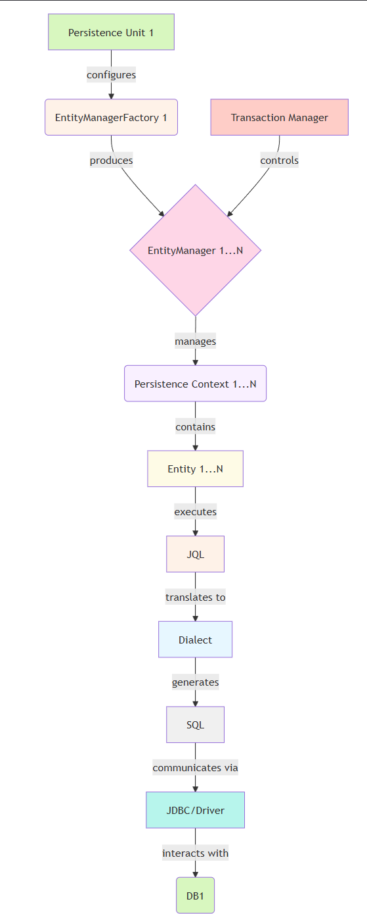

&nbsp;

JPA is the intermediary that ==bridges your Java objects with the database tables.==

It's a specification that defines the concepts and APIs,

while implementations like Hibernate provide the actual functionality.

&nbsp;

## Object-Relational Mapping (ORM)

ORM is a programming technique that converts data between incompatible type systems - specifically between object-oriented programming languages and relational databases.

### ORM provides a mapping layer that handles:

1.  **Object-Table Mapping**: Maps classes to tables and fields to columns
2.  **Identity Management**: Tracks object identity and manages persistence state
3.  **Relationship Handling**: Manages one-to-one, one-to-many, many-to-many relationships
4.  **Inheritance Strategies**: Maps object inheritance to database structures
5.  **Lazy Loading**: Loads data on demand to optimize performance
6.  **Caching**: Reduces database access by caching entities
7.  **Query Abstraction**: Provides object-oriented query languages

* * *

## JPA Specification

JPA (Java Persistence API) is a specification that standardizes ORM for Java applications. It defines:

1.  **Entity Model**: How to define persistent entities
2.  **EntityManagerFactory & EntityManager**: Interfaces for managing entities
3.  **Persistence Context**: The runtime environment for entity instances
4.  **Entity Lifecycle**: The states and transitions of entity instances
5.  **Query Language (JPQL)**: An object-oriented query language
6.  **Criteria API**: A programmatic query building API
7.  **Transaction Management**: Integration with JTA or resource-local transactions

* * *

### **Hibernate as JPA Implementation**

Hibernate implements the JPA specification and adds additional features.

1.  **Native API: Session, SessionFactory alongside EntityManager**
    - Hibernate provides its own APIs (`Session` and `SessionFactory`) in addition to the JPA `EntityManager`.
    - The `Session` interface in Hibernate is an extension of the JPA `EntityManager`, providing more granular control over database operations. For example, `SessionImpl` (Hibernate's class) directly implements the `EntityManager` interface, allowing developers to use Hibernate-specific methods alongside standard JPA methods.

&nbsp;

2.  **Enhanced Features: Additional mapping types, query features, caching options**
    
    - Hibernate extends JPA by offering advanced mapping capabilities, query enhancements, and caching mechanisms.
    - While JPA provides basic entity mapping and caching, Hibernate introduces additional mapping types (e.g., `@Any`, `@Formula`) and query features like HQL (Hibernate Query Language). It also supports multi-level caching (Level 1, Level 2, and Query Cache), which gives developers finer control over performance optimization.
3.  **Hibernate-specific Extensions: Filters, interceptors, custom types**
    
    - Hibernate includes extensions like filters, interceptors, and custom types that are not part of the JPA specification.
    - Filters allow dynamic filtering of data at runtime (e.g., applying a "soft delete" filter). Interceptors enable pre/post-event handling for persistence operations (e.g., logging changes). Custom types let developers define how Java objects are mapped to database columns, providing flexibility beyond JPA’s standard mappings.
4.  **Dialect System: Database-specific SQL generation**
    
    - Hibernate uses a dialect system to generate SQL queries optimized for specific databases.
    - The dialect system abstracts database-specific SQL syntax and features. For example, Hibernate can generate MySQL-specific SQL when using the `MySQLDialect` or Oracle-specific SQL with `OracleDialect`. This ensures portability across different databases while leveraging their native capabilities.

&nbsp;

5.  **Performance Optimizations: Batch processing, connection management**
    - Hibernate offers advanced performance optimizations such as batch processing and efficient connection management.
    - Batch processing allows multiple SQL statements to be executed in a single database round-trip, reducing latency. Connection management features like connection pooling and lazy loading optimize resource usage. These optimizations are crucial for handling large datasets and high-concurrency scenarios efficiently.

Hibernate acts as both a **JPA provider** (implementing the JPA specification) and an **enhanced ORM framework** with additional features. It bridges the gap between JPA's standardization and the need for advanced functionality, making it a powerful tool for object-relational mapping in Java applications.

&nbsp;

&nbsp;