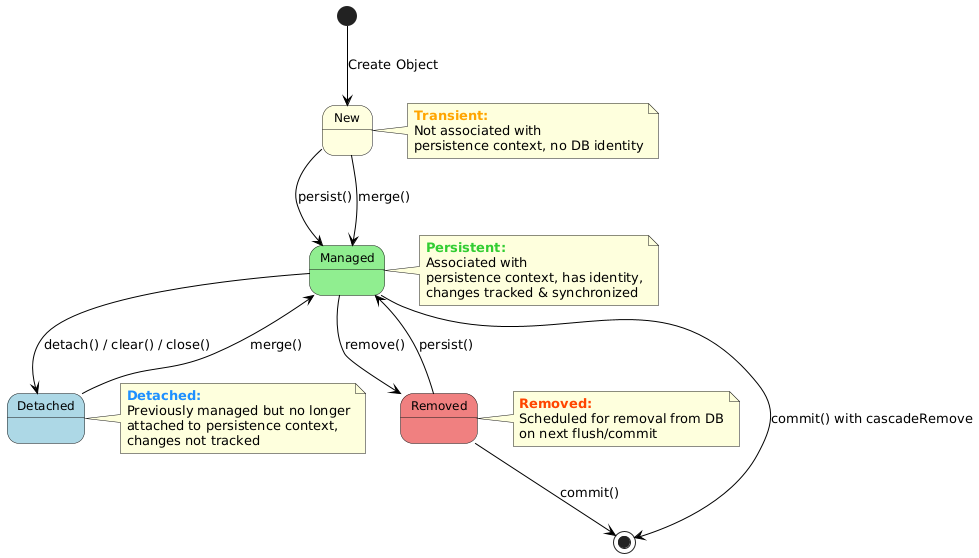
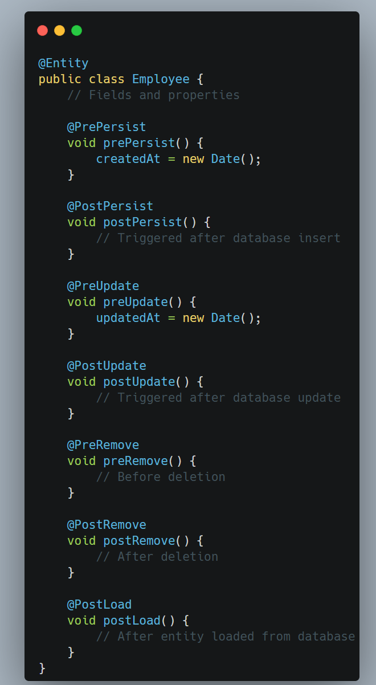
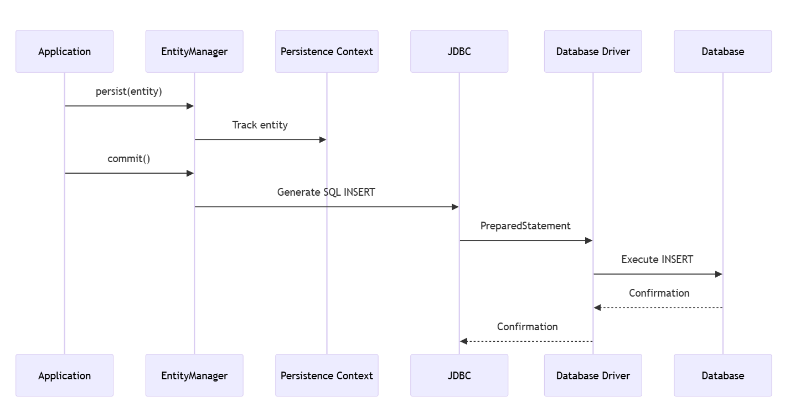
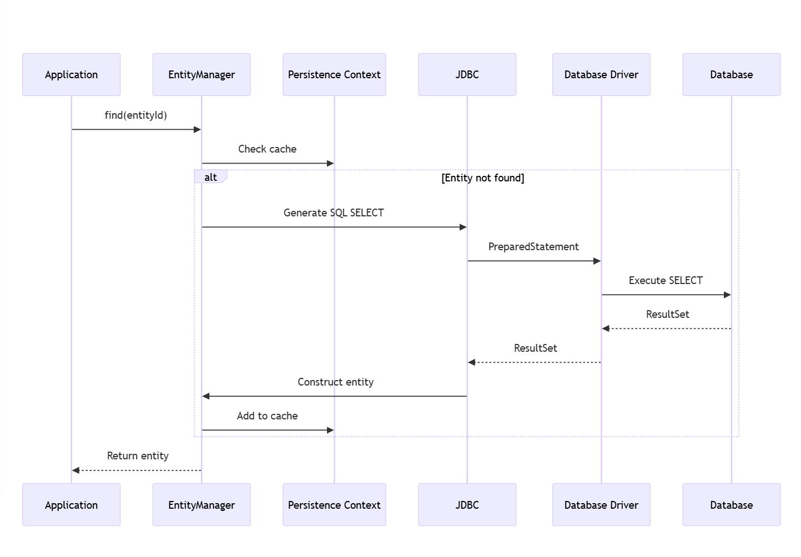
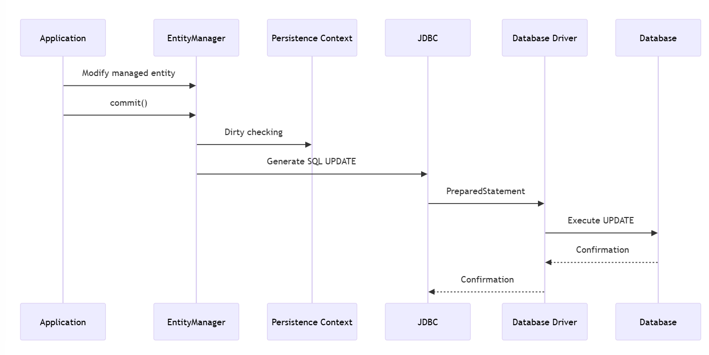
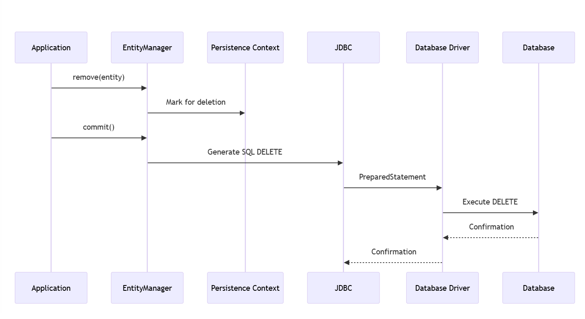

&nbsp;

#### 1\. New/Transient

- Entity instance created with `new` operator
- No persistent identity (no database record)
- Not associated with persistence context
- Changes not tracked
- Will be garbage collected if not referenced
- No database operations triggered by changes

```java
// New/Transient entity
Employee employee = new Employee("Jane", "HR", 85000.0);
// No database impact yet
```

#### 2\. Managed/Persistent

- Has persistent identity (primary key)
- Associated with an active persistence context
- Changes automatically detected and synchronized (dirty checking)
- Lazy loading of associations possible
- Will be saved to database on flush/commit

```java
// Making entity managed
em.persist(employee);  // Now it's managed

// Or retrieving managed entity
Employee managed = em.find(Employee.class, 1L);
managed.setSalary(90000.0);  // Change tracked automatically
```

#### 3\. Detached

- Has persistent identity (was previously persisted)
- No longer associated with persistence context
- Changes not tracked or synchronized
- Lazy associations may not be accessible
- Can be reattached via merge()

```java
// Detaching entity
em.detach(managed);  // Now it's detached
managed.setDepartment("Finance");  // Change not tracked

// Or when closing EntityManager
em.close();  // All entities become detached
```

&nbsp;

#### 4\. Removed

- Scheduled for deletion from database
- Still managed until flush/commit
- Will be deleted upon transaction commit
- Can be reactivated via persist()

```java
// Marking entity for removal
em.remove(managed);  // Scheduled for deletion
// Will be deleted on commit
```

&nbsp;

* * *

### Lifecycle Callback Methods

Entities can define methods that are called when lifecycle events occur:



## The Persistence Operations Flow

&nbsp;how persistence operations flow through the architecture:

Persist Operation



&nbsp;

2\. Find Operation:



3\. Update Operation:



4\. Delete Operation:

