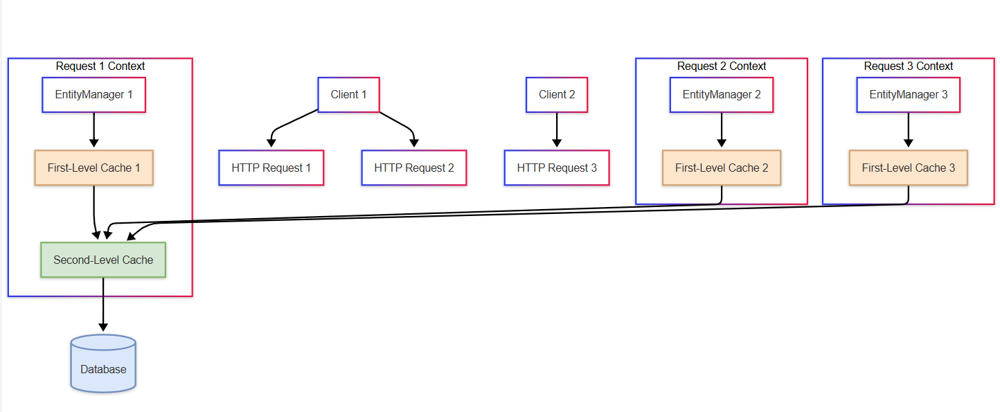
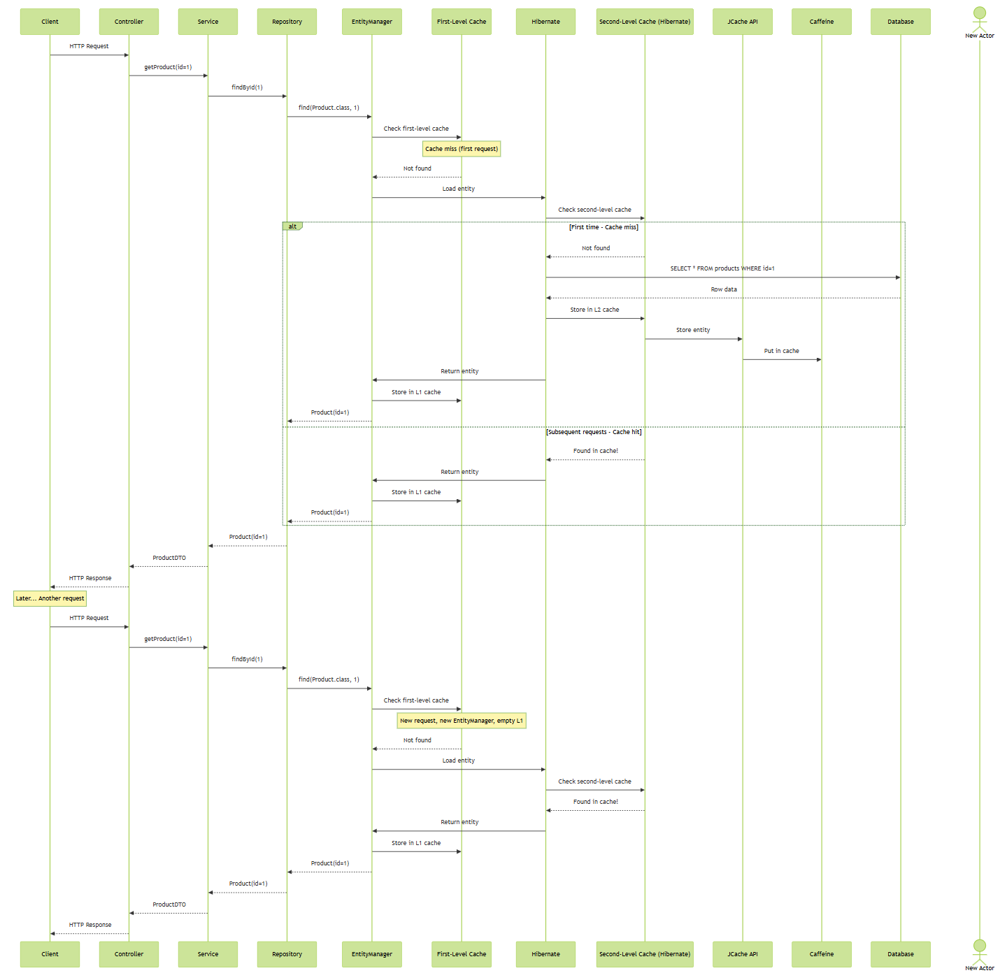
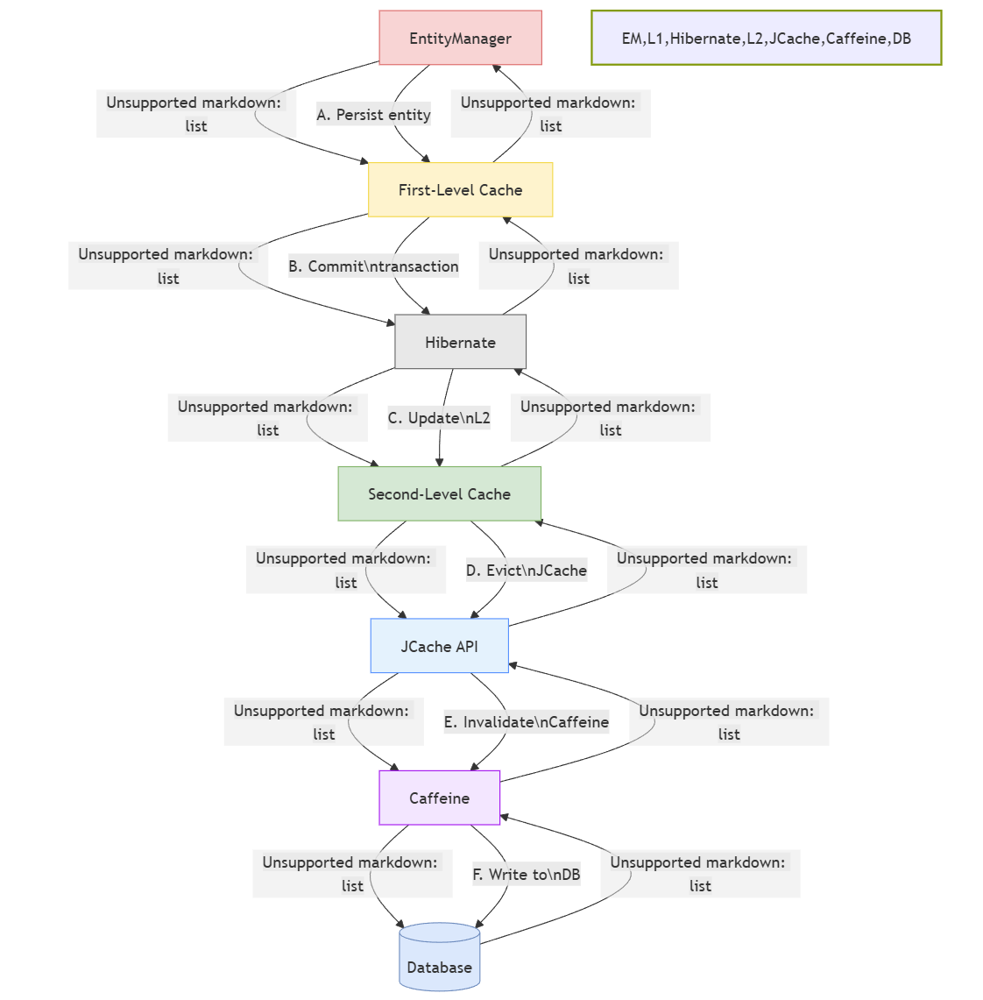

## Why We Need Second-Level Caching

First-level caching is fantastic, but it has fundamental limitations based on its design. Think of it as having a notebook that you throw away after each conversation. What if you want to remember things across multiple conversations?

Here's why second-level caching becomes necessary:

### Limitations of First-Level Cache

1.  **Request-Scoped**: First-level cache is bound to a specific EntityManager instance. In web applications, this typically means it only lasts for the duration of a single HTTP request.
2.  **No Cross-Request Sharing**: When a user makes a second request, we fetch the same data all over again, even if nothing has changed.
3.  **No Application-Wide Sharing**: Different users requesting the same data (like product information in an e-commerce site) each get their own copy from the database.
4.  **Resource Duplication**: The same entity might be loaded hundreds of times across different user sessions, consuming unnecessary memory and database resources.

Imagine running an e-commerce site where thousands of users view the same products. With only first-level caching, we'd hit the database for each user's request to see that bestselling laptop - even though the data rarely changes!

* * *

Second-level cache solves these problems by providing a shared cache that spans:

- Multiple EntityManager instances
- Multiple user sessions
- Multiple HTTP requests
- The entire application's lifetime (or until cache entries expire)

It sits between your application and the database, reducing load and improving response times for data that's frequently read but rarely changed.



&nbsp;

## Enabling Second-Level Cache in Spring Boot

Setting up second-level caching in Spring Boot involves several steps. 

```xml
  <!-- JCache API -->
    <dependency>
        <groupId>javax.cache</groupId>
        <artifactId>cache-api</artifactId>
    </dependency>
```

&nbsp;

```xml
 <!-- Hibernate JCache integration -->
    <dependency>
        <groupId>org.hibernate</groupId>
        <artifactId>hibernate-jcache</artifactId>
    </dependency>
```

&nbsp;

```xml
 <!-- Caffeine cache provider -->
    <dependency>
        <groupId>com.github.ben-manes.caffeine</groupId>
        <artifactId>caffeine</artifactId>
    </dependency>
```

&nbsp;

```xml
  <!-- Caffeine JCache implementation -->
    <dependency>
        <groupId>com.github.ben-manes.caffeine</groupId>
        <artifactId>jcache</artifactId>
    </dependency>
```

&nbsp;

### Why Each Dependency?

1.  **cache-api (JCache/JSR-107)**: This is the standard Java caching API that provides a common interface for different cache implementations. It's like a universal adapter that allows Hibernate to work with any compliant cache provider.
2.  **hibernate-jcache**: This is Hibernate's integration with the JCache standard. It allows Hibernate to use any JCache-compliant provider for second-level caching.
3.  **caffeine**: This is a high-performance, near-optimal caching library. It's known for its speed and efficiency in memory management.
4.  **jcache (Caffeine's JCache implementation)**: This allows Caffeine to implement the JCache API, making it compatible with Hibernate's JCache integration.

### Configure Hibernate Properties

Next, we need to configure Hibernate to use second-level caching in our `application.properties` or `application.yml` file:

&nbsp;

```properties
# Enable second level cache
spring.jpa.properties.hibernate.cache.use_second_level_cache=true

# Specify the cache region factory
spring.jpa.properties.hibernate.cache.region.factory_class=org.hibernate.cache.jcache.JCacheRegionFactory

# Optionally enable query cache (for caching HQL/JPQL query results)
spring.jpa.properties.hibernate.cache.use_query_cache=true


# Configure Caffeine as our provider
spring.cache.type=caffeine
spring.cache.caffeine.spec=maximumSize=1000,expireAfterWrite=300s
```

&nbsp;

### Step 3: Configure Cache Regions with Caffeine

We can create a configuration class to define specific cache settings for different entities:

```java
@Configuration
public class CacheConfig {

    @Bean
    public CacheManager cacheManager() {
        // Create Caffeine cache manager
        CaffeineCacheManager cacheManager = new CaffeineCacheManager();
        
        // Set default cache configuration
        cacheManager.setCaffeine(Caffeine.newBuilder()
                .expireAfterWrite(30, TimeUnit.MINUTES)
                .maximumSize(1000));
        
        // Add specific cache names we want to create
        cacheManager.setCacheNames(Arrays.asList(
                "com.example.entity.Product",
                "com.example.entity.Category",
                "query.findAllActiveProducts"
        ));
        
        return cacheManager;
    }
```

&nbsp;

### Step 4: Mark Entities as Cacheable

Now, we need to tell Hibernate which entities we want to cache:

```java
@Entity
@Table(name = "products")
@Cacheable
@org.hibernate.annotations.Cache(usage = CacheConcurrencyStrategy.READ_WRITE)
public class Product {
    @Id
    @GeneratedValue(strategy = GenerationType.IDENTITY)
    private Long id;
    
    private String name;
    private String description;
    private BigDecimal price;
    private boolean active;
    
    // Collections need their own cache settings
    @OneToMany(mappedBy = "product")
    @org.hibernate.annotations.Cache(usage = CacheConcurrencyStrategy.READ_WRITE)
    private Set<Review> reviews = new HashSet<>();
    
    // Getters and setters...
}

@Entity
@Table(name = "categories")
@Cacheable
@org.hibernate.annotations.Cache(usage = CacheConcurrencyStrategy.READ_ONLY)
public class Category {
    @Id
    @GeneratedValue(strategy = GenerationType.IDENTITY)
    private Long id;
    
    private String name;
    
    // Getters and setters...
}
```

&nbsp;

&nbsp;

### Step 5: Cache Queries When Needed

For frequently executed queries whose results change infrequently:

```java
@Repository
public class ProductRepository extends JpaRepository<Product, Long> {
    
    @QueryHints({
        @QueryHint(name = "org.hibernate.cacheable", value = "true"),
        @QueryHint(name = "org.hibernate.cacheRegion", value = "query.findAllActiveProducts")
    })
    @Query("SELECT p FROM Product p WHERE p.active = true")
    List<Product> findAllActiveProducts();
}
```



&nbsp;



&nbsp;

## Cache Regions and Region Factory

Cache regions in Hibernate are logical partitions for storing different types of cached data. Think of them as separate drawers in a filing cabinet, each dedicated to specific types of documents.

### What Are Cache Regions?

1.  **Entity Regions**: Each entity class gets its own region, typically named after the fully qualified class name (e.g., `com.example.entity.Product`).
2.  **Collection Regions**: For cached collections, named after the entity class and collection field (e.g., `com.example.entity.Product.reviews`).
3.  **Query Regions**: For cached query results, either using default name or a custom one.
4.  **Custom Regions**: You can define special-purpose regions with custom names.

### The Region Factory

The Region Factory is the component responsible for creating and managing these cache regions. It's the bridge between Hibernate and the underlying cache provider.

In our case, we're using `JCacheRegionFactory`, which connects Hibernate to any JCache-compatible provider

## Configuring Caffeine Cache Policies

Caffeine provides several configuration options that let us fine-tune caching behavior. Here are the key parameters:

### Size-Based Eviction

Controls how many entries the cache can hold:

```java
// Maximum entries in the cache
.maximumSize(1000)

```

### Time-Based Eviction

Controls how long entries stay in the cache:

```java
// Expire after last write
.expireAfterWrite(30, TimeUnit.MINUTES)

// Expire after last access
.expireAfterAccess(1, TimeUnit.HOURS)
```

&nbsp;