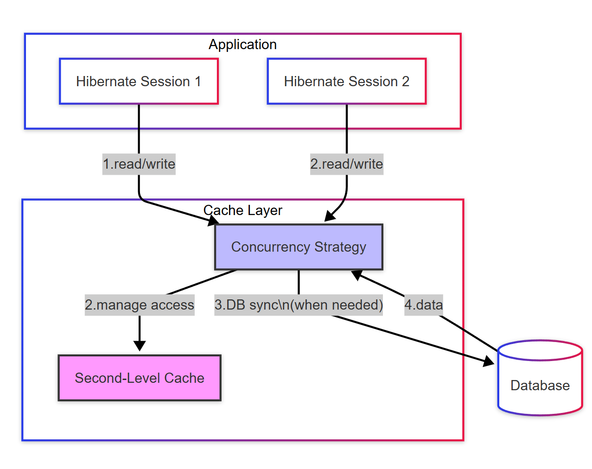
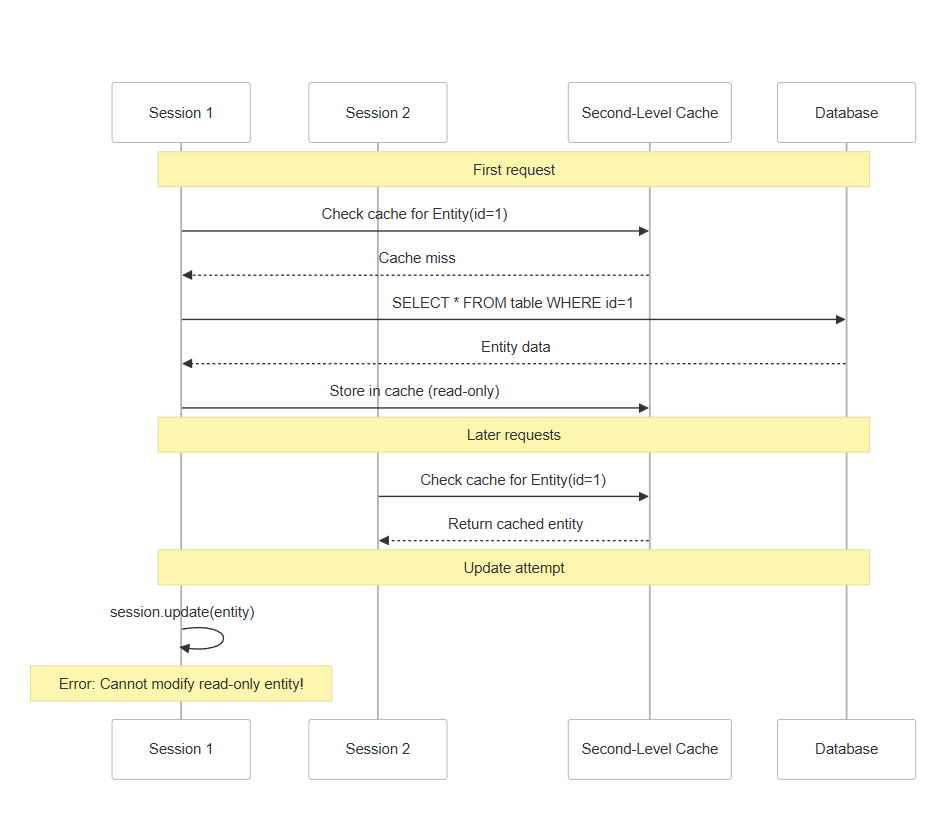
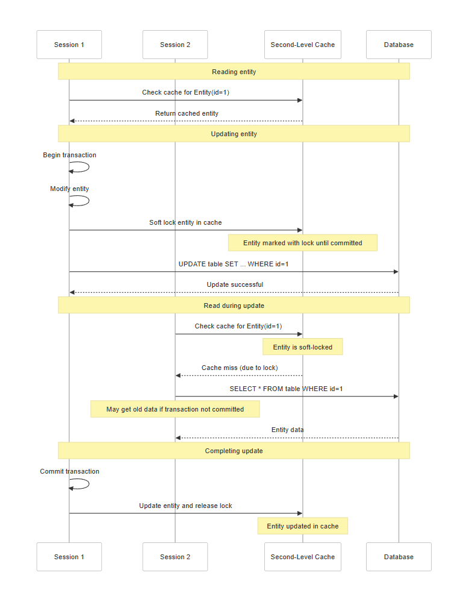

## Understanding Cache Concurrency Basics

Think of the second-level cache as a shared resource that multiple sessions can access simultaneously. Without proper coordination, this could lead to data inconsistency issues such as:

1.  One transaction updates an entity while another reads a stale version
2.  Two transactions update the same entity at the same time
3.  A transaction reads partially updated data

To address these challenges, Hibernate offers several concurrency strategies that provide different trade-offs between performance and data consistency.

## The Cache Concurrency Strategies

&nbsp;



&nbsp;

&nbsp;

### 1\. Read-Only Strategy

The simplest and highest-performing strategy for data that never changes.

**How it works:**

- The cache assumes the data never changes
- Multiple sessions can read the same cached data concurrently
- Any attempt to update a read-only entity will throw an exception
- Extremely high performance as there's no locking or synchronization

&nbsp;

&nbsp;

&nbsp;

&nbsp;



**Best used for:**

- Reference data (countries, currencies)
- Configuration settings that rarely change
- Historical records that are immutable

&nbsp;

### 2\. Read-Write Strategy

Provides strong consistency for frequently updated data while maintaining good read performance.



&nbsp;

**How it works:**

- Uses a "soft locking" mechanism
- When an entity is being updated, it's marked with a lock in the cache
- Other sessions bypass the cache and go directly to the database when they see a lock
- After the update transaction completes, the cache is updated with the new version
- Provides strong consistency but with more overhead than read-only

**Best used for:**

- Frequently accessed data that changes regularly
- When strong consistency is required
- Balance between read performance and write consistency

### 3\. Nonstrict Read-Write Strategy

A simple approach for data that is occasionally updated and where occasional stale reads are acceptable.

### 4\. Transactional Strategy

The strongest consistency model, using the underlying cache provider's transactional capabilities.

&nbsp;

## Implementation Details

Here's how we can configure these strategies in your Hibernate application:

```java
@Entity
@Cacheable
@org.hibernate.annotations.Cache(
    usage = CacheConcurrencyStrategy.READ_WRITE,  // Choose your strategy
    region = "product"
)
public class Product {
    // Entity definition
}
```

&nbsp;

```java
# Enable second-level cache
hibernate.cache.use_second_level_cache=true

# Specify cache provider
hibernate.cache.region.factory_class=org.hibernate.cache.jcache.JCacheRegionFactory

# For EHCache specifically
hibernate.javax.cache.provider=org.ehcache.jsr107.EhcacheCachingProvider

# Configure regions with specific TTL
hibernate.javax.cache.uri=ehcache.xml
```

&nbsp;

## Choosing the Right Strategy

The best strategy depends on your specific use case:

1.  **Read-Only**: Use when data never changes or is updated outside the application
2.  **Nonstrict Read-Write**: Use for infrequently updated data where occasional stale reads are acceptable
3.  **Read-Write**: Use for frequently updated data requiring strong consistency
    1.  **Transactional**: Use for critical data requiring transaction isolation