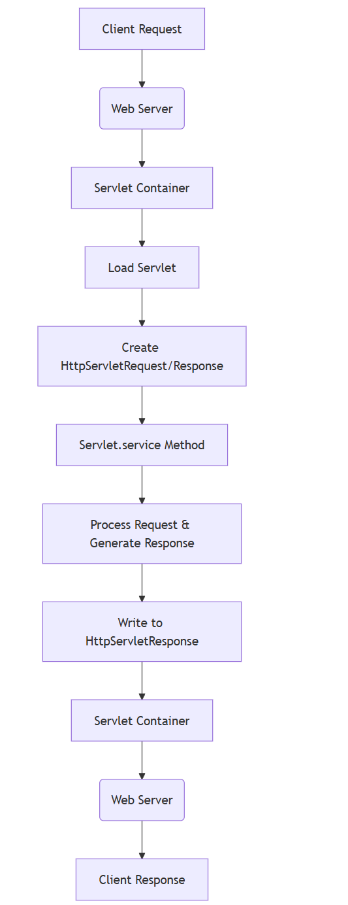

## What is a Servlet?

A servlet is a Java class that handles HTTP requests and generates responses. Think of it as the foundational building block for Java-based web applications.

At its core, a servlet:

1.  Receives HTTP requests from clients (browsers, mobile apps, etc.)
2.  Processes those requests (often interacting with databases or other services)
3.  Returns HTTP responses (HTML, JSON, XML, etc.)

Here's what a basic servlet looks like:

```java
public class HelloServlet extends HttpServlet {
    @Override
    protected void doGet(HttpServletRequest request, HttpServletResponse response) 
            throws ServletException, IOException {
        response.setContentType("text/html");
        PrintWriter out = response.getWriter();
        out.println("<html><body>");
        out.println("<h1>Hello, World!</h1>");
        out.println("</body></html>");
    }
}
```

&nbsp;

Let's understand how the servlet environment works:

1.  **Servlet Container**: Also known as a web container (like Tomcat, Jetty, or WebSphere), it provides the runtime environment for servlets.
2.  **Deployment Descriptor (web.xml)**: This configuration file maps URLs to specific servlets:

```xml
<servlet>
    <servlet-name>HelloServlet</servlet-name>
    <servlet-class>com.example.HelloServlet</servlet-class>
</servlet>
<servlet-mapping>
    <servlet-name>HelloServlet</servlet-name>
    <url-pattern>/hello</url-pattern>
</servlet-mapping>
```

&nbsp;

**Servlet Lifecycle**:

- `init()`: Called once when the servlet is loaded
- `service()`: Called for each request (which delegates to methods like **doGet** or **doPost**)
- `destroy()`: Called when the servlet is unloaded

&nbsp;

## The Problem with Raw Servlets

When building complex applications with raw servlets, several challenges emerge:

- Writing HTML directly in Java code is cumbersome
- Mapping different URLs to different servlets becomes complex
- Sharing data between servlets is difficult
- Handling forms and file uploads requires a lot of boilerplate code
- No built-in dependency injection or component management

This is where frameworks like Spring emerged to solve these problems.

&nbsp;

Here is basic request and response flow with servelt  
<br/>

&nbsp;

&nbsp;