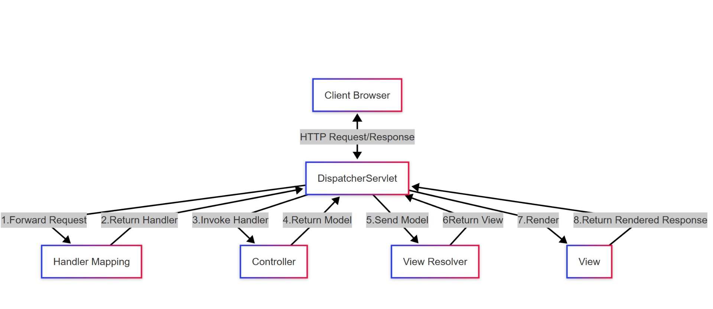

&nbsp;

&nbsp;

Spring MVC (Model-View-Controller) is built on top of the servlet API but provides a more structured approach:

- **DispatcherServlet**: This is Spring's front controller pattern implementation. It's a special servlet that handles all incoming requests and dispatches them to appropriate handlers.
- **Handler Mapping**: Determines which controller should handle a request based on URL patterns.
- **Controllers**: Instead of extending HttpServlet, you create classes with annotations like `@Controller`.
- **View Resolvers**: Convert logical view names to actual view implementations (like JSP pages or Thymeleaf templates).

&nbsp;  
<br/>

Here's a Spring MVC controller example:

```java
@Controller
public class HelloController {
    @GetMapping("/hello")
    public String hello(Model model) {
        model.addAttribute("message", "Hello, World!");
        return "greeting"; // This refers to a view template named "greeting"
    }
}
```

&nbsp;

## Spring's DispatcherServlet: The Central Component

==The `DispatcherServlet` is the heart of Spring MVC and is itself a servlet. It replaces the need to create multiple servlets for different endpoints.==

Here's how it's configured in a traditional Spring application:

&nbsp;

**Web.xml**

```xml
<!-- web.xml -->
<servlet>
    <servlet-name>dispatcher</servlet-name>
    <servlet-class>org.springframework.web.servlet.DispatcherServlet</servlet-class>
    <init-param>
        <param-name>contextConfigLocation</param-name>
        <param-value>/WEB-INF/spring-mvc-config.xml</param-value>
    </init-param>
    <load-on-startup>1</load-on-startup>
</servlet>

<servlet-mapping>
    <servlet-name>dispatcher</servlet-name>
    <url-pattern>/</url-pattern>
</servlet-mapping>
```

&nbsp;

&nbsp;

## Request Processing in the DispatcherServlet

When a request arrives, the DispatcherServlet follows this process:

1.  Consults the `HandlerMapping` to identify the appropriate controller
2.  Invokes the controller method to process the request
3.  The controller returns a logical view name and model data
4.  The `ViewResolver` translates the logical view name to an actual View implementation
5.  The View renders the model data into the response

&nbsp;

&nbsp;