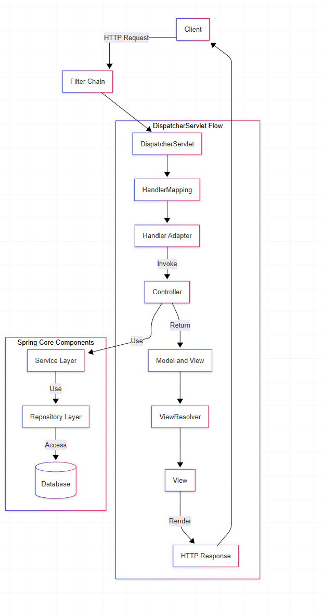

Spring Boot greatly simplifies this setup. With Spring Boot:

1.  The DispatcherServlet is auto-configured
2.  No need for explicit web.xml or other servlet configurations
3.  Embedded servlet containers (Tomcat, Jetty, Undertow) eliminate the need for separate deployment

In Spring Boot, a minimal web application looks like:   
<br/>

```java
@SpringBootApplication
public class Application {
    public static void main(String[] args) {
        SpringApplication.run(Application.class, args);
    }
}

@RestController
class HelloController {
    @GetMapping("/hello")
    public String hello() {
        return "Hello, World!";
    }
}
```

###  The Complete Picture: Spring's Request Handling Stack:

&nbsp;

&nbsp;

'

&nbsp;

The complete Spring web stack includes:

1.  **Filters**: Intercept requests before they reach the DispatcherServlet (useful for authentication, logging, etc.)
2.  **DispatcherServlet**: The central servlet that coordinates the request handling
3.  **Handler Mappings**: Match requests to handlers (controllers)
4.  **Handler Adapters**: Execute the handlers and adapt their return values
5.  **Controllers**: Process requests and return responses
6.  **View Resolvers and Views**: Convert controller responses to HTTP responses
7.  **Exception Handlers**: Process exceptions that occur during request handling

&nbsp;

## Spring Security Integration

Spring Security integrates with this architecture through filters:

```java
@Configuration
@EnableWebSecurity
public class SecurityConfig extends WebSecurityConfigurerAdapter {
    @Override
    protected void configure(HttpSecurity http) throws Exception {
        http
            .authorizeRequests()
                .antMatchers("/public/**").permitAll()
                .anyRequest().authenticated()
            .and()
            .formLogin();
    }
}
```

&nbsp;

These security filters are added to the filter chain that processes requests before they reach the DispatcherServlet.

* * *

## Spring Boot Auto-Configuration

Spring Boot's magic comes from auto-configuration. When you add spring-boot-starter-web to your project:

1.  It detects that you want a web application
2.  Automatically configures an embedded servlet container (Tomcat by default)
3.  Sets up the DispatcherServlet and required components
4.  Configures a default error page

&nbsp;

* * *

## From Raw Servlets to Modern Spring Boot

Let's trace the evolution:

1.  **Raw Servlets**: Manual handling of HTTP requests and responses  
    
    ```java
    public class MyServlet extends HttpServlet {
        protected void doGet(HttpServletRequest request, HttpServletResponse response) {
            // Manual processing
        }
    }
    ```
    

  
     **2. Spring MVC with XML Configuration**: Structured approach but still verbose

     

```xml
<servlet>
    <servlet-name>dispatcher</servlet-name>
    <servlet-class>org.springframework.web.servlet.DispatcherServlet</servlet-class>
</servlet>
```

&nbsp;

&nbsp;  **3. Spring MVC with Java Configuration**: More concise but still requires setup

&nbsp;  

```java
@Configuration
@EnableWebMvc
public class WebConfig implements WebMvcConfigurer {
    // Configuration methods
}
```

&nbsp;

&nbsp;  4. **Spring Boot**: Minimal configuration with sensible defaults

considering we have added spring web starter dependencies

```java
@SpringBootApplication
public class Application {
    public static void main(String[] args) {
        SpringApplication.run(Application.class, args);
    }
}
```

&nbsp;

- **Servlets** are Java classes that handle HTTP requests and responses.
- **Servlet Containers** (like Tomcat) provide the runtime environment for servlets.
- **Spring MVC** builds on servlets, with the **DispatcherServlet** as its front controller.
- **Spring Boot** simplifies Spring MVC configuration by auto-configuring the servlet environment.