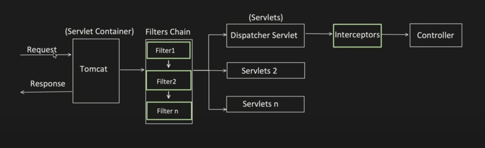
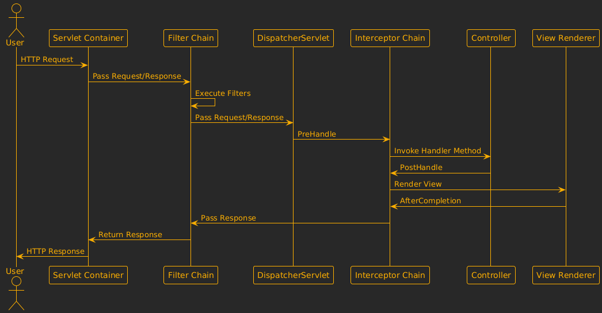

&nbsp;

**Filters** and **Interceptors** are used to perform pre-processing and post-processing tasks for HTTP requests. However, they operate at different levels and serve distinct purposes.

Basic flow and placement

### **1\. Filters**

#### **What are Filters?**

- Filters are part of the **Servlet API** , which is a lower-level API than Spring MVC.
- They are executed before the request reaches the DispatcherServlet (the core component of Spring MVC).
- Filters can be applied to any request that hits the servlet container, regardless of whether it is handled by Spring or not.

&nbsp;

#### **Key Characteristics of Filters**

1.  **Scope** : Filters apply to all incoming requests at the servlet container level.
2.  **Execution Timing** : Filters are executed before the DispatcherServlet processes the request and after the response is generated.
3.  **Use Cases** :
    - Logging and auditing.
    - Authentication and authorization.
    - Modifying the request/response headers or body.
    - Compression or encryption of data.
4.  **Configuration** : Filters are typically configured in `web.xml` or via Java-based configuration using `FilterRegistrationBean`.

&nbsp;

#### **How Filters Work**

- A filter intercepts the request and response objects.
- It can modify these objects, perform checks, or even block the request entirely.
- After processing, the filter passes the request and response to the next filter in the chain or to the DispatcherServlet.

&nbsp;

* * *

* * *

### **2\. Interceptors**

#### **What are Interceptors?**

- Interceptors are part of the **Spring MVC framework** and operate at a higher level than filters.
- They are executed after the **DispatcherServlet**  has mapped the request to a specific handler (controller method).

#### **Key Characteristics of Interceptors**

1.  **Scope** : Interceptors apply only to requests handled by Spring MVC (i.e., requests mapped to controllers).
2.  **Execution Timing** : Interceptors are executed during the request processing lifecycle managed by Spring MVC.
3.  **Use Cases** :
    - Adding or modifying model attributes.
    - Performing pre- and post-processing logic for controller methods.
    - Validating request parameters or headers.
    - Logging and performance monitoring.
4.  **Configuration** : Interceptors are registered with the `WebMvcConfigurer` interface or through XML configuration.

&nbsp;

#### **How Interceptors Work**

- An interceptor can execute logic before the controller method is invoked (`preHandle`), after the controller method but before the view is rendered (`postHandle`), and after the view is rendered (`afterCompletion`).
- Interceptors have access to the `HandlerMethod` (the controller method) and the `ModelAndView` object, making them more

&nbsp;

### **Differences Between Filters and Interceptors**

| Feature | Filters | Interceptors |
| --- | --- | --- |
| **Framework** | Part of Servlet API | Part of Spring MVC |
| **Scope** | Applies to all requests | Applies to Spring MVC-handled requests |
| **Execution Timing** | Before DispatcherServlet | After DispatcherServlet |
| **Access to Context** | Limited to`HttpServletRequest`and`HttpServletResponse` | Access to`HandlerMethod`,`ModelAndView`, and other Spring-specific objects |
| **Use Cases** | General-purpose tasks like security, logging, compression | Controller-specific tasks like modifying models, validating inputs |
| **Configuration** | Configured via`web.xml`or`FilterRegistrationBean` | Configured via `WebMvcConfigurer` |

&nbsp;

&nbsp;

### **Flow of Request Processing in Spring Web**

1.  **Request Received by Servlet Container** :
    
    - The request first hits the servlet container (e.g., Tomcat).
    - Filters are executed in the order they are defined.
2.  **DispatcherServlet** :
    
    - After passing through all filters, the request reaches the `DispatcherServlet`.
    - The `DispatcherServlet` maps the request to a specific controller method.
3.  **Interceptor Execution** :
    
    - Once the request is mapped to a controller method, interceptors are executed in the following phases:
        - `preHandle`: Before the controller method is invoked.
        - `postHandle`: After the controller method is invoked but before the view is rendered.
        - `afterCompletion`: After the view is rendered.
4.  **Response Sent Back** :
    
    - **The response flows back through the interceptors and filters in reverse order.**
        - we can apply post processing when the response is flowing back

&nbsp;

&nbsp;