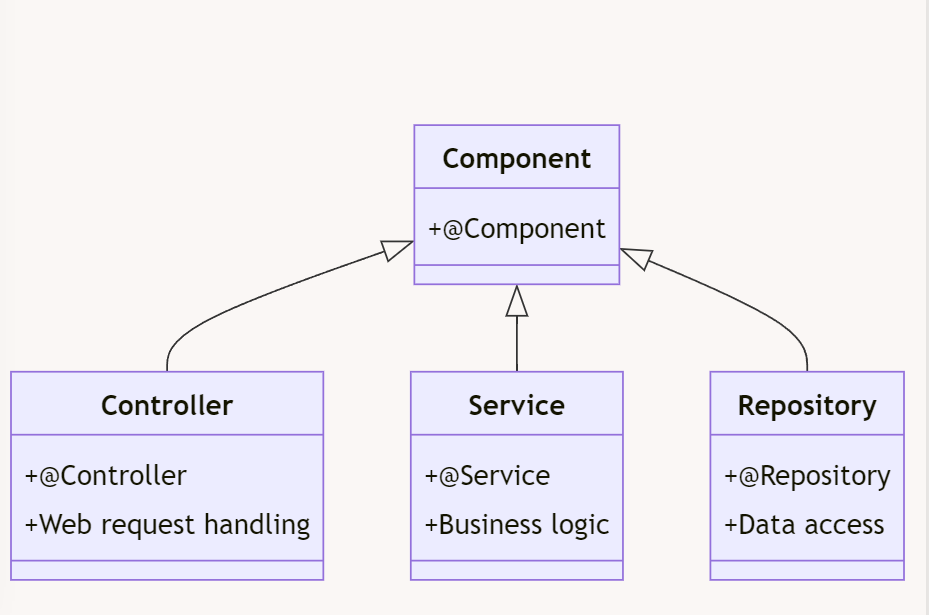
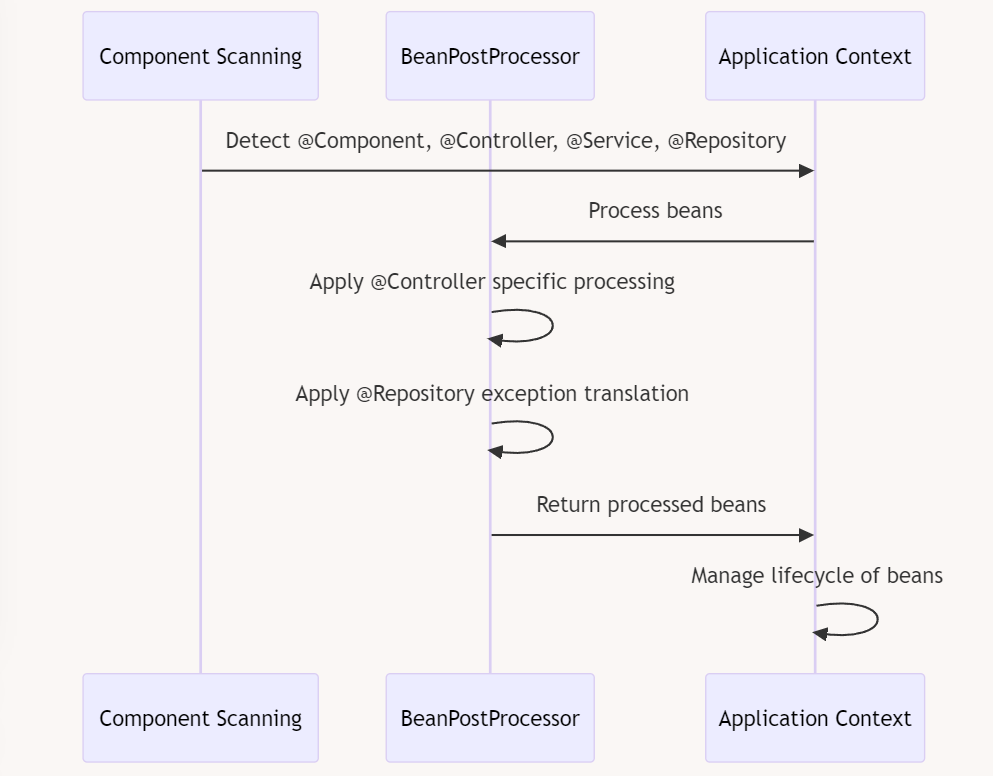

Spring provides four main stereotype annotations:

1.  `@Component`
2.  `@Controller`
3.  `@Service`
4.  `@Repository`

All these annotations (`@Component`, `@Service`, `@Repository`, `@Controller`) are meta-annotated with `@Component`, meaning that Spring treats them all as `@Component` behind the scenes.

They serve the same primary purpose: marking a class as a Spring bean, which means that Spring will manage its lifecycle and dependencies.

While these annotations may seem interchangeable at first glance, they serve distinct purposes in a Spring application's architecture. Let's explore why they're not interchangeable and how Spring manages them differently.

&nbsp;

| Annotation | Primary Use | Layer | Additional Functionality |
| --- | --- | --- | --- |
| @Component | Generic components | Any | Base for all other stereotype annotations |
| @Controller | Web request handling | Presentation | Enables handler mapping for @RequestMapping |
| @Service | Business logic | Service | No additional functionality (semantic) |
| @Repository | Data access and persistence | Data Access | Exception translation to DataAccessException |

&nbsp;

- @Component
    - This is the most generic stereotype annotation.
    - It's used to mark any Spring-managed component that doesn't fit into more specific categories.
    - All other stereotype annotations are specializations of @Component.
- @Controller
    - Used in the presentation layer for handling web requests.
    - Automatically detected by Spring MVC's component scanning.
    - Enables additional web-related functionality:
        - Handler mapping for @RequestMapping annotations.
        - Model attribute handling.
        - Automatic view resolution.
- @Service
    - Indicates that the class contains business logic.
    - Doesn't provide any additional functionality over @Component.
    - Serves as a semantic marker for service layer components.
- @Repository
    - Used for data access objects (DAOs) or repository classes.
    - Enables automatic persistence exception translation.
    - Translates technology-specific exceptions (e.g., SQLException) into Spring's DataAccessException hierarchy.

&nbsp;

&nbsp;

&nbsp;

Now, let's address why these annotations are not interchangeable and how Spring manages them differently, despite their identical definition at the class level:

1.  Semantic Meaning:
    - While all these annotations mark a class as a Spring-managed component, they carry different semantic meanings.
    - This semantic difference helps developers and tools  to understand the intended purpose of each component in the application architecture.
2.  AOP (Aspect-Oriented Programming) Pointcuts:
    - Spring and other frameworks often use these annotations as pointcuts for applying aspects.
    - For example, transaction management might be applied differently to @Service and @Repository beans.
3.  Exception Handling:
    - @Repository triggers automatic exception translation.
    - Spring wraps platform-specific exceptions and rethrows them as one of Spring's unified unchecked DataAccessException subclasses.
4.  Request Mapping:
    - @Controller is specifically recognized by Spring MVC for mapping web requests.
    - It enables the use of @RequestMapping and other web-specific annotations.
5.  Component Scanning:
    - While all these annotations are picked up by component scanning, Spring may apply different post-processing steps based on the specific annotation.
6.  Framework Integration:
    - Other frameworks or tools may provide special handling for specific annotations.
    - For instance, Spring Data repositories are typically annotated with @Repository.

We can see in the diagram that component scan detects all strereotype annotations

but BeanPostProcessor applies specific processing based on the annotation type  
 

* * *

&nbsp;

&nbsp;