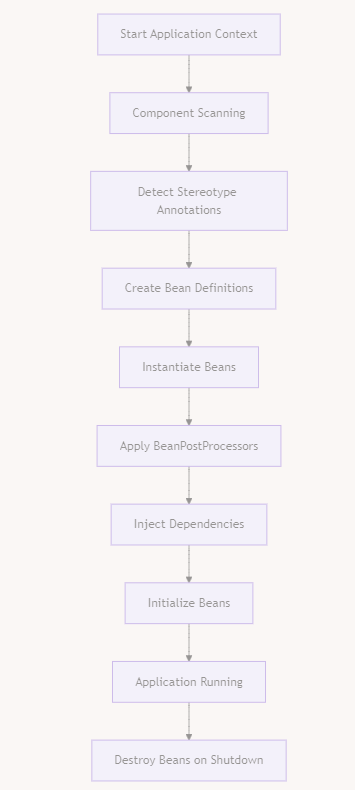
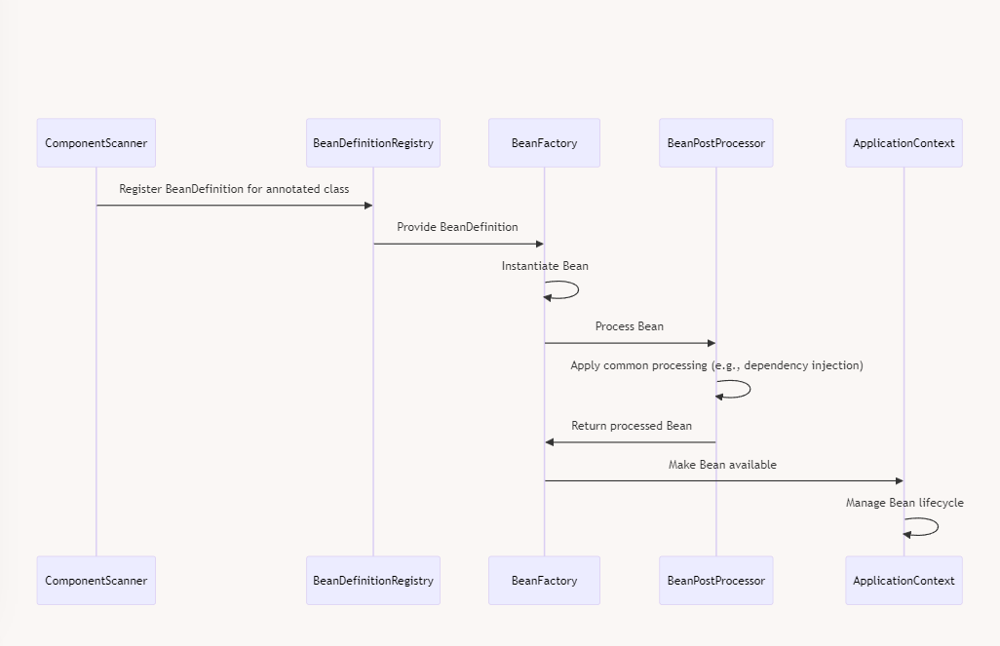

Spring's common handling for stereotype annotations involves several key processes and components. Let's break this down:

1.  Component Scanning
2.  Bean Definition Creation
3.  Bean Post-Processing
4.  Dependency Injection
5.  Lifecycle Management

&nbsp;

1.  Component Scanning:
    - Spring scans the classpath for classes annotated with stereotype annotations.
    - This is typically configured using @ComponentScan or automatically with @SpringBootApplication.
2.  Bean Definition Creation:
    - For each detected component, Spring creates a bean definition.
    - This definition includes metadata about the bean, such as its class, scope, and dependencies.
3.  Bean Post-Processing:
    - After bean definitions are created, various ==BeanPostProcessors== run to modify or enhance the beans.
    - This is where much of the "magic" of Spring happens, like applying AOP proxies.
4.  Dependency Injection:
    - Spring resolves and injects dependencies for each bean.
    - This can be done via constructor injection, setter injection, or field injection.
5.  Lifecycle Management:
    - Spring manages the complete lifecycle of each bean, from instantiation to destruction.
    - This includes calling any defined initialization or destruction methods.

&nbsp;

&nbsp;

**Key Components involved:**  
 

| Component | Description | Role in Annotation Handling |
| --- | --- | --- |
| ClassPathBeanDefinitionScanner | Scans the classpath for candidate components | Detects classes with stereotype annotations |
| BeanDefinitionRegistry | Holds bean definitions | Stores metadata about detected components |
| BeanFactory | Central interface for accessing beans | Manages bean instances |
| BeanPostProcessor | Interface for modifying bean instances | Applies additional processing to beans |
| AutowiredAnnotationBeanPostProcessor | Specific BeanPostProcessor | Handles dependency injection |
| ApplicationContext | High-level interface for accessing beans | Coordinates the overall process |

&nbsp;

- Detection:
    - During component scanning, Spring uses ClassPathBeanDefinitionScanner to find classes annotated with @Component or its specializations.
    - It looks at the class-level annotations to determine if a class should be considered a Spring-managed component.
- Bean Definition Creation:
    - For each detected component, Spring creates a BeanDefinition.
    - The BeanDefinition includes metadata such as the bean's class, scope, lazy-init flag, and dependencies.
- Post-Processing:
    - Various BeanPostProcessors run on each bean.
    - A crucial one is AutowiredAnnotationBeanPostProcessor, which handles dependency injection for @Autowired, @Value, and @Inject annotations.
- Proxy Creation:
    - If necessary, Spring creates proxy objects around the original bean instances.
    - This is done for features like AOP (Aspect-Oriented Programming) or transaction management.
- Lifecycle Management:
    - Spring calls any defined initialization methods (e.g., @PostConstruct).
    - It manages the bean's lifecycle, including destruction (e.g., @PreDestroy).

&nbsp;

Common behaviors applied to all stereotype annotations include:

1.  Singleton scope by default (unless specified otherwise).
2.  Eligibility for dependency injection.
3.  Participation in the Spring application context lifecycle.
4.  Ability to have aspects applied to them.

&nbsp;