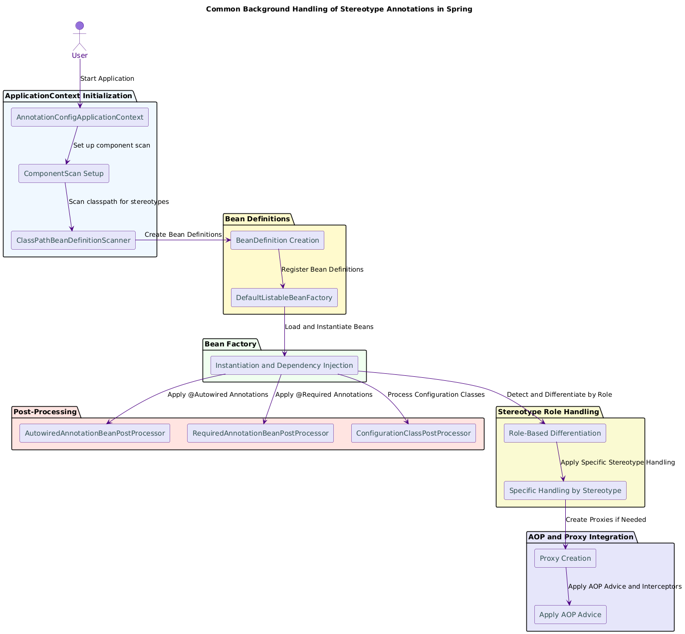

Spring Framework uses a common set of underlying mechanisms and processes to handle stereotype annotations such as `@Component`, `@Service`, `@Repository`, and `@Controller`. Despite the differences in their specific use cases and roles, these annotations share a common background handling and detection process within the Spring ecosystem.

&nbsp;

&nbsp;

&nbsp;

&nbsp;

#### **1\. ApplicationContext Initialization**

- **Initialization Phase**: Spring's `ApplicationContext` initializes, typically using classes like `AnnotationConfigApplicationContext` or `ClassPathXmlApplicationContext`.
- **Configuration Setup**: The context begins by setting up configuration classes or XML configuration, which define component scanning parameters or specific bean definitions.

* * *

#### **2\. Component Scanning Setup**

- **Component Scan Annotation**: Configured via `@ComponentScan`, `@SpringBootApplication`, or equivalent XML configuration. This instructs Spring on which packages to scan for beans.
- **Classpath Scanning**: Spring uses `ClassPathBeanDefinitionScanner` to scan specified packages for classes annotated with stereotype annotations like `@Component`, `@Service`, `@Repository`, and `@Controller`.

&nbsp;

* * *

#### **3\. Bean Definition Creation**

- **Bean Definition Parsing**: For each class identified by the component scanner, Spring creates a `BeanDefinition` object. This object encapsulates metadata about the bean, such as:
    - Bean class type
    - Scope (e.g., singleton, prototype)
    - Qualifiers (e.g., custom annotations like `@Qualifier`)
    - Stereotype annotations present on the class

* * *

#### **4\. Registration of Bean Definitions**

- **BeanDefinitionRegistry**: The `BeanDefinition` objects are registered within the `BeanDefinitionRegistry`, which is typically managed by `DefaultListableBeanFactory`. This registry is central to Spring’s bean management and is used throughout the bean lifecycle.
- **Metadata Storage**: Bean definitions and their metadata are stored and used later during bean creation and initialization.

* * *

#### **5\. Instantiation and Dependency Injection**

- **Instantiation**: The `BeanFactory` creates instances of the beans based on their definitions.
- **Dependency Injection**: During instantiation, dependencies specified via annotations (`@Autowired`, `@Inject`) or XML configuration are injected into the beans.

* * *

#### **6\. Bean Post-Processing**

- **Common Post-Processors**: Spring applies various `BeanPostProcessor` implementations to the instantiated beans. These post-processors modify or enhance beans based on annotations or other criteria:
    - **`AutowiredAnnotationBeanPostProcessor`**: Processes fields, methods, or constructors annotated with `@Autowired` to inject dependencies.
    - **`RequiredAnnotationBeanPostProcessor`**: Ensures required properties are set, enforcing rules around `@Required` annotations.
    - **`ConfigurationClassPostProcessor`**: Handles processing of configuration classes, including parsing `@Bean` methods and applying property source configurations.

* * *

#### **7\. Specific Handling Based on Stereotype Annotations**

- **Role-Based Differentiation**: Despite the common processing path, Spring applies specific roles and behaviors based on the stereotype annotation:
    - **`@Component`**: Generic role; simply registers the bean as a Spring-managed component.
    - **`@Service`**: Implies a business service layer; mainly a semantic difference with no additional behavior.
    - **`@Repository`**: Indicates a data access layer; Spring applies exception translation through `PersistenceExceptionTranslationPostProcessor`.
    - **`@Controller`**: Marks a class as a Spring MVC controller; integrates with Spring MVC's request handling mechanisms like `RequestMappingHandlerMapping`.

* * *

#### **8\. Proxy and AOP Integration (If Applicable)**

- **AOP and Proxies**: Spring uses Aspect-Oriented Programming (AOP) to apply cross-cutting concerns (like transaction management or logging) to beans, particularly those marked with annotations like `@Transactional` or beans identified as repositories (`@Repository`).
- **Proxy Creation**: AOP proxy creation occurs through classes like `ProxyFactory` or `AnnotationAwareAspectJAutoProxyCreator`, which wrap beans with proxies that apply the necessary advice or interceptors.

* * *

#### **9\. Final Initialization and Context Readiness**

- **Final Bean Initialization**: After post-processing and any necessary proxying, the beans are fully initialized, injected with dependencies, and ready for use within the application.
- **Application Context Completes Initialization**: At this point, the `ApplicationContext` is fully configured with all beans registered, processed, and prepared for operation.

* * *

### Summary of Common Handling

- **Unified Detection Mechanism**: Spring uses classpath scanning and metadata parsing to detect and handle stereotype annotations uniformly.
- **Common Lifecycle Management**: Beans annotated with any stereotype follow a similar lifecycle involving registration, instantiation, and post-processing.
- **Role-Specific Enhancements**: Although processing starts commonly, Spring differentiates the beans based on annotations (`@Controller` for MVC integration, `@Repository` for exception translation, etc.) and applies specific behaviors accordingly.
- **AOP and Proxy Usage**: Spring seamlessly integrates AOP to manage cross-cutting concerns, applying advice dynamically based on annotations and bean roles.