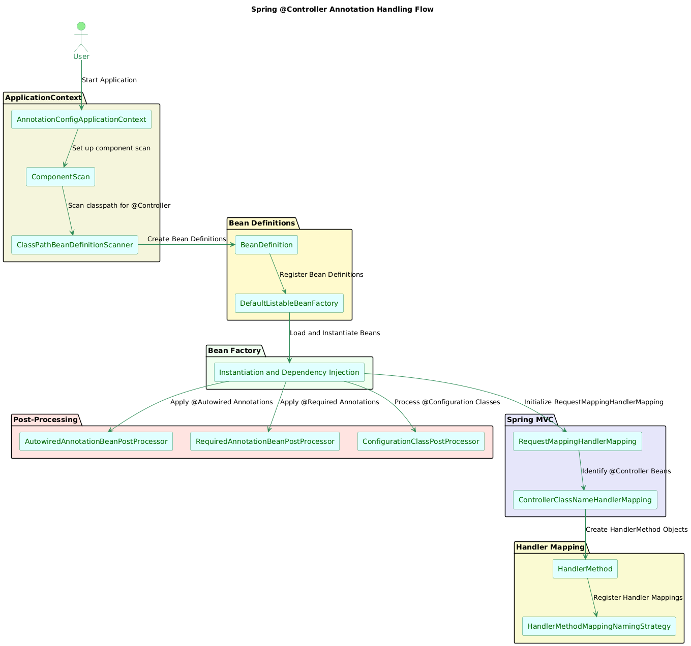

&nbsp;

&nbsp;

* * *

#### **1\. ApplicationContext Initialization**

- **Component Scan Setup:** When the Spring application starts, the `ApplicationContext` is initialized. It begins by setting up the component scanning, typically defined in the configuration class using `@ComponentScan` or directly through `@SpringBootApplication` which includes component scanning by default.
- **Classpath Scanning:** Spring scans the classpath for beans annotated with stereotype annotations (`@Component`, `@Service`, `@Repository`, `@Controller`).

&nbsp;

&nbsp;

* * *

#### **2\. Identifying Beans with Stereotype Annotations**

- **Bean Definition Creation:** For each class found with stereotype annotations, Spring creates a `BeanDefinition` object. This object contains metadata about the bean, including its class, scope, qualifiers, and annotations.
- **Metadata Processing:** Spring uses a `ClassPathBeanDefinitionScanner` to read metadata from classes. It identifies beans by checking annotations and registers them with the application context.

&nbsp;

* * *

#### **3\. Registering Bean Definitions in the ApplicationContext**

- **BeanDefinitionRegistry:** The `BeanDefinition` objects are registered in the `BeanDefinitionRegistry`, usually managed by the `DefaultListableBeanFactory`, which acts as the central registry of beans for the application context.

* * *

&nbsp;

#### **4\. Post-Processing of Bean Definitions**

- **ConfigurationClassPostProcessor:** This post-processor handles configuration classes and processes annotations like `@ComponentScan`, which include stereotype annotations indirectly.
- **CommonAnnotationBeanPostProcessor:** This processor scans for common Java EE annotations, but more importantly, it's one of many processors that handle the lifecycle of beans annotated with Spring stereotypes.

&nbsp;

* * *

#### **5\. Loading and Instantiating Beans**

- **Bean Factory Pre-Processing:** Before beans are instantiated, various `BeanFactoryPostProcessor`s, such as `PropertySourcesPlaceholderConfigurer`, modify the application context configuration.
- **Instantiation:** The `BeanFactory` creates instances of beans based on their `BeanDefinition`. During this phase, dependency injection is handled, and beans are prepared for further processing.

* * *

#### **6\. Specific Handling of `@Controller` by Spring MVC**

- **RequestMappingHandlerMapping Initialization:**
    - **Handler Mapping Setup:** During the initialization of Spring MVC, the `RequestMappingHandlerMapping` bean is initialized. This component is responsible for mapping HTTP requests to handler methods.
    - **Detecting `@Controller` Beans:** `RequestMappingHandlerMapping` scans all beans registered in the context to identify those annotated with `@Controller` or other handler annotations like `@RequestMapping` or `@RestController`.

```java
public class RequestMappingHandlerMapping extends RequestMappingInfoHandlerMapping{

    @Override
    protected boolean isHandler(Class<?> beanType) {
        // Checks if the class is annotated with @Controller or @RequestMapping
        return (AnnotatedElementUtils.findAnnotation(beanType, Controller.class) != null ||
                AnnotatedElementUtils.findAnnotation(beanType, RequestMapping.class) != null);
    }

    @Override
    protected void detectHandlerMethods(Object handler) {
        // Identifies handler methods within the controller,
        //below is not actual implementationbut similar implementation
        Method[] methods = ReflectionUtils.getAllDeclaredMethods(handler.getClass());
        for (Method method : methods) {
            if (isHandlerMethod(method)) {
                registerHandlerMethod(handler, method, createRequestMappingInfo(method));
            }
        }
    }
}

```

&nbsp;

#### **7\. Registration of Handler Methods**

- **Mapping Registration:**
    - **HandlerMethod:** For each handler method annotated with `@RequestMapping`, `@GetMapping`, etc., `RequestMappingHandlerMapping` creates a `HandlerMethod` object, which represents the link between the HTTP request and the method.
    - **Mapping Registration:** It registers these handler methods into the mapping registry, associating request paths with the appropriate method.

&nbsp;

&nbsp;

* * *

#### **8\. Bean Post-Processing for Controllers**

- **Bean Post-Processors:**
    - **AutowiredAnnotationBeanPostProcessor:** Handles dependency injection for fields, methods, and constructors annotated with `@Autowired` within controllers.
    - **RequiredAnnotationBeanPostProcessor:** Ensures that required properties are set, enforcing Spring’s requirement handling.

```java
@Override
public Object postProcessAfterInitialization(Object bean, String beanName) throws BeansException {
    if (isControllerBean(bean)) {
        // Additional handling for @Controller beans
    }
    return bean; // Return the processed bean
}

```

* * *

#### **9\. AOP and Proxy Creation (If Needed)**

- **AOP Application:** If there are AOP aspects or proxies that need to be applied (e.g., for transaction management or security), Spring applies these during the post-processing phase using `ProxyFactory` or other proxy mechanisms.

* * *

#### **10\. Final Initialization**

- **Bean Initialization Completion:** All beans, including controllers, are fully initialized with their dependencies injected and any AOP proxies applied.
- **Context Ready:** At this point, the application context is fully set up, and the beans are ready for use within the application. For `@Controller` beans, this means they are ready to handle web requests as defined by their handler methods.

&nbsp;

&nbsp;

&nbsp;