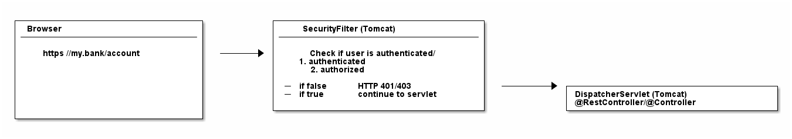
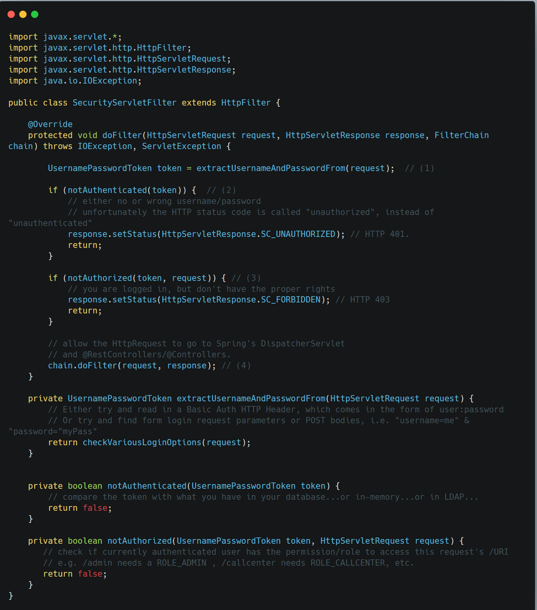

### What is Spring Security and how does it work?

**The short answer**:

At its core, Spring Security is really just a bunch of servlet filters that help you add [authentication](https://www.marcobehler.com/guides/spring-security#authentication-explained) and [authorization](https://www.marcobehler.com/guides/spring-security#authorization-explained) to your web application.

It also integrates well with frameworks like Spring Web MVC (or [Spring Boot](https://www.marcobehler.com/guides/spring-boot)), as well as with standards like OAuth2 or SAML. And it auto-generates login/logout pages and protects against common exploits like CSRF.

&nbsp;

## Web Application Security: 101

1.  Authentication
    
2.  Authorization
    
3.  Servlet Filters
    

&nbsp;

* * *

### 1\. Authentication

First off, if you are running a typical (web) application, you need your users to *authenticate*. That means your application needs to verify if the user is *who* he claims to be, typically done with a username and password check.

**User**: "I’m the president of the United States. My `username` is: potus!"

**Your webapp**: "Sure sure, what’s your `password` then, Mr. President?"

**User**: "My password is: th3don4ld".

**Your webapp**: "Correct. Welcome, Sir!"

&nbsp;

* * *

### 2\. Authorization

In simpler applications, authentication might be enough: As soon as a user authenticates, she can access every part of an application.

But most applications have the concept of permissions (or roles). Imagine: customers who have access to the public-facing frontend of your webshop, and administrators who have access to a separate admin area.

Both type of users need to login, but the mere fact of authentication doesn’t say anything about what they are allowed to do in your system. Hence, you also need to check the permissions of an authenticated user, i.e. you need to *authorize* the user.

**User**: "Let me play with that nuclear football…​."

**Your webapp**: "One second, I need to check your `permissions` first…​..yes Mr. President, you have the right clearance level. Enjoy."

**User**: "What was that red button again…​??"

* * *

### 3\. Servlet Filters

Last but not least, let’s have a look at Servlet Filters. What do they have to do with authentication and authorization?

#### Why use Servlet Filters?

We know  that basically any Spring web application is *just* one servlet: Spring’s good old [DispatcherServlet](https://docs.spring.io/spring/docs/current/spring-framework-reference/web.html#mvc-servlet), that redirects incoming HTTP requests (e.g. from a browser) to your @Controllers or @RestControllers.

The thing is: There is no security hardcoded into that DispatcherServlet and you also very likely don’t want to fumble around with a raw HTTP Basic Auth header in your @Controllers. Optimally, the authentication and authorization should be done before a request hits your @Controllers.

&nbsp;

Luckily, there’s a way to do exactly this in the Java web world: you can put filters in front of servlets, which means you could think about writing a SecurityFilter and configure it in your Tomcat (servlet container/application server) to filter every incoming HTTP request before it hits your servlet.

&nbsp;

&nbsp;

#### A naive SecurityFilter

A SecurityFilter has roughly 4 tasks and a naive and overly-simplified implementation could look like this:

&nbsp;

&nbsp;

1.  First, the filter needs to extract a username/password from the request. It could be via a [Basic Auth HTTP Header](https://en.wikipedia.org/wiki/Basic_access_authentication), or form fields, or a cookie, etc.
    
2.  Then the filter needs to validate that username/password combination against *something*, like a database.
    
3.  The filter needs to check, after successful authentication, that the user is authorized to access the requested URI.
    
4.  If the request *survives* all these checks, then the filter can let the request go through to your DispatcherServlet, i.e. your @Controllers.
    

&nbsp;

&nbsp;

it would sooner or later lead to one monster filter with a ton of code for various authentication and authorization mechanisms.

In the real-world, however, you would split this one filter up into *multiple* filters, that you then *chain* together.

For example, an incoming HTTP request would…​

1.  First, go through a LoginMethodFilter…​
    
2.  Then, go through an AuthenticationFilter…​
    
3.  Then, go through an AuthorizationFilter…​
    
4.  Finally, hit your servlet.
    

This concept is called *FilterChain* and the last method call in your filter above is actually delegating to that very chain:

&nbsp;

With such a filter (chain) you can basically handle every authentication or authorization problem there is in your application, without needing to change your actual application implementation (think: your @RestControllers / @Controllers).

&nbsp;