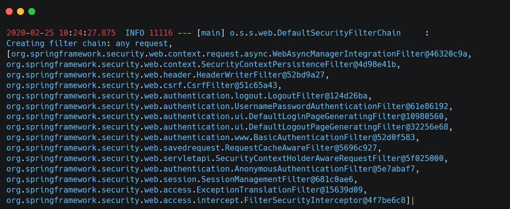
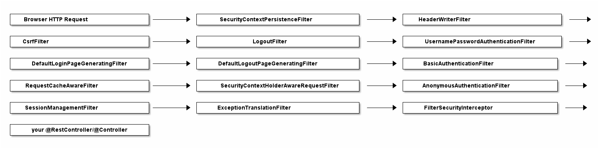

### Spring’s DefaultSecurityFilterChain

Let’s assume you \[set up Spring Security\](https://www.marcobehler.com/guides/spring-security#spring-security-dependencies) correctly and then boot up your web application. You’ll see the following log message:

&nbsp;

&nbsp;

it looks like Spring Security does not just install *one* filter, instead it installs a whole filter chain consisting of 15 (!) different filters.

So, when an HTTPRequest comes in, it will go through *all* these 15 filters, before your request finally hits your @RestControllers. The order is important, too, starting at the top of that list and going down to the bottom.

&nbsp;

&nbsp;

### Analyzing Spring’s FilterChain

- **BasicAuthenticationFilter**: Tries to find a Basic Auth HTTP Header on the request and if found, tries to authenticate the user with the header’s username and password.
    
- **UsernamePasswordAuthenticationFilter**: Tries to find a username/password request parameter/POST body and if found, tries to authenticate the user with those values.
    
- **DefaultLoginPageGeneratingFilter**: Generates a login page for you, if you don’t explicitly disable that feature. THIS filter is why you get a default login page when enabling Spring Security.
    
- **DefaultLogoutPageGeneratingFilter**: Generates a logout page for you, if you don’t explicitly disable that feature.
    
- **FilterSecurityInterceptor**: Does your authorization.
    

&nbsp;

So with these couple of filters, Spring Security provides you a login/logout page, as well as the ability to login with Basic Auth or Form Logins, as well as a couple of additional goodies like the CsrfFilter, that we are going to have a look at later.

&nbsp;

* * *

Those filters, for a large part, are Spring Security. Not more, not less.

They do all the work. What’s left for you is to configure how they do their work, i.e. which URLs to protect, which to ignore and what database tables to use for authentication.

Hence, we need to have a look at how to configure Spring Security, next.