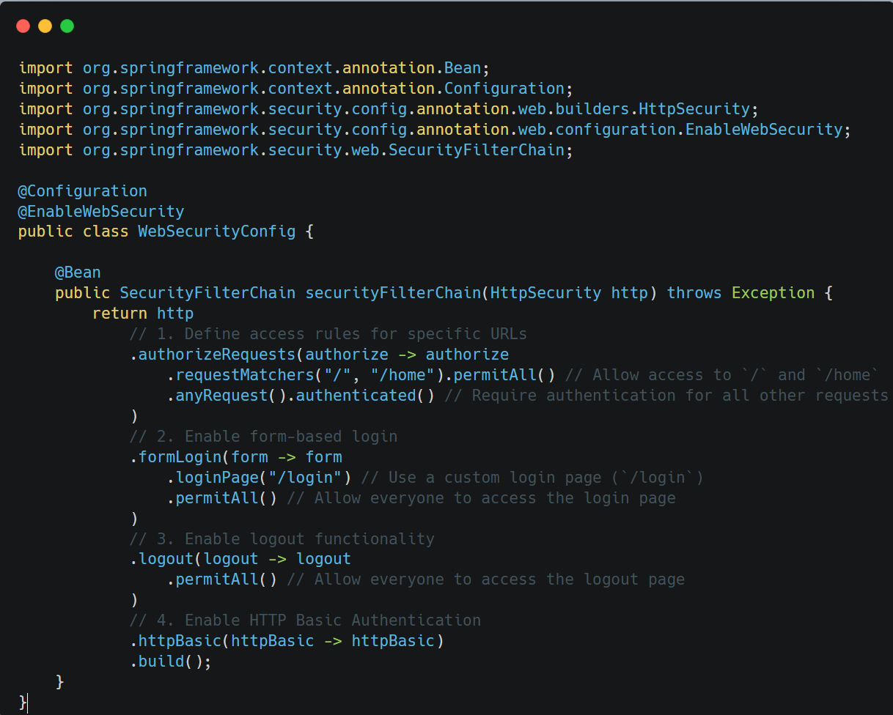
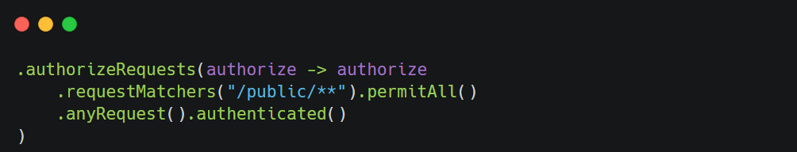
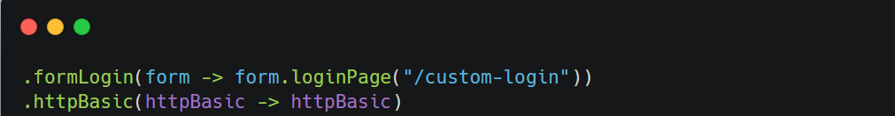

### **How to Configure Spring Security: Using SecurityFilterChain**

With the latest versions of Spring Security (5.7+), the way to configure security has evolved. Instead of extending `WebSecurityConfigurerAdapter`, ==you now define a `SecurityFilterChain`== bean directly. This approach is more  modular, flexible, and aligns with Spring's move toward functional-style configuration.

&nbsp;

&nbsp;

#### **Key Concepts**

1.  **Annotate with `@EnableWebSecurity`:**
    
    - The `@EnableWebSecurity` annotation is still used to enable Spring Security in your application.  
         
2.  \*\*Define a `SecurityFilterChain` Bean:  
    \*\*
    
    - Instead of extending `WebSecurityConfigurerAdapter`, you create a `@Bean` method that returns a  
         `SecurityFilterChain`. This allows you to configure your security rules programmatically.  
         
3.  **Use the DSL (Domain-Specific Language):**
    
    - The new DSL provides methods like `authorizeRequests()`, `formLogin()`, `httpBasic()`, etc., which allow you to configure security in a declarative and expressive manner.

&nbsp;

1.  **Is Annotated with `@EnableWebSecurity`:**
    
    - The `@EnableWebSecurity` annotation enables Spring Security in your application.
2.  **Defines a `SecurityFilterChain` Bean:**
    
    - The `SecurityFilterChain` bean replaces the need to extend `WebSecurityConfigurerAdapter`. It provides a programmatic way to configure security.
3.  **URL Access Rules:**
    
    - `.requestMatchers("/", "/home").permitAll()`:
        - Allows unrestricted access to the `/` and `/home` endpoints.
    - `.anyRequest().authenticated()`:
        - Requires authentication for all other requests.
4.  **Form Login Configuration:**
    
    - `.loginPage("/login")`:
        - Specifies a custom login page (`/login`) instead of the default one provided by Spring Security.
    - `.permitAll()`:
        - Ensures that anyone can access the login page without being authenticated.
5.  **Logout Configuration:**
    
    - `.logout().permitAll()`:
        - Allows unrestricted access to the logout functionality.
6.  **HTTP Basic Authentication:**
    
    - `.httpBasic()`:
        - Enables HTTP Basic Authentication, allowing clients to authenticate using an `Authorization` header.

* * *

The `HttpSecurity` object provides a powerful DSL (Domain-Specific Language) for configuring your application's security. Here’s what you can achieve with it:

1.  **Specify URL Protection Rules:**
    
    - Use `.authorizeRequests()` to define which URLs require authentication and which ones are publicly accessible.  
        
2.  **Configure Authentication Methods:**
    
    - Use `.formLogin()` to enable form-based authentication.
    - Use `.httpBasic()` to enable HTTP Basic Authentication.  
        
3.  **Customize Security Features:**
    
    - You can customize features like CSRF protection, session management, and CORS policies using the DSL.
    - Example (Disable CSRF):  
        

&nbsp;

* * *

#### **Default Behavior**

If you do not configure any security settings, Spring Security applies the following defaults:

1.  **All Requests Require Authentication:**
    
    - By default, every request to your application will require authentication.
        
        
        
2.  **Form Login Enabled:**
    
    - A default login form is provided for form-based authentication.
3.  **HTTP Basic Authentication Enabled:**
    
    - Clients can authenticate using an HTTP Basic Auth header.

This default behavior is why your application may appear "locked down" as soon as you add Spring Security.

&nbsp;

* * *

#### **Authentication in Spring Security**

Spring Security uses filters like `BasicAuthenticationFilter` to extract credentials (e.g., username/password from an HTTP Basic Auth header). However, these filters need to validate the credentials against an authentication provider.

This leads us to the question of **how authentication works in Spring Security** . Authentication providers are responsible for verifying credentials against a user store (e.g., in-memory users, database, LDAP, etc.).

&nbsp;

Configuring authentication providers is a separate step and typically involves setting up a `UserDetailsService` or integrating with external systems like OAuth2 or LDAP.