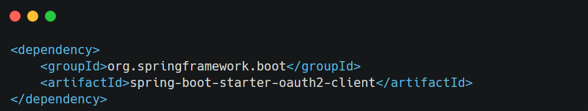
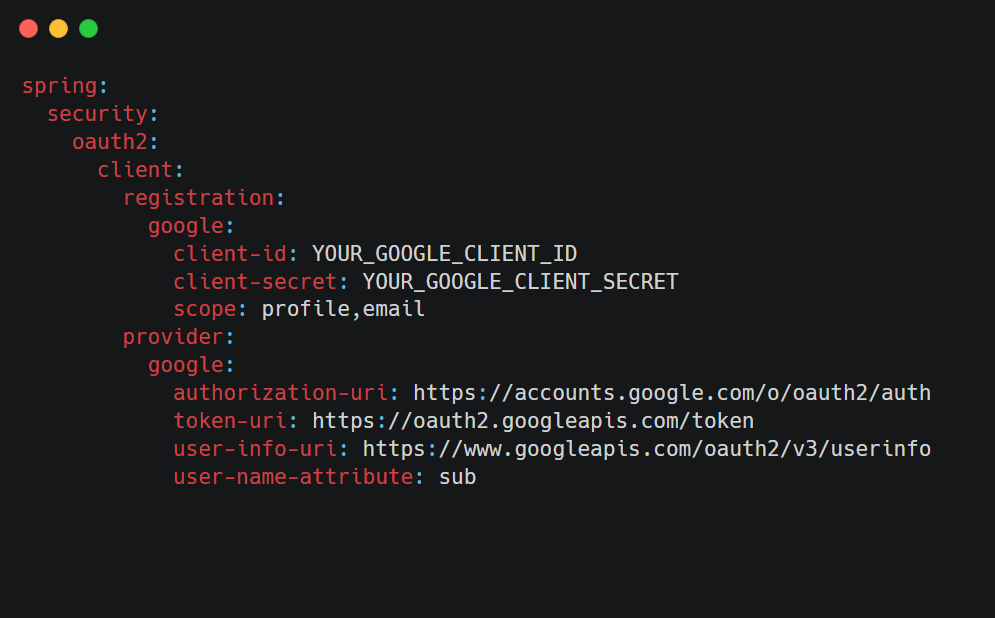
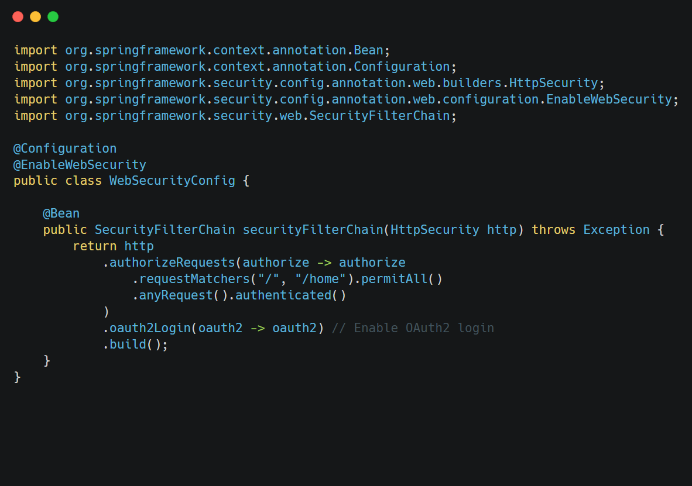

When it comes to authentication and Spring Security you have roughly three scenarios:

1.  The **default**: You *can* access the (hashed) password of the user, because you have his details (username, password) saved in e.g. a database table.
    
2.  **Less common**: You *cannot* access the (hashed) password of the user. This is the case if your users and passwords are stored *somewhere* else, like in a 3rd party identity management product offering REST services for authentication. say  [Atlassian Crowd](https://www.atlassian.com/software/crowd).
    
3.  **Also popular**: You want to use **OAuth2** or "Login with Google/Twitter/etc." (OpenID), likely in combination with JWT. Then none of the following applies
    

&nbsp;

&nbsp;

### **What is OAuth2?**

OAuth2 is an authorization framework that enables applications to obtain limited access to user accounts on an HTTP service (e.g., APIs). It works by delegating user authentication to the service hosting the account and authorizing third-party applications to access specific resources.

&nbsp;

### **Configuring OAuth2 in Spring Security**

Spring Security provides robust support for OAuth2, allowing you to integrate with external authorization servers (e.g., Google, GitHub) or configure your own. Below, we’ll explore how to configure OAuth2 for common use cases.

&nbsp;

&nbsp;**Add Dependencies:**

&nbsp;

**Configure Application Properties:** Add the client ID and client secret for the OAuth2 provider in your

`application.yml` or `application.properties` file. For example, for Google:

&nbsp;

&nbsp;

**Update Security Configuration:** Modify your `SecurityFilterChain` to enable OAuth2 login:

&nbsp;

&nbsp;