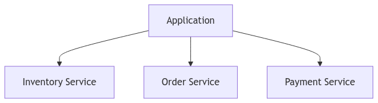
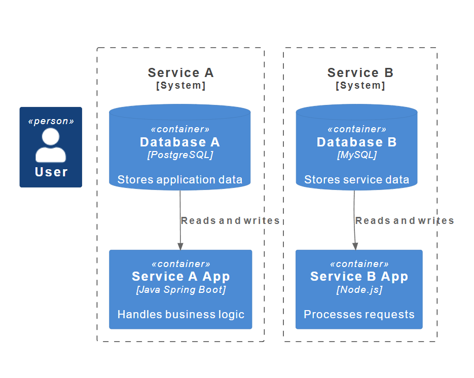
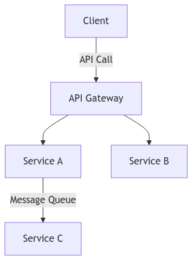
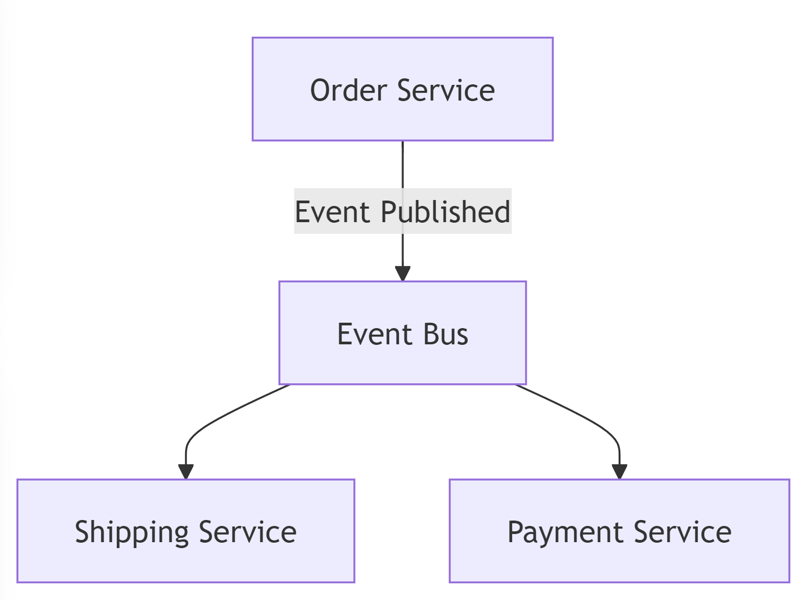

### Microservices Design Phases

#### 1\. **Decomposition Patterns**

Decomposition is how we divide our Monolith application into manageable and independent services called microservices. There are a few approaches we can use to break down our system.

- **By Business Capability**: We decompose services based on what the business needs. Each service represents a distinct business function. For example, in an e-commerce platform, we could have services for "inventory management," "payment," and "order processing."
    
- **By Subdomain**: Here, we split services based on the domain boundaries. We use Domain-Driven Design (DDD) concepts, like splitting based on bounded contexts. Each service owns a specific subdomain.
    
- **By Resources (REST-oriented)**: We organize services around resources that map to REST APIs, such as products, users, and orders.
    

&nbsp;

* * *

#### 2\. **Database Patterns**

Databases are critical when working with microservices, and we must decide how to store and manage data for each service.

- **Database per Service**: Each service has its own database, ensuring isolation and independent scaling. This allows us to decouple the data for each service, preventing issues like locking between services.
    
- **Shared Database**: In some cases, multiple services might access the same database. This can simplify data management but couples services tightly and can create contention.
    
- **SAGA Pattern**: For handling distributed transactions, we can use the SAGA pattern, where each local transaction updates its database and publishes an event to trigger the next action.
    

#### 3\. **Communication Patterns**

Microservices communicate with each other using different patterns, depending on the needs of the system.

- **Synchronous Communication**: Services communicate directly, often using REST APIs or gRPC. While simple, this can lead to tight coupling and latency issues.
    
- **Asynchronous Communication**: Services communicate indirectly using messaging systems like RabbitMQ or Kafka. This allows for more resilient systems, decoupling services by introducing message queues.
    
- **API Gateway**: We often use an API Gateway to centralize and route requests to different microservices. It simplifies client communication by hiding the complexity of the service architecture.
    

&nbsp;

&nbsp;

&nbsp;

&nbsp;

&nbsp;

#### 4\. **Integration Patterns**

Integration is how we connect and synchronize data between services. A few common patterns include:

- **Event-Driven Architecture**: Services produce and consume events asynchronously. For example, if an order is created, an "order-created" event is sent, and other services (like shipping or payment) react to it.
    
- **Publish-Subscribe Pattern**: Services publish events, and multiple services subscribe to those events. This allows us to decouple services, as they don’t need to know about each other’s existence.
    
- **Service-Oriented Architecture (SOA)**: We use a centralized service bus to integrate services, a common approach in legacy systems.
    

&nbsp;

&nbsp;

#### 5\. **Deployment Patterns**

Microservices have unique deployment challenges, and we can use several patterns to simplify deployment.

- **Single Service per Host**: We deploy each service on its own virtual machine or container. This is simple to implement and allows easy scaling of individual services.
    
- **Multiple Services per Host**: We can deploy multiple services on a single host. This reduces resource consumption but couples services.
    
- **Service Mesh**: A service mesh manages microservice communication at the infrastructure layer, handling things like retries, timeouts, and security across services.
    

#### 6\. **Cross-Cutting Concerns**

Cross-cutting concerns are functionalities that span across multiple microservices, such as monitoring, logging, and security.

- **Logging**: We need centralized logging to capture logs from all services. Tools like ELK (Elasticsearch, Logstash, Kibana) can aggregate logs.
    
- **Monitoring**: We monitor each service's health using tools like Prometheus or Grafana. Health checks and metrics help us maintain uptime and resolve issues quickly.
    
- **Security**: Security is crucial in microservices. We ensure secure communication between services using OAuth, mutual TLS, or API tokens.