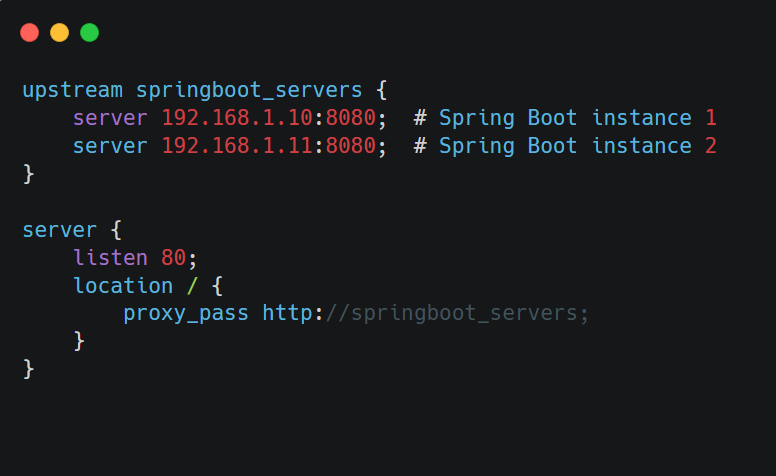

&nbsp;

When our application grows and runs on multiple servers, we need a way to distribute incoming traffic evenly—this is where **load balancing** comes in. Think of it like a traffic cop directing cars (requests) to different lanes (servers) to prevent congestion

&nbsp;

&nbsp;

### **How Load Balancers Work**

1.  **Request Arrives**: A user hits our application (e.g., `example.com`).
    
2.  **Load Balancer Decides**: Instead of sending all requests to one server, it picks the best available server.
    
3.  **Response Sent**: The chosen server processes the request and sends back the result.
    

This prevents any single server from getting overwhelmed while improving reliability (if one server crashes, others keep running).

&nbsp;

&nbsp;

* * *

### **Common Load Balancing Techniques**

#### **1\. Round Robin (Simplest Method)**

- **How it works**: Distributes requests **sequentially** to each server in order.
    
    - *Example*: Server 1 → Server 2 → Server 3 → Server 1 → ...
- **Pros**:
    
    - Easy to implement.
        
    - Works well when all servers are equally powerful.
        
- **Cons**:
    
    - Doesn’t account for server load (a slow server gets the same traffic as a fast one).

&nbsp;

* * *

#### **2\. Least Connections (Smarter Distribution)**

- **How it works**: Sends requests to the server with the **fewest active connections**.
    
    - *Example*: If Server 1 has 10 active requests and Server 2 has 2, new requests go to Server 2.
- **Pros**:
    
    - Better for uneven workloads (avoids overloading busy servers).
- **Cons**:
    
    - Slightly more complex than Round Robin.

* * *

&nbsp;

#### **3\. IP Hash (Session Persistence)**

- **How it works**: The same user (IP) always goes to the same server.
    
    - *Example*: User A always hits Server 1, User B always hits Server 2.
- **Pros**:
    
    - Useful for maintaining user sessions (e.g., shopping carts).
- **Cons**:
    
    - Can lead to uneven distribution if some users make many more requests.

&nbsp;

* * *

&nbsp;

### **Redundancy & Failover Strategies**

Load balancers also improve **reliability**. Here’s how:

1.  **Health Checks**:
    
    - The load balancer periodically checks if servers are alive.
        
    - If a server crashes, it’s **automatically removed** from rotation.
        
2.  **Backup Servers (Passive Mode)**:
    
    - Keep spare servers on standby; if primary servers fail, backups take over.
3.  **Multi-Region Load Balancing**:
    
    - Distribute traffic across **different data centers** (e.g., AWS in US + Europe).

&nbsp;

&nbsp;

&nbsp;

#### **Nginx (Popular, Reverse Proxy + Load Balancer)**

- **What it does**:
    
    - A **server-side** load balancer (sits in front of Spring Boot apps).
        
    - Routes traffic to multiple backend instances.
        

&nbsp;  Basic Configuration:

- All requests to port `80` get distributed across the two Spring Boot servers.

  
        

&nbsp;

- **Pros**:
    
    - Works with **any** backend (Java, Node, Python, etc.).
        
    - Supports **SSL termination, caching, and static file serving**.
        
- **Cons**:
    
    - Requires manual setup (not embedded like Spring Cloud LB).