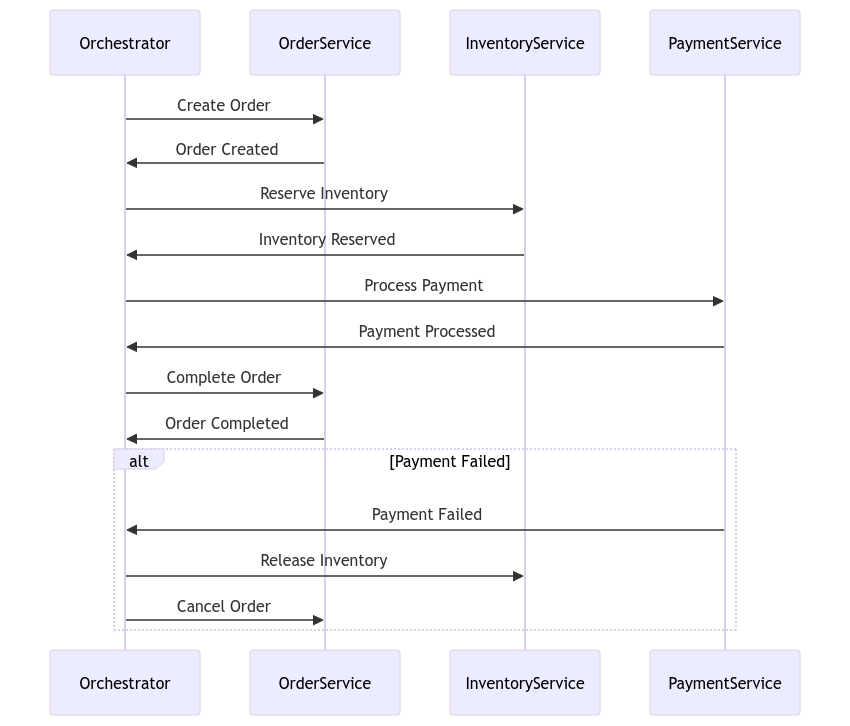
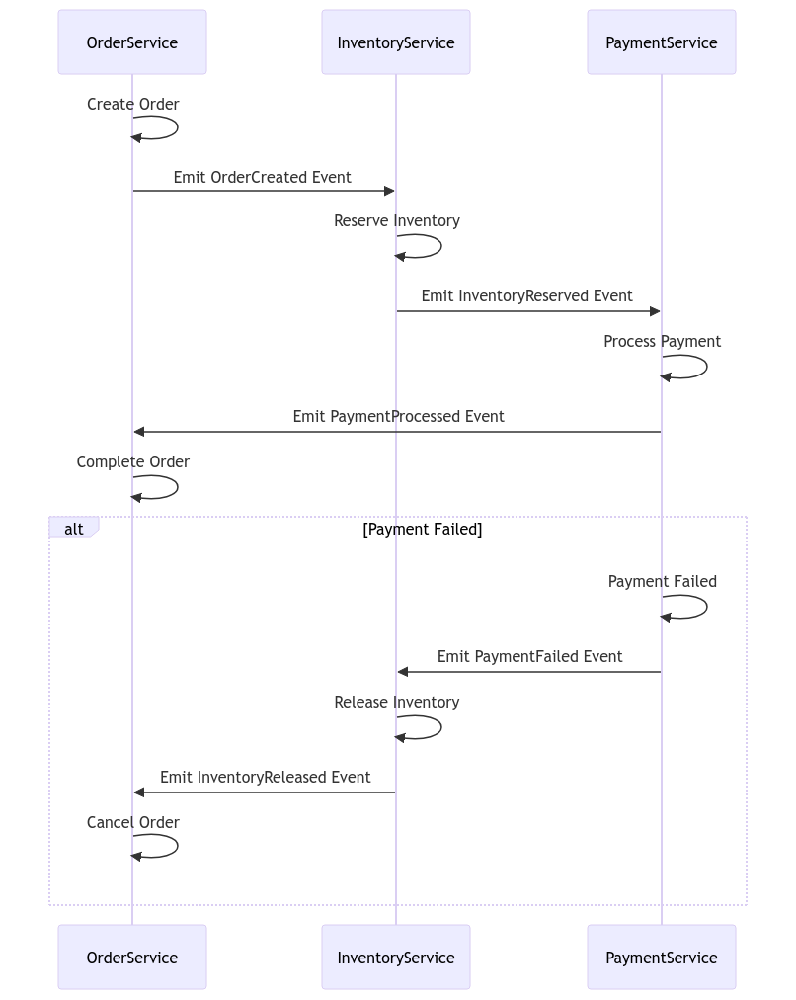

### **SAGA Pattern: A Deep Dive**

The **SAGA pattern** is a key solution for managing **distributed transactions** in microservices. When each microservice has its own database, traditional ACID transactions are no longer feasible. Instead, we rely on **event-driven transactions** and **compensation mechanisms** to maintain data consistency across services.

#### **Purpose of SAGA Pattern**

The main goal of the SAGA pattern is to ensure that distributed transactions across multiple services are eventually consistent. Unlike ACID transactions, which lock resources to ensure atomicity, SAGA orchestrates multiple steps (local transactions) across different services. ==If any step fails, the SAGA pattern triggers compensating transactions to undo the changes, achieving eventual consistency.==

* * *

#### **Types of SAGA Pattern**

There are two main ways we can implement the SAGA pattern:

1.  **Choreography-Based SAGA**  
    Each microservice involved in the transaction triggers the next step by producing an event. This is a **decentralized approach**, where there’s no central coordinator managing the transaction.
    
2.  **Orchestration-Based SAGA**  
    A central controller or orchestrator explicitly manages the transaction. It sends commands to services, waits for responses, and ensures the flow of the overall transaction.
    

* * *

### **How SAGA Works**

To understand the SAGA pattern deeply, let’s imagine we are building an **e-commerce application**. In a typical order processing scenario, we have multiple services involved: **OrderService**, **InventoryService**, and **PaymentService**. Each service manages its own database, and no global transaction can span all services. Here’s how we can handle the transaction using SAGA:

1.  **Step 1: Start Transaction (Create Order)**
    
    - A customer places an order.
    - The **OrderService** starts the transaction by creating a new order and publishing an event like `OrderCreated`.
2.  **Step 2: Reserve Inventory**
    
    - The **InventoryService** listens for the `OrderCreated` event.
    - It reserves the items and updates its own database.
    - It then publishes an event like `InventoryReserved`.
3.  **Step 3: Process Payment**
    
    - The **PaymentService** listens for the `InventoryReserved` event.
    - It charges the customer and updates the payment status in its own database.
    - It publishes an event like `PaymentProcessed`.
4.  **Step 4: Complete Order**
    
    - Finally, the **OrderService** listens for the `PaymentProcessed` event and marks the order as complete in its own database.

If any of these steps fail, the SAGA pattern initiates **compensating transactions** to roll back the changes made by the previous services. For example, if the payment fails, we roll back the inventory reservation and cancel the order.

&nbsp;

* * *

### **Choreography-Based SAGA**

In the **choreography-based** approach, ==services communicate with each other by emitting events==. Each service reacts to events from others and performs its local transaction. If one service fails, it emits a failure event, triggering compensating actions in other services.

**Example Choreography:**

- **OrderService** creates an order and emits `OrderCreated`.
- **InventoryService** listens to `OrderCreated`, reserves inventory, and emits `InventoryReserved`.
- **PaymentService** listens to `InventoryReserved`, processes payment, and emits `PaymentProcessed`.
- **OrderService** listens to `PaymentProcessed` and completes the order.

If any step fails:

- If **PaymentService** fails, it emits `PaymentFailed`, causing **InventoryService** to emit `InventoryRelease`, and **OrderService** to cancel the order.

* * *

### **Orchestration-Based SAGA**

In the **orchestration-based** approach, ==a central orchestrator manages the entire transaction process. The orchestrator knows the workflow and issues commands to the relevant services==. It waits for each step to complete and proceeds to the next. If a step fails, the orchestrator triggers compensating actions.

**Steps in Orchestration**:

1.  **Orchestrator** starts by sending a command to **OrderService** to create an order.
2.  **OrderService** performs its task and sends a success/failure response back to the orchestrator.
3.  **Orchestrator** sends a command to **InventoryService** to reserve inventory.
4.  **InventoryService** reserves the items and reports back to the orchestrator.
5.  **Orchestrator** sends a command to **PaymentService** to process the payment.
6.  **PaymentService** processes the payment and reports back.
7.  Finally, the **Orchestrator** sends a command to **OrderService** to mark the order as complete.

If the **PaymentService** fails, the orchestrator issues commands to **InventoryService** and **OrderService** to roll back their changes.

&nbsp;

* * *

### **Detailed Example of Orchestration with Compensation**

Let’s take a detailed example with **Spring Boot** and how we can implement a SAGA pattern using orchestration.

1.  **Start with Orchestrator**: We implement an orchestrator that coordinates the transaction flow. For instance, we might use a **Spring Boot service** with **Spring State Machine** to manage the workflow.

```java
public class OrderSagaOrchestrator {
    public void startSaga(Order order) {
        // Step 1: Create Order
        createOrder(order);
        
        // Step 2: Reserve Inventory
        reserveInventory(order);

        // Step 3: Process Payment
        processPayment(order);

        // Step 4: Mark Order Complete
        completeOrder(order);
    }

    public void compensateSaga(Order order) {
        // If any step fails, roll back previous steps
        cancelOrder(order);
        releaseInventory(order);
        rollbackPayment(order);
    }
}

```

  
**OrderService Example**: The **OrderService** communicates with the orchestrator and performs its local transaction.

&nbsp;

```java
public class OrderService {
    public void createOrder(Order order) {
        // Save order to the database
        orderRepository.save(order);
        // Notify the orchestrator that order is created
        orchestrator.onOrderCreated(order);
    }

    public void cancelOrder(Order order) {
        // Cancel order and update the database
        order.setStatus(OrderStatus.CANCELLED);
        orderRepository.save(order);
    }
}

```

&nbsp;

&nbsp;

**Compensating Transaction**: If the payment fails, the orchestrator compensates the previously executed steps. In this case, we need to release the reserved inventory and cancel the order.

&nbsp;

* * *

### **Challenges in SAGA Implementation**

1.  **Complexity**: Implementing SAGA introduces complexity in terms of managing state, compensation logic, and error handling. This complexity can grow as the number of services increases.
2.  **Latency**: Since SAGA transactions are not atomic, there can be delays between steps. This can lead to inconsistency in the system during the time the SAGA is in progress.
3.  **Idempotency**: Each service must ensure that its actions are idempotent (i.e., performing the same action multiple times results in the same state). This is crucial in distributed systems to avoid unintended side effects.

Orchestration-Based



&nbsp;

Choreography-Based

