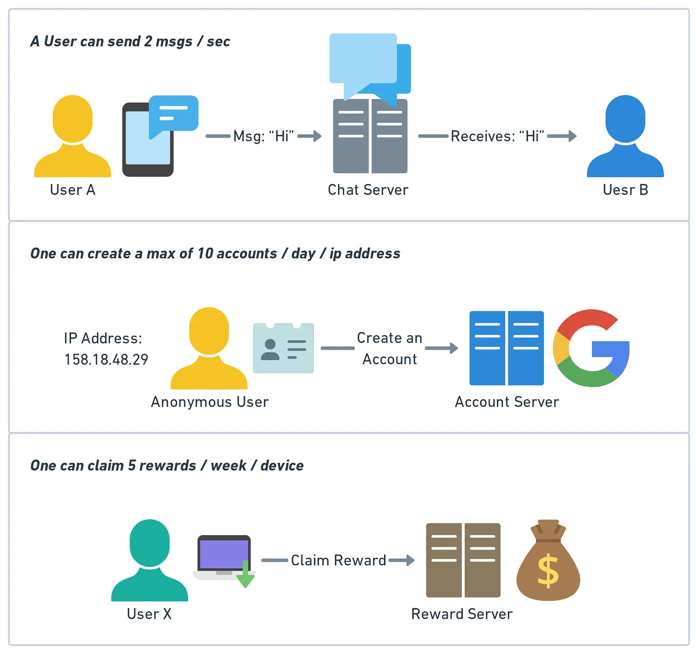
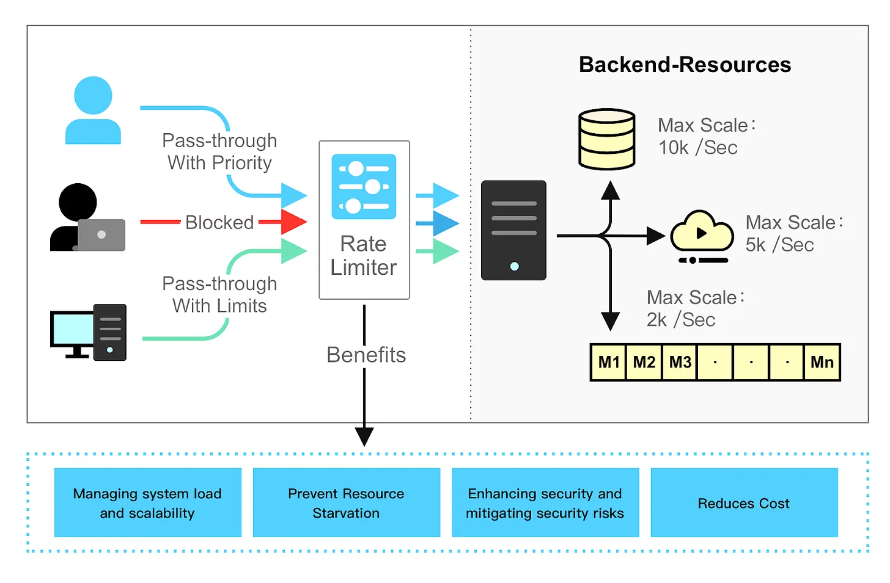
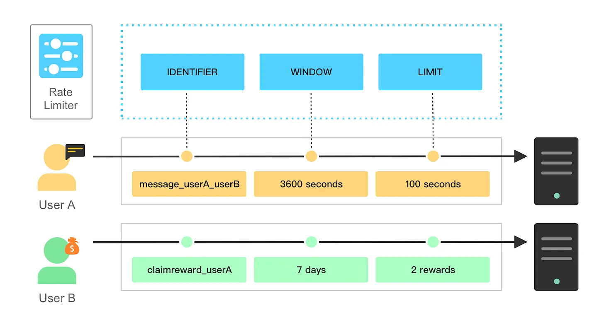
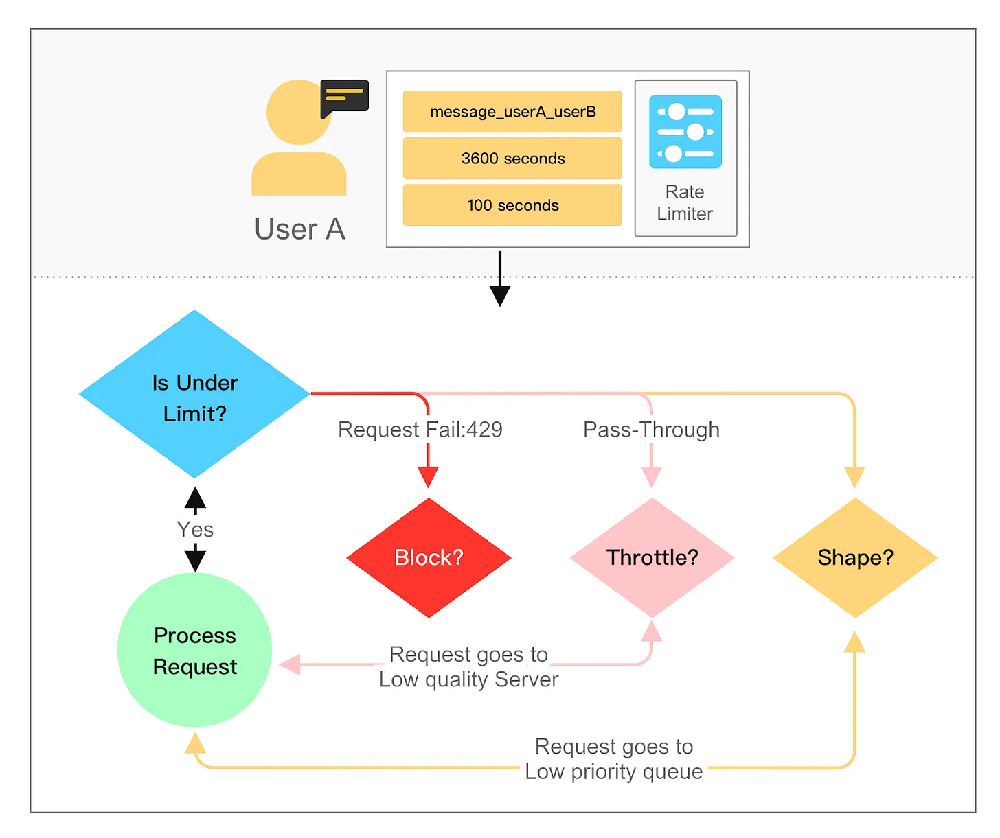
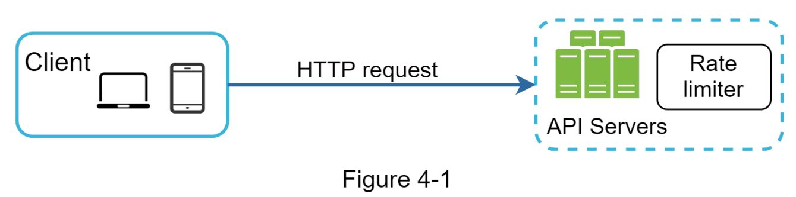
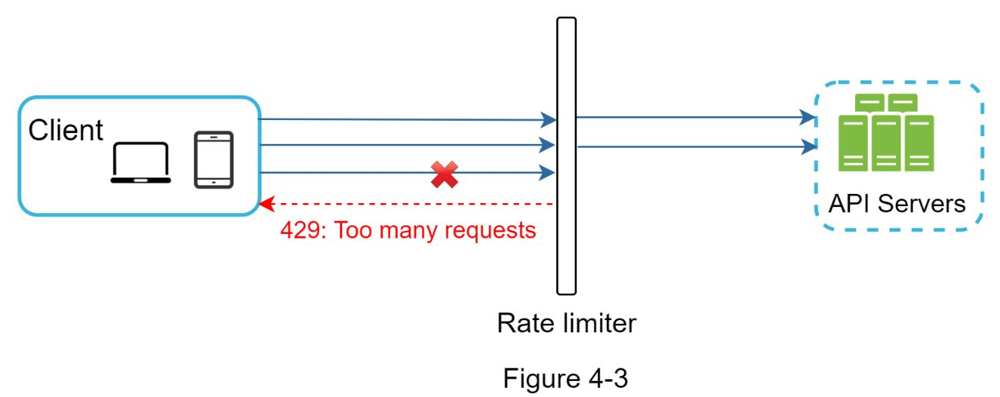
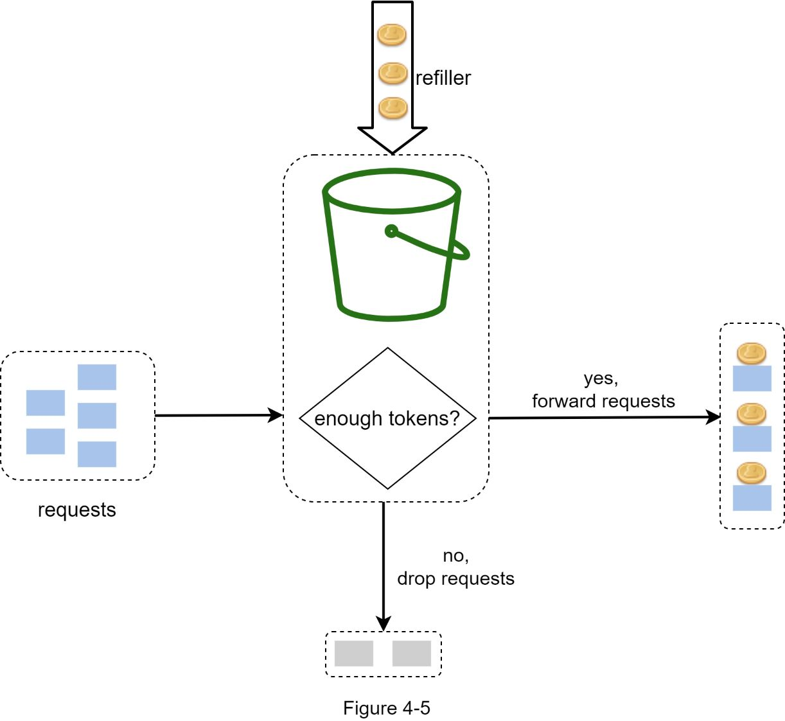

==Rate limiting controls the rate at which users or services can access a resource. When the rate of requests exceeds the threshold defined by the rate limiter, the requests are throttled or blocked. Here are some examples:==

- A user can send a message no more than 2 per second
    
- One can create a maximum of 10 accounts per day from the same IP address
    
- One can claim rewards no more than 5 times per week from the same device
    

&nbsp;

&nbsp;

## Why Rate Limiting is Necessary?

Rate Limiting is necessary because of the following reasons:

- ****Preventing Abuse:**** Limits excessive requests to prevent flooding endpoints, ensuring data integrity and availability.
- ****Ensuring Fair Use:**** Distributes resources evenly among users, preventing one user from monopolizing service resources and improving overall satisfaction.
- ****Maintaining Performance:**** Prevents server overloads, reduces latency, and ensures efficient service delivery, enhancing user experience.
- ****reduces cost**** Controls resource usage to prevent unexpected infrastructure costs, managing resources effectively
- ****Prevents resources starvation:**** Mitigates DoS attacks by limiting request rates, and safeguarding website availability and reliability against malicious overload attempts.

&nbsp;

&nbsp;

&nbsp;**Rate limiting can be applied at various levels:**

- **User Level :** Suppose on a social media platform to avoid spams or malicious activity , number of posts, comments can be restricted at user level  
     
- **Application Level:**  In a situation like major concert sale , platform can expect surge of surge in traffic , application level can be very useful in this case , it can prevent number of tickets purchased per minute ,it prevent system from being overwhelmed and overloaded
- **API Level :** Consider a cloud storage service that provides an API for uploading and downloading files. To ensure fair use and protect the system from misuse, the service might enforce limits on the number of API calls each user can make per minute.
- **User Account Level : A SaaS platform offering multiple tiers of service can have different usage limits for each tier. Free tier users may have a lower rate limit compared to premium tier users. This effectively manages resource usage while encouraging users to upgrade to higher limits.**
- **and many more like based on IPS , geography ,etc**

## Core Concepts of Rate Limiting

Most rate limiting implementations share three core concepts.

They are the **limit**, the **window**, and the **identifier**

- The **limit** defines the ceiling for allowable requests or actions within a designated time span. For example, we might allow a user to send no more than 100 messages every hour..
- The **window** is the time period where the limit comes into play. It could be any length of time, whether it be an hour, a day, or a week. Longer durations do have their own implementation challenges, like storage durability
- The **identifier** is a unique attribute that differentiates between individual callers. A user ID or IP address is a common example.

* * *

### Rate Limiting Responses :

**blocking, throttling, and shaping.**

- Blocking takes place when requests exceeding the limit are denied access to the resource. It is commonly expressed as an error message such as HTTP status code 429 (Too Many Requests).
- Throttling, by comparison, involves slowinging down or delaying the requests that go beyond the limit. An example would be a video streaming service reducing the quality of the stream for users who have gone over their data cap.
- Shaping, on the other hand, allows requests that surpass the limit. But those requests are assigned lower priority. This ensures that users who abide by the limits receive quality service. For example, in a content delivery network, requests from users who have crossed their limits may be processed last, while those from normal users are prioritized.

&nbsp;

&nbsp;

* * *

&nbsp;

**Where to put the rate limiter?**

Intuitively, you can implement a rate limiter at either the client or server-side.

- **Client-side implementation.** Generally speaking, client is an unreliable place to enforce rate limiting because client requests can easily be forged by malicious actors. Moreover, we might not have control over the client implementation.
- **Server-side implementation.**

- **Rate limiter middleware:** Instead of putting a rate limiter at the API servers, we create a rate limiter middleware, which throttles requests to your APIs

&nbsp;

Cloud microservices  have become widely popular and **rate limiting is usually implemented within a component called API gateway**. API gateway is a fully managed service that supports rate limiting, SSL termination, authentication, IP whitelisting, servicing static content, etc.

while deciding where to put rate limiter, need to consider business need ,if we implement rate limiter at server there will be whole control on algorithm , and using third party rate limiter ,there are limited control in choosing rate control  
 Building your own rate limiting service takes time. If you do not have enough engineering resources to implement a rate limiter, a commercial API gateway is a better option.

* * *

**Token bucket algorithm**

Works as follows:

- A token bucket is a container that has pre-defined capacity.
- Tokens are put in the bucket at preset rates periodically.
- Once the bucket is full, no more tokens are added.
- Each request consumes one token. When a request arrives, we check if there are enough tokens in the bucket.
- If there are enough tokens, we take one token out for each request, and the request goes through.
- If there are not enough tokens, the request is dropped.  
    

&nbsp;The token bucket algorithm takes two parameters:

- **Bucket size:** the maximum number of tokens allowed in the bucket
- **Refill rate:** number of tokens put into the bucket every second How many buckets do we need? This varies, and it depends on the rate-limiting rules. Here are a few examples.

It is usually necessary to have different buckets for different API endpoints. For instance, if a user is allowed to make 1 post per second, add 150 friends per day, and like 5 posts per second, 3 buckets are required for each user.

- if we need to throttle requests based on IP addresses, each IP address requires a bucket.
- If the system allows a maximum of 10,000 requests per second, it makes sense to have a global bucket shared by all requests.

&nbsp;Implentation

&nbsp;https://github.com/ashishps1/awesome-system-design-resources/blob/main/implementations/java/rate_limiting/TokenBucket.java

&nbsp;

* * *

**Leaking bucket algorithm**

The leaking bucket algorithm is similar to the token bucket except that requests are processed at a fixed rate.

It is usually implemented with a first-in-first-out (FIFO) queue.

The algorithm works as follows:

- When a request arrives, the system checks if the queue is full.  If it is not full, the request is added to the queue.
- Otherwise, the request is dropped.
- Requests are pulled from the queue and processed at regular intervals.

&nbsp;