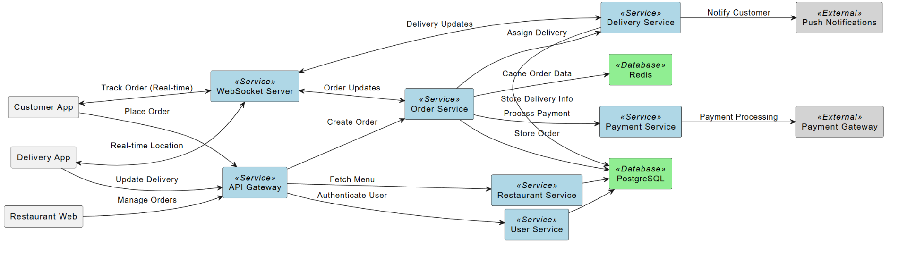

&nbsp;

&nbsp;

&nbsp;

&nbsp;

### Components

- **Customer App**: The mobile app where customers browse restaurants, place orders, and track deliveries in real time.
- **Restaurant Web**: A web interface for restaurants to manage their menus, accept or update orders (e.g., "preparing"), and communicate statuses.
- **Delivery App**: The mobile app used by delivery personnel to accept delivery assignments, update statuses (e.g., "delivered"), and share their location.
- **API Gateway**: Acts as a traffic cop, routing requests from the apps and web interface to the right microservices (e.g., Order Service).
- **WebSocket Server**: Enables real-time updates, like notifying the customer when their order is out for delivery or showing the delivery person’s live location.
- **Microservices**:
    - **User Service**: Handles user logins, profiles, and authentication.
    - **Restaurant Service**: Manages restaurant info and menu data.
    - **Order Service**: Processes orders from creation to completion.
    - **Payment Service**: Deals with payment transactions.
    - **Delivery Service**: Assigns deliveries and tracks their progress.
- **Databases**:
    - **PostgreSQL**: Stores permanent data like user info, orders, and delivery records.
    - **Redis**: Speeds things up by caching data that’s accessed often, like order statuses.
- **External Services**:
    - **Payment Gateway**: A third-party service (e.g., Stripe) for secure payment processing.
    - **Push Notifications**: Sends instant alerts to users (e.g., "Your food is on the way!") via services like Firebase.

&nbsp;

* * *

### Simplified Happy Flow

- Customer places an order via the **Customer App** → **API Gateway** → **Order Service**.
- Payment is handled by the **Payment Service** → **Payment Gateway**.
- Restaurant manages the order via the **Restaurant Web** → **Order Service**.
- Delivery is assigned and tracked via the **Delivery Service** → **Delivery App**.
- Real-time updates reach the customer via the **WebSocket Server** and **Push Notifications**.

* * *

## General Flow

1.  **Place Order (Customer App → API Gateway)**
    - The customer picks food in the Customer App and submits an order. The app sends this to the API Gateway, which directs it to the Order Service.
2.  **Track Order (Customer App → WebSocket Server)**
    - The customer tracks their order’s status (e.g., "being prepared") in real time via the WebSocket Server, which gets updates from other services.
3.  **Manage Orders (Restaurant Web → API Gateway)**
    - The restaurant uses the Restaurant Web to accept the order and update its status (e.g., "ready"). This goes through the API Gateway to the Order Service and Restaurant Service.
4.  **Update Delivery (Delivery App → API Gateway)**
    - The delivery person uses the Delivery App to mark the order as "picked up" or "delivered." This info goes through the API Gateway to the Delivery Service.
5.  **Real-time Location (Delivery App → WebSocket Server)**
    - The Delivery App sends the delivery person’s live location to the WebSocket Server, which shares it with the customer.
6.  **Order Request (API Gateway → Order Service)**
    - The API Gateway sends the order details to the Order Service for processing.
7.  **Process Payment (Order Service → Payment Service)**
    - The Order Service tells the Payment Service to handle the customer’s payment.
8.  **Payment Gateway (Payment Service → Payment Gateway)**
    - The Payment Service works with the external Payment Gateway to securely process the payment.
9.  **Assign Delivery (Order Service → Delivery Service)**
    - After payment, the Order Service tells the Delivery Service to assign a delivery person.
10. **Notify Customer (Delivery Service → Push Notifications)**
    - The Delivery Service sends a notification (e.g., "Your order is out for delivery") to the customer via Push Notifications.
11. **Store Order (Order Service → PostgreSQL)**
    - The Order Service saves the order details in PostgreSQL for record-keeping.
12. **Store Delivery Info (Delivery Service → PostgreSQL)**
    - The Delivery Service logs delivery details (e.g., who’s delivering) in PostgreSQL.
13. **Cache Order Data (Order Service → Redis)**
    - The Order Service stores quick-access data (like order status) in Redis to speed up updates.
14. **Order Updates (WebSocket Server → Order Service)**
    - The WebSocket Server checks the Order Service for the latest order status to send to the customer.
15. **Delivery Updates (WebSocket Server → Delivery Service)**
    - The WebSocket Server gets delivery progress from the Delivery Service to keep the customer updated.

&nbsp;

&nbsp;