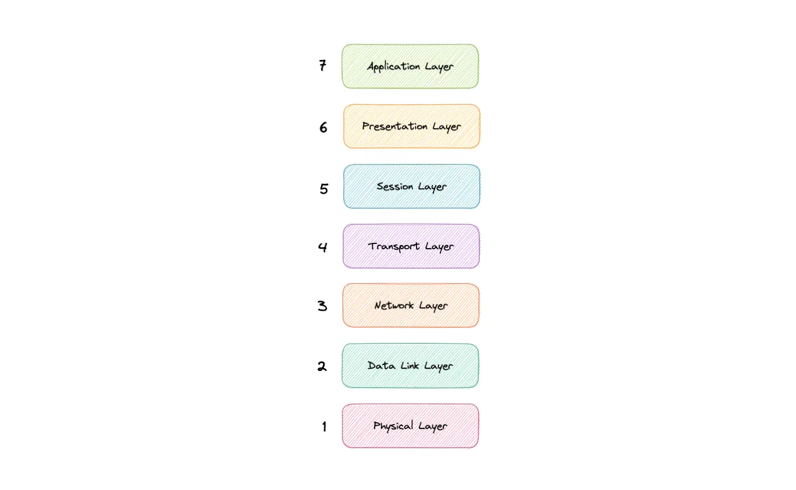
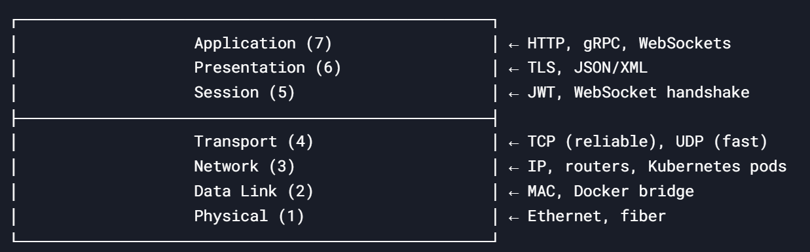

The OSI Model is a logical and conceptual model that defines network communication used by systems open to interconnection and communication with other systems.

The OSI Model can be seen as a universal language for computer networking. It's based on the concept of splitting up a communication system into seven abstract layers, each one stacked upon the last.

&nbsp;

&nbsp;

### **The 7 Layers** 

| Layer | Name | Key Responsibility | Real-World Analogies | Tech Stack Examples |
| --- | --- | --- | --- | --- |
| **7** | Application | Human-readable protocols (HTTP, gRPC) | "The language you speak" | Spring Boot REST APIs, RabbitMQ messages |
| **6** | Presentation | Data translation (encryption, compression) | "Translator for different formats" | TLS/SSL, JSON/XML serialization |
| **5** | Session | Manages connections (start/end sessions) | "Phone call setup/hangup" | WebSockets, JWT sessions |
| **4** | Transport | Reliable data delivery (TCP/UDP) | "Postal service (registered mail)" | TCP (PostgreSQL), UDP (DNS) |
| **3** | Network | Logical addressing & routing (IP) | "GPS for packets" | IP routing, Kubernetes CNI (Flannel) |
| **2** | Data Link | Physical addressing (MAC, switches) | "Local street addresses" | Ethernet, Docker bridge networks |
| **1** | Physical | Raw bit transmission (cables, WiFi) | "The roads/tunnels" | Fiber optics, AWS VPC backbone |

&nbsp;

&nbsp;

&nbsp;

&nbsp;

### Application

This is the only layer that directly interacts with data from the user. Software applications like web browsers and email clients rely on the application layer to initiate communication.

Application layer protocols include HTTP as well as SMTP.

&nbsp;

* * *

### Presentation

The presentation layer is also called the Translation layer. The data from the application layer is extracted here and manipulated as per the required format to transmit over the network. The functions of the presentation layer are translation, encryption/decryption, and compression.

&nbsp;

* * *

### Session

This is the layer responsible for opening and closing communication between the two devices. The time between when the communication is opened and closed is known as the session. The session layer ensures that the session stays open long enough to transfer all the data being exchanged, and then promptly closes the session in order to avoid wasting resources. 

&nbsp;

* * *

&nbsp;

### Transport

The transport layer (also known as layer 4) is responsible for end-to-end communication between the two devices. This includes taking data from the session layer and breaking it up into chunks called segments before sending it to the Network layer (layer 3). It is also responsible for reassembling the segments on the receiving device into data the session layer can consume.

&nbsp;

* * *

### Network

The network layer is responsible for facilitating data transfer between two different networks. The network layer breaks up segments from the transport layer into smaller units, called packets, on the sender's device, and reassembles these packets on the receiving device.

The network layer also finds the best physical path for the data to reach its destination this is known as routing. If the two devices communicating are on the same network, then the network layer is unnecessary.

* * *

&nbsp;

### Data Link

The data link layer is very similar to the network layer, except the data link layer facilitates data transfer between two devices on the same network.

The data link layer takes packets from the network layer and breaks them into smaller pieces called frames.

* * *

### Physical

This layer includes the physical equipment involved in the data transfer, such as the cables and switches. This is also the layer where the data gets converted into a bit stream, which is a string of 1s and 0s. The physical layer of both devices must also agree on a signal convention so that the 1s can be distinguished from the 0s on both devices.

&nbsp;

* * *

&nbsp;

&nbsp;

### **How Data Flows Through the Layers**

**Example**: Your Spring Boot app calls a PostgreSQL database.

1.  **Application (Layer 7)**:
    
    - Your app sends a SQL query via JDBC (`jdbc:postgresql://db:5432`).
2.  **Presentation (Layer 6)**:
    
    - Data is serialized (e.g., PostgreSQL’s binary protocol).
3.  **Transport (Layer 4)**:
    
    - TCP ensures reliable delivery (retries if packets are lost).
4.  **Network (Layer 3)**:
    
    - IP addresses route packets to the DB (`db` → resolves to `10.96.12.34` in Kubernetes).
5.  **Data Link (Layer 2)**:
    
    - Docker/K8s uses a virtual switch (e.g., `vethabc123`) to forward frames.

* * *

&nbsp;

&nbsp;

&nbsp;