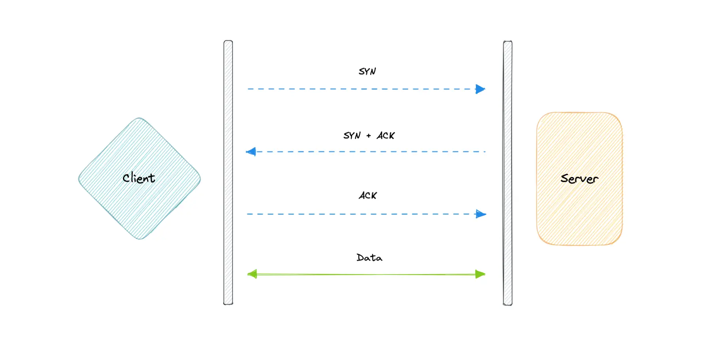
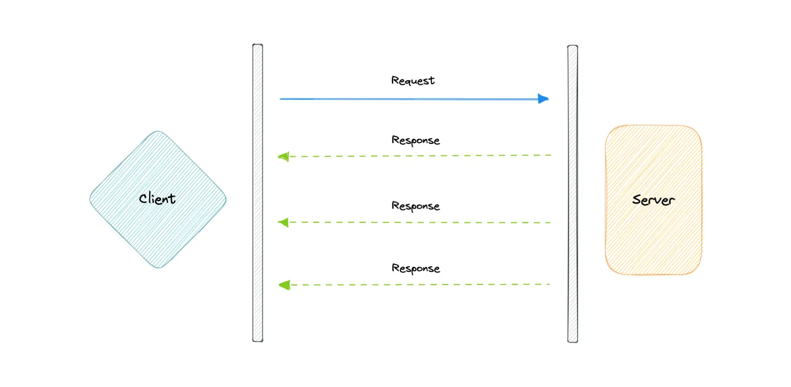

&nbsp;

&nbsp;

&nbsp;

&nbsp;

&nbsp;

## TCP

Transmission Control Protocol (TCP) is ==connection-oriented, meaning once a connection has been established, data can be transmitted in both directions.==

TCP has built-in systems to check for errors and to guarantee data will be delivered in the order it was sent, making it the perfect protocol for transferring information like still images, data files, and web pages.

&nbsp;

&nbsp;

## UDP

User Datagram Protocol (UDP) is a simpler, ==connectionless internet protocol in which error-checking and recovery services are not required.==

With UDP, there is no overhead for opening a connection, maintaining a connection, or terminating a connection. Data is continuously sent to the recipient, whether or not they receive it.

&nbsp;

&nbsp;

&nbsp;

&nbsp;

### **Key Characteristics Compared**

| Feature | TCP | UDP |
| --- | --- | --- |
| **Reliability** | ✅ Guarantees delivery | ❌ No delivery guarantees |
| **Ordering** | ✅ Preserves packet order | ❌ Packets may arrive out of order |
| **Connection** | ✅ Handshake (SYN/ACK) | ❌ No connection setup |
| **Speed** | ❌ Slower (overhead) | ✅ Blazing fast |
| **Use Cases** | Web, DBs, file transfers | Video streaming, gaming, DNS |
| **Protocol Examples** | HTTP, PostgreSQL, SSH | DNS, VoIP, Kubernetes probes |

&nbsp;

### **When to Use Which?**

#### **Use TCP When:**

- You need **reliable delivery** (e.g., banking transactions, API calls).
    
- Example Tech:
    
    - Spring Boot REST APIs (HTTP/HTTPS).
        
    - PostgreSQL/MySQL database connections.
        
    - File transfers (SFTP, SCP).
        

#### **Use UDP When:**

- You need **speed over reliability** (e.g., real-time systems).
    
- Example Tech:
    
    - Video streaming (e.g., Zoom, Netflix).
        
    - DNS lookups (UDP on port 53).
        
    - Multiplayer games (e.g., Fortnite, PUBG).
        
    
    &nbsp;
    
    &nbsp;
    
    &nbsp;