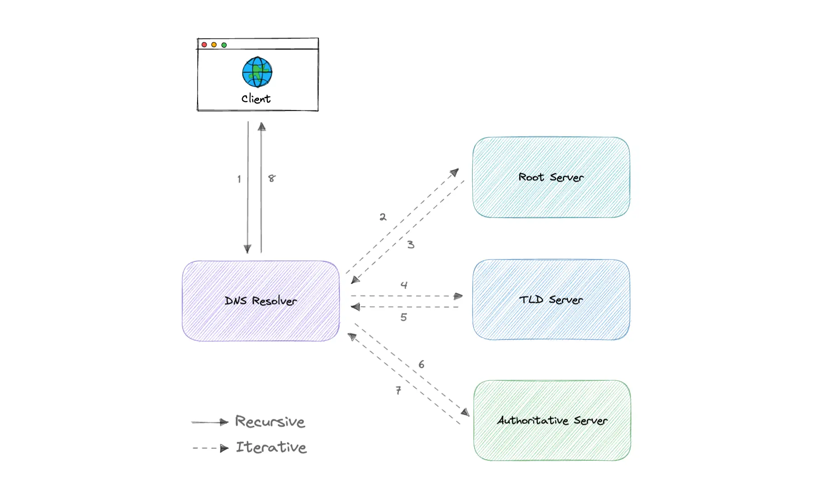

&nbsp;

Earlier we learned about IP addresses that enable every machine to connect with other machines. But as we know humans are more comfortable with names than numbers. It's easier to remember a name like `google.com` than something like `122.250.192.232`.

This brings us to Domain Name System ==(DNS) which is a hierarchical and decentralized naming system used for translating human-readable domain names to IP addresses.==

&nbsp;

## How DNS works

&nbsp;

#### **The Lookup Process**

1.  **Query Initiation**:
    
    - You type `api.yourservice.com` in a Spring Boot app.
2.  **Recursive Resolver**:
    
    - Your app asks the configured resolver (e.g., `8.8.8.8`).
3.  **Hierarchical Resolution**:  
    
    
4.  **Response**:
    
    - Returns `54.210.29.1` .

&nbsp;

Once the IP address has been resolved, the client should be able to request content from the resolved IP address. For example, the resolved IP may return a webpage to be rendered in the browser.

&nbsp;

### DNS Resolver

A DNS resolver (also known as a DNS recursive resolver) is the first stop in a DNS query.

The recursive resolver acts as a middleman between a client and a DNS nameserver.

After receiving a DNS query from a web client, a recursive resolver will either respond with cached data, or send a request to a root nameserver, followed by another request to a TLD nameserver, and then one last request to an authoritative nameserver.

After receiving a response from the authoritative nameserver containing the requested IP address, the recursive resolver then sends a response to the client.

&nbsp;

&nbsp;

### DNS root server

A root server accepts a recursive resolver's query which includes a domain name, and the root nameserver responds by directing the recursive resolver to a TLD nameserver, based on the extension of that domain (`.com`, `.net`, `.org`, etc.).

The root nameservers are overseen by a nonprofit called the <ins>Internet Corporation for Assigned Names and Numbers (ICANN)</ins>.

There are 13 DNS root nameservers known to every recursive resolver. There are 13 types of root nameservers, but there are multiple copies of each one all over the world.

&nbsp;

### TLD nameserver

A TLD nameserver maintains information for all the domain names that share a common domain extension, such as `.com`, `.net`, or whatever comes after the last dot in a URL.

Management of TLD nameservers is handled by the <ins>Internet Assigned Numbers Authority (IANA)</ins>, which is a branch of <ins>ICANN</ins>. The IANA breaks up the TLD servers into two main groups:

- **Generic top-level domains**: These are domains like `.com`, `.org`, `.net`, `.edu`, and `.gov`.
- **Country code top-level domains**: These include any domains that are specific to a country or state. Examples include `.uk`, `.us`, `.ru`, and `.jp`.

&nbsp;

### Authoritative DNS server

The authoritative nameserver is usually the resolver's last step in the journey for an IP address. The authoritative nameserver contains information specific to the domain name it serves (e.g. <ins>google.com</ins>)

&nbsp;

## DNS Caching

A DNS cache (sometimes called a DNS resolver cache) is a temporary database, maintained by a computer's operating system, that contains records of all the recent visits and attempted visits to websites and other internet domains.

&nbsp;

## Examples

These are some widely used managed DNS solutions:

- <ins>Route53</ins>
- <ins>Cloudflare DNS</ins>
- <ins>Google Cloud DNS</ins>
- <ins>Azure DNS</ins>
- <ins>NS1</ins>