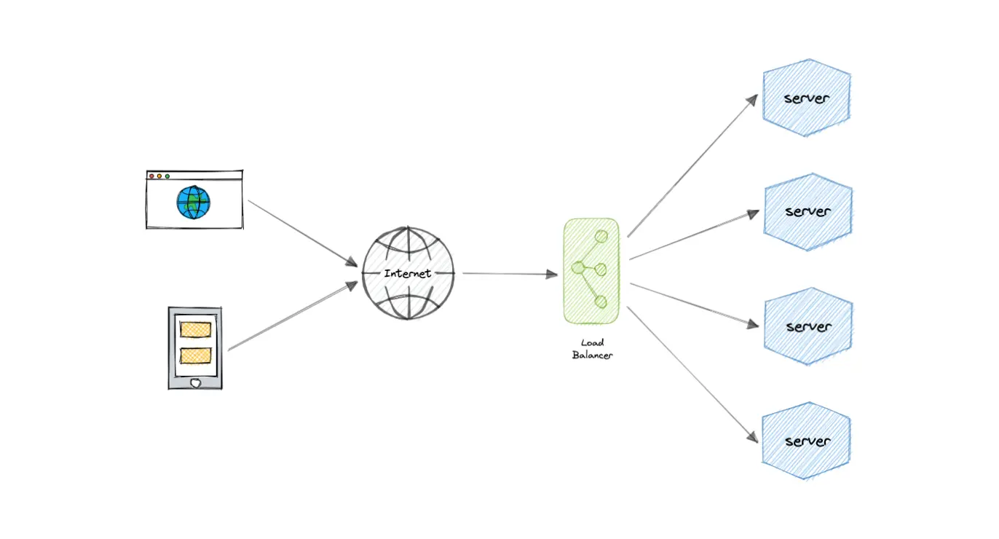
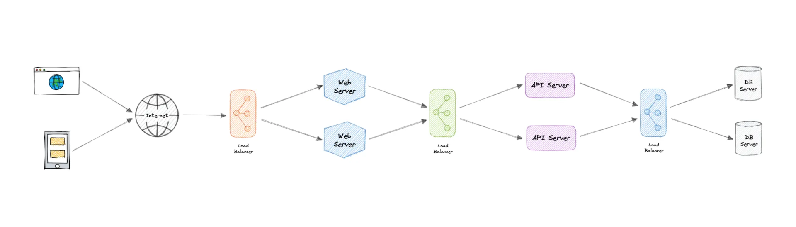
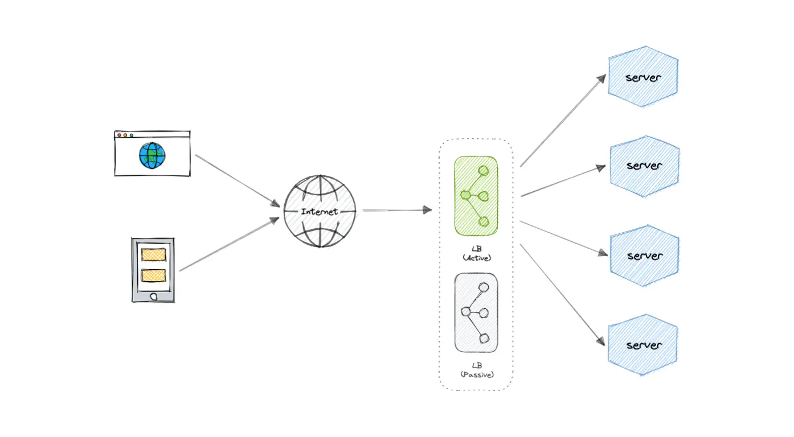

Load balancing lets us distribute incoming network traffic across multiple resources ensuring high availability and reliability by sending requests only to resources that are online. This provides the flexibility to add or subtract resources as demand dictates.

&nbsp;

&nbsp;

For additional scalability and redundancy, we can try to load balance at each layer of our system:

meaning instead at just api, we can have multiple load balancers one at each level

&nbsp;

## But why?

Modern high-traffic websites must serve hundreds of thousands, if not millions, of concurrent requests from users or clients. To cost-effectively scale to meet these high volumes, modern computing best practice generally requires adding more servers.

A load balancer can sit in front of the servers and route client requests across all servers capable of fulfilling those requests in a manner that maximizes speed and capacity utilization. This ensures that no single server is overworked, which could degrade performance. If a single server goes down, the load balancer redirects traffic to the remaining online servers. When a new server is added to the server group, the load balancer automatically starts sending requests to it.

&nbsp;

## Workload distribution

This is the core functionality provided by a load balancer and has several common variations:

- **Host-based**: Distributes requests based on the requested hostname.(`api.example.com` vs `admin.example.com`).
- **Path-based**: Using the entire URL to distribute requests as opposed to just the hostname.((`/payments` → Payment-Service).)
- **Content-based**: Inspects the message content of a request. This allows distribution based on content such as the value of a parameter.

* * *

### **Types of Load Balancers (Simplified)**

#### **A. Application Load Balancer (ALB)**

- **Works with**: HTTP/HTTPS (Layer 7).
    
- **Use Case**: Routing API requests (e.g., `/users` → User-Service, `/orders` → Order-Service).
    
- **How You’ll Use It**:
    
    - Deploy 10 instances of your Spring Boot app.
        
    - ALB splits traffic across them.
        

&nbsp;

#### **B. Network Load Balancer (NLB)**

- **Works with**: Raw TCP/UDP (Layer 4).
    
- **Use Case**: High-speed apps (gaming, stock trading).
    
- **How You’ll Use It**:
    
    - Your Java app uses WebSockets or gRPC? NLB handles it faster.

&nbsp;

#### **C. Ingress Controllers (Kubernetes)**

- **Works with**: Kubernetes pods.
    
- **Use Case**: Routing traffic to different microservices in K8s.
    
- **How You’ll Use It**:
    
    - Deploy a Spring Boot app in K8s.
        
    - Ingress LB routes `api.com/login` → Auth-Service, `api.com/payments` → Payment-Service.
        

&nbsp; 

* * *

## Routing Algorithms

Now, let's discuss commonly used routing algorithms:

- **Round-robin**: Requests are distributed to application servers in rotation.
- **Weighted Round-robin**: Builds on the simple Round-robin technique to account for differing server characteristics such as compute and traffic handling capacity using weights that can be assigned via DNS records by the administrator.
- **Least Connections**: A new request is sent to the server with the fewest current connections to clients. The relative computing capacity of each server is factored into determining which one has the least connections.
- **Least Response Time**: Sends requests to the server selected by a formula that combines the fastest response time and fewest active connections.
- **Least Bandwidth**: This method measures traffic in megabits per second (Mbps), sending client requests to the server with the least Mbps of traffic.
- **Hashing**: Distributes requests based on a key we define, such as the client IP address or the request URL.

&nbsp;

* * *

## Advantages

Load balancing also plays a key role in preventing downtime, other advantages of load balancing include the following:

- Scalability
- Redundancy
- Flexibility
- Efficiency

&nbsp;

* * *

## Redundant load balancers

Load balancer itself can be a single point of failure. To overcome this, a second or `N` number of load balancers can be used in a cluster mode.

And, if there's a failure detection and the *active* load balancer fails, another *passive* load balancer can take over which will make our system more fault-tolerant.

&nbsp;

&nbsp;

## Features

Here are some commonly desired features of load balancers:

- **Autoscaling**: Starting up and shutting down resources in response to demand conditions.
- **Sticky sessions**: The ability to assign the same user or device to the same resource in order to maintain the session state on the resource.
- **Healthchecks**: The ability to determine if a resource is down or performing poorly in order to remove the resource from the load balancing pool.
- **Persistence connections**: Allowing a server to open a persistent connection with a client such as a WebSocket.
- **Encryption**: Handling encrypted connections such as TLS and SSL.
- **Certificates**: Presenting certificates to a client and authentication of client certificates.
- **Compression**: Compression of responses.
- **Caching**: An application-layer load balancer may offer the ability to cache responses.
- **Logging**: Logging of request and response metadata can serve as an important audit trail or source for analytics data.
- **Request tracing**: Assigning each request a unique id for the purposes of logging, monitoring, and troubleshooting.
- **Redirects**: The ability to redirect an incoming request based on factors such as the requested path.
- **Fixed response**: Returning a static response for a request such as an error message.

&nbsp;

&nbsp;

&nbsp;

## Examples

Following are some of the load balancing solutions commonly used in the industry:

- <ins>Amazon Elastic Load Balancing</ins>
- <ins>Nginx</ins>